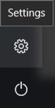

=========================
Windows Development Setup
=========================

.. WARNING:: This document extends, Windows Requirements Install Guide
(RequirementsWindows.rst).


.. NOTE:: Most development will be for the plugins, not platform, so these instructions
    are not high priority.


Hardware Recommendation
-----------------------

*  32gb of ram (minimum 16gb)

Software Requirements
`````````````````````

#.  Dependencies ( these should be fixed in the peek install and not required here.
Brenton to confirm. )

    Run these command in terminal ::

        $ pip install psycopg2
        $ pip install pycparser
        $ pip install cffi
        $ pip install cryptography
        $ pip install pytest
        $ pip install coverage
        $ pip install pypiwin32

#.  Visual Studio Code,

    :Download: `<https://code.visualstudio.com>`_

    Add PATH to environment variables ::

        "C:\Program Files (x86)\Microsoft VS Code\bin"


Enable your device for development
``````````````````````````````````


.. image:: windows_development_setup_screenshots/DevMode-UpdateSecurity.jpg
.. image:: windows_development_setup_screenshots/DevMode-ForDevelopers.jpg
`<https://msdn.microsoft.com/en-us/windows/uwp/get-started/enable-your-device-for-development>`_

FROM SHELL
``````````

#.  Checkout the following, all in the same folder,

    :From: `<https://github.com/Synerty>`_

*  Repositories
    #.  synerty-peek
    #.  peek-plugin-base
    #.  peek-agent
    #.  peek-client
    #.  peek-client-fe
    #.  peek-platform
    #.  peek-server
    #.  peek-server-fe
    #.  peek-worker

#.  Update git config ::

        $ git config -unset core.symlink
        $ git config -add core.symlink true

#.  Install front end packages

        Go to the peek-server-fe/peek_server_fe/ and peek-client-fe/peek_client_fe/ ::

        $ npm install

#.  Symlink the tsconfig.json and node_modules file and directory in the parent
directory of peek-client-fe, peek-server-fe and the plugins. These steps are run in the
directory where the projects are checked out from. These are required for the frontend
typescript compiler. ::

        $ ln -s peek-client-fe/peek_client_fe/node_modules .
        $ ln -s peek-client-fe/peek_client_fe/tsconfig.json .
    #.  ::

            $ cd peek-server-fe/peek_server_fe/
            $ ng build

            $ cd peek-client-fe/peek_client_fe/
            $ ng build

#.  These steps link the projects under site-packages and installs their dependencies.

    #.  Run the following commands ::

            $ cd synerty-peek
            $ ./pip_uninstall_and_develop.sh

    #.  For repositories and plugins run from their directory ::

            $ python setup.py develop

SETTING UP PYCHARM
``````````````````

#.  Open pycharm,

    #.  Open the peek project, open in new window
    #.  Open each of the other projects mentioned above, add to current window

#.  File -> Settings (Ctrl+Alt+S with eclipse keymap)

    #. Editor -> Inspection (use the search bar for finding the inspections)

        #.  Disable Python -> "PEP8 Naming Convention Violation"
        #.  Change Python -> "Type Checker" from warning to error
        #.  Change Python -> "Incorrect Docstring" from warning to error
        #.  Change Python -> "Missing type hinting ..." from warning to error
        #.  Change Python -> "Incorrect call arguments" from warning to error
        #.  Change Python -> "Unresolved references" from warning to error

    #. Project -> Project Dependencies

        #.  peek_platform depends on -> plugin_base
        #.  peek_server depends on -> peek_platform, peek_server_fe
        #.  peek_client depends on -> peek_platform, peek_client_fe
        #.  peek_agent depends on -> peek_platform
        #.  peek_worker depends on -> peek_platform

    #.  Languages & Frameworks -> Node.js and NPM

        #.  Node interpreter -> ~/node-v7.1.0/bin/node
        #.  Remove other node interpreters

        .. image::pycharm_setup/settings_nodejs_and_npm.png

    #.  Languages & Frameworks -> TypesScript

        #.  Node interpreter -> ~/node-v7.1.0/bin/node
        #.  Enable TypeScript Compiler -> Checked
        #.  Set options manually -> Checked
        #.  Command line options -> --target es5 --experimentalDecorators --lib es6,dom --sourcemap --emitDecoratorMetadata
        #.  Generate source maps -> Checked

        .. image::pycharm_setup/settings_typescript.png

    #.  Languages & Frameworks -> Typescript -> TSLint

        #.  Select "Enable"
        #.  Node interpreter -> ~/node-v7.1.0/bin/node
        #.  TSLint Package -> ~/node-v7.1.0/lib/node_modules/tslint

        .. image::pycharm_setup/settings_tslint.png

*You can now start developing*
