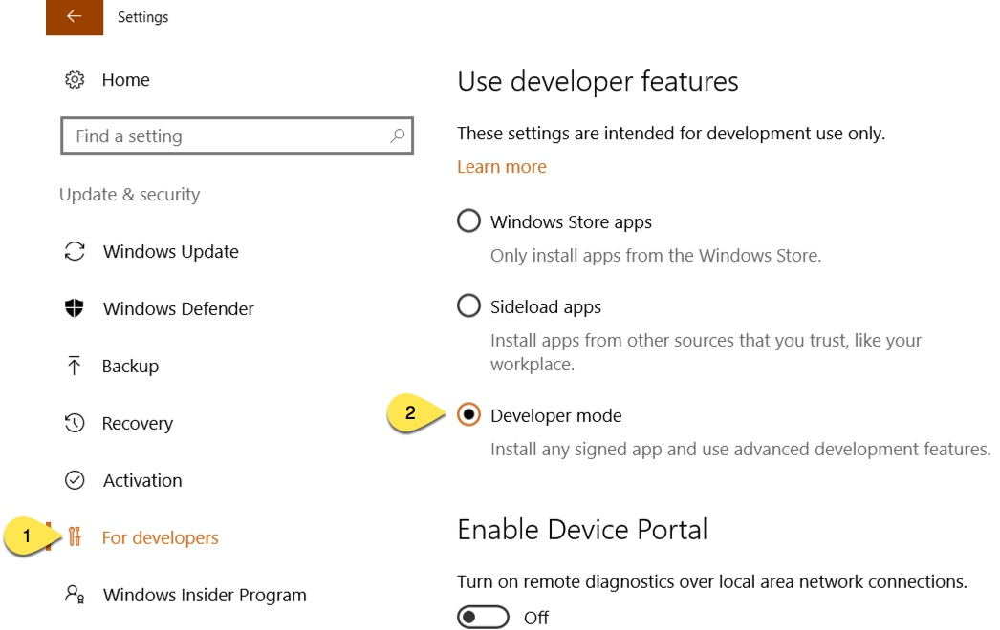

=========================
Windows Development Setup
=========================

.. WARNING:: This document extends, Windows Requirements Install Guide
(RequirementsWindows.rst).


.. NOTE:: Most development will be for the plugins, not platform, so these instructions
    are not high priority.


Hardware Recommendation
-----------------------

*  32gb of ram (minimum 16gb)

Software Requirements
---------------------

#.  Dependencies ( these should be fixed in the peek install and not required here.
Brenton to confirm. )

    Run these command in terminal ::

        $ pip install psycopg2
        $ pip install pycparser
        $ pip install cffi
        $ pip install cryptography
        $ pip install pytest
        $ pip install coverage
        $ pip install pypiwin32

#.  Visual Studio Code,

    :Download: `<https://code.visualstudio.com>`_

    Add PATH to environment variables ::

        "C:\Program Files (x86)\Microsoft VS Code\bin"


Enable your device for development
``````````````````````````````````

.. image:: windows_development_setup_screenshots/DevMode-UpdateSecurity.jpg

`<https://msdn.microsoft.com/en-us/windows/uwp/get-started/enable-your-device-for-development>`_

Clone Peek Repositories
-----------------------

#.  Checkout the following, all in the same folder,

    .. NOTE:: core.symlink:  If false, symbolic links are checked out as small plain
    files that contain the link text. git-update-index[1] and git-add[1] will not change
    the recorded type to regular file. Useful on filesystems like FAT that do not support
    symbolic links.  The default is true, except git-clone[1] or git-init[1] will probe
    and set core .symlinks false if appropriate when the repository is created.

    :From: `<https://github.com/Synerty>`_

    *  Repositories
        #.  synerty-peek
        #.  peek-plugin-base
        #.  peek-agent
        #.  peek-client
        #.  peek-client-fe
        #.  peek-platform
        #.  peek-server
        #.  peek-server-fe
        #.  peek-worker
        ::

            cd ~peek/Documents/
            mkdir peek-mobile
            cd ~peek/Documents/peek-mobile/
            git clone https://github.com/Synerty/{repository}.git
            cd ~peek/Documents/peek-mobile/{repository}
            git config --unset core.symlink
            git config --add core.symlink true

    *  Script to clone all repositories: ::

            mkdir ~peek/Documents/peek-mobile
            cd ~peek/Documents/peek-mobile/
            git clone https://github.com/Synerty/synerty-peek.git
            cd ~peek/Documents/peek-mobile/synerty-peek
            git config --unset core.symlink
            git config --add core.symlink true
            cd ~peek/Documents/peek-mobile/
            git clone https://github.com/Synerty/peek-plugin-base.git
            cd ~peek/Documents/peek-mobile/peek-plugin-base
            git config --unset core.symlink
            git config --add core.symlink true
            cd ~peek/Documents/peek-mobile/
            git clone https://github.com/Synerty/peek-agent.git
            cd ~peek/Documents/peek-mobile/peek-agent
            git config --unset core.symlink
            git config --add core.symlink true
            cd ~peek/Documents/peek-mobile/
            git clone https://github.com/Synerty/peek-client.git
            cd ~peek/Documents/peek-mobile/peek-client
            git config --unset core.symlink
            git config --add core.symlink true
            cd ~peek/Documents/peek-mobile/
            git clone https://github.com/Synerty/peek-client-fe.git
            cd ~peek/Documents/peek-mobile/peek-client-fe
            git config --unset core.symlink
            git config --add core.symlink true
            cd ~peek/Documents/peek-mobile/
            git clone https://github.com/Synerty/peek-platform.git
            cd ~peek/Documents/peek-mobile/peek-platform
            git config --unset core.symlink
            git config --add core.symlink true
            cd ~peek/Documents/peek-mobile/
            git clone https://github.com/Synerty/peek-server.git
            cd ~peek/Documents/peek-mobile/peek-server
            git config --unset core.symlink
            git config --add core.symlink true
            cd ~peek/Documents/peek-mobile/
            git clone https://github.com/Synerty/peek-server-fe.git
            cd ~peek/Documents/peek-mobile/peek-server-fe
            git config --unset core.symlink
            git config --add core.symlink true
            cd ~peek/Documents/peek-mobile/
            git clone https://github.com/Synerty/peek-worker.git
            cd ~peek/Documents/peek-mobile/peek-worker
            git config --unset core.symlink
            git config --add core.symlink true
            cd ~peek/Documents/peek-mobile/
            ls -l


#.  Install front end packages

    Go to the ~peek/Documents/peek-mobile/peek-client-fe/peek_client_fe/ ::

        cd ~peek/Documents/peek-mobile/peek-client-fe/peek_client_fe/
        npm install


#.  Symlink the tsconfig.json and node_modules file and directory in the parent
directory of peek-client-fe, peek-server-fe and the plugins. These steps are run in the
directory where the projects are checked out from. These are required for the frontend
typescript compiler. ::

        cd ~peek/Documents/peek-mobile/
        ln -s peek-client-fe/peek_client_fe/node_modules .
        ln -s peek-client-fe/peek_client_fe/tsconfig.json .

        cd ~peek/Documents/peek-mobile/peek-client-fe/peek_client_fe/
        ng build


#.  These steps link the projects under site-packages and installs their dependencies.

    #.  Run the following commands ::

            cd ~peek/Documents/peek-mobile/synerty-peek
            ./pip_uninstall_and_develop.sh

    #.  For repositories and plugins run from their directory ::

            $ python setup.py develop


*You can now start developing*
