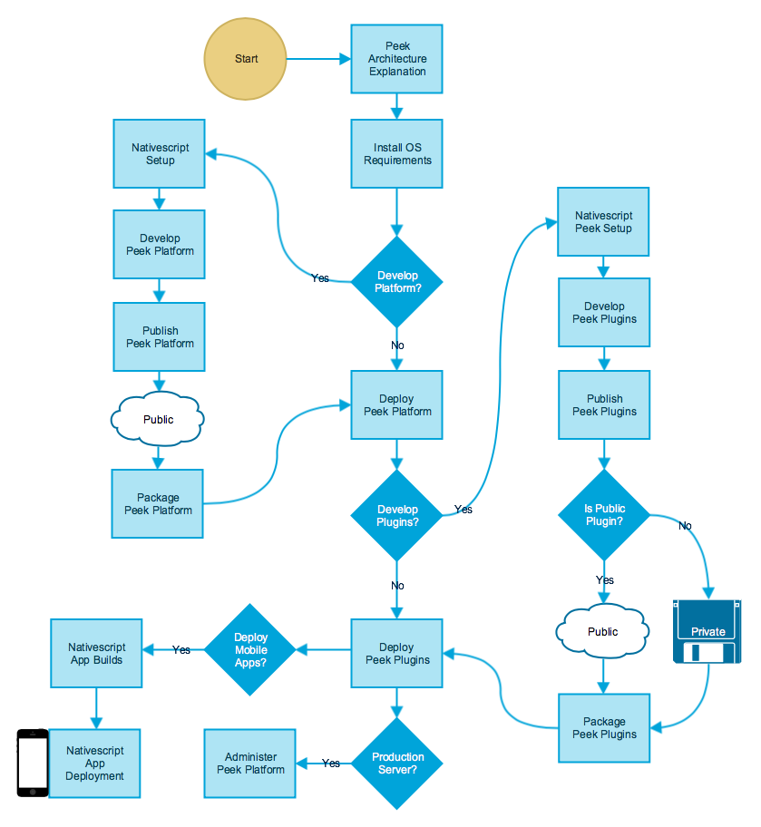

.. image:: https://readthedocs.org/projects/synerty-peek/badge/?version=latest
    :target: http://synerty-peek.readthedocs.io/en/latest/?badge=latest
    :alt: Documentation Status

============
Synerty Peek
============

What is Peek
------------

Peek is semi distributed pluggable python platform.

Peek provides a platform for Python similar to the functionality JBOSS provides for JAVA.
(Or at least that is in the intention, it's early days)

The Big Bang
------------

Peek was created and is maintained by Synerty to provide common facilities python plugins,
Allowing developers to better sensationalise and integrate new code.

Synerty uses the Peek platform to provide scalable enterprise grade applications.

Cross Platform
--------------

Peek is compatible with the following operating systems

*   Linux (Preferred)
    *   Debian 8
    *   Redhat Enterprise Linux 6+

*   Windows (64bit only)
    *   Windows 7
    *   Windows 10
    *   Windows 2008R2
    *   Windows 2012R2

Technologies
------------

Peek utilises the following technologies

A multiteared architecture platform for python, supporting :

*   Reactive / observable data transport using Synerty Vortex.
    (Synerty's observable, routable, data serialisation and transport library)

*   Reactive framework, using Twisted

*   A web based user and admin site, using:

    *   Bootstrap3
    *   Angular2+, Angular CLI
    *   Typescript
    *   FontAwesome
    *   Web Sockets with HTTP Fallback

*   A native mobile app, using:

    *   Nativescript2+
    *   Angular2+
    *   Typescript
    *   FontAwesome
    *   Web Sockets

*   Persistent Storage, using either:

    *   PostGreSQL for NoSQL and SQL support (Preferred)
    *   MS SQL Server (SQL Only)

*   Multiprocessing worker services using Celery, rabbitmq and redis

*   External data input / output (EG, External SQL or SOAP), for example:

    *   txCelery
    *   SOAPpy
    *   cxOracle
    *   Any other libraries your plugins wants to install


Browser Support
---------------

Peek provides two separate web apps, one for administration one for users.
These web applications are tested against the following browsers.

Current Browser Support
```````````````````````
*   Desktop
    *   Chrome
    *   IE 11 and above
    *   Microsoft Edge
    *   Safari on Mac

*   Mobile
    *   Safari on iOS
    *   Mobile Chrome

How to Use Peek Documention
---------------------------

The Peek platform documentation is designed like code (IE, Modular).

http://synerty-peek.readthedocs.io/



