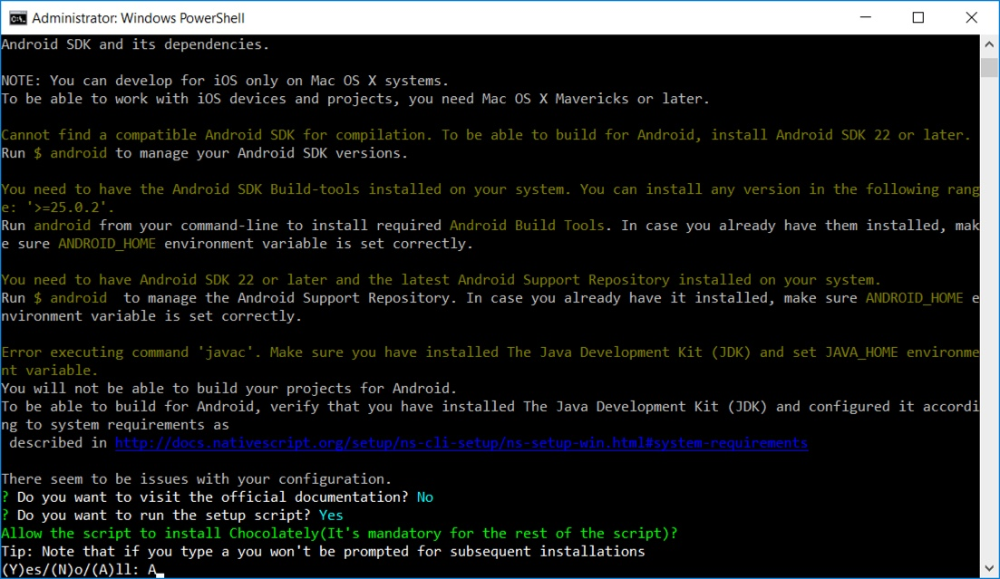

==================================
Windows Nativescript Install Guide
==================================

The Peek platform is designed to run on Linux, however, it is compatible with windows.
Please read through all of the documentation before commencing the installation
procedure.

Installation Objective
----------------------

This *Installation Guide* contains specific Windows operating system requirements for the
configuring of synerty-peek.

Dependencies
````````````

This install procedure requires software installed by the prerequisites steps.


Optional  Software
``````````````````

*   VirtualBox
*   Geny Motion

Required Software
`````````````````

Below is a list of all the required software:

*   Java JDK
*   nativescript NPM package


Online Installation Guide
-------------------------


Java Install
````````````

** TODO **


Nativescript Package
````````````````````

*  Install the required NPM packages

Run the Command Prompt as Administrator and run the following commands: ::

        npm -g install @angular/cli typescript tslint nativescript

*  Do you want to run the setup script? ::

        Y



|

*  Allow the script to install Chocolatey(It's mandatory for the rest of the
script) ::

        A

*  Do you want to install the Android emulator?: ::

        N

.. image:: windows_installation_screenshots/Nativescript-InstallComplete.jpg

|

*  Once the installation is complete press 'ctrl+c' to exit the PowerShel
shell then in the command prompt run ::

        tns doctor

.. image:: windows_installation_screenshots/Nativescript-tnsDoctor.jpg

|

*  Confirm Environment Variable ANDROID_HOME ::

        C:\Users\peek\AppData\Local\Android\android-sdk

*  Confirm Environment Variable JAVA_HOME ::

        C:\Program Files\Java\jdk1.8.0_121

.. note:: For Offline installation, install the Node.js 7+ and NPM 3+ on a machine
    with internet access.  Package the installed nodejs files and installed modules
    'C:\Users\peek\nodejs'.  Unpackage in the same directory location on the offline
    server.
