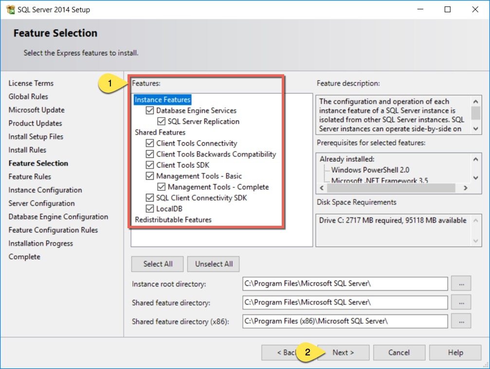
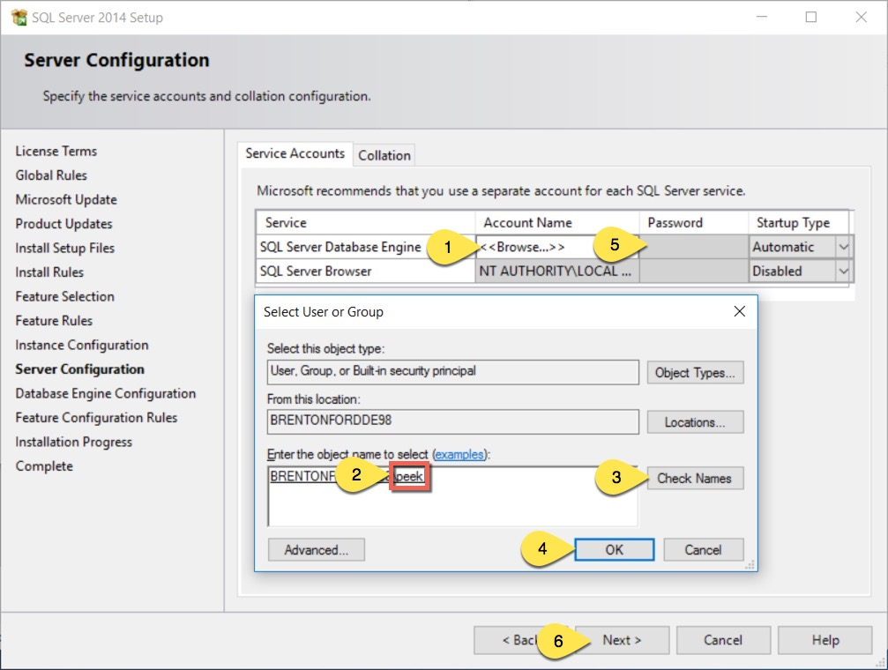
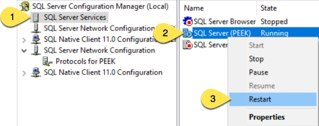
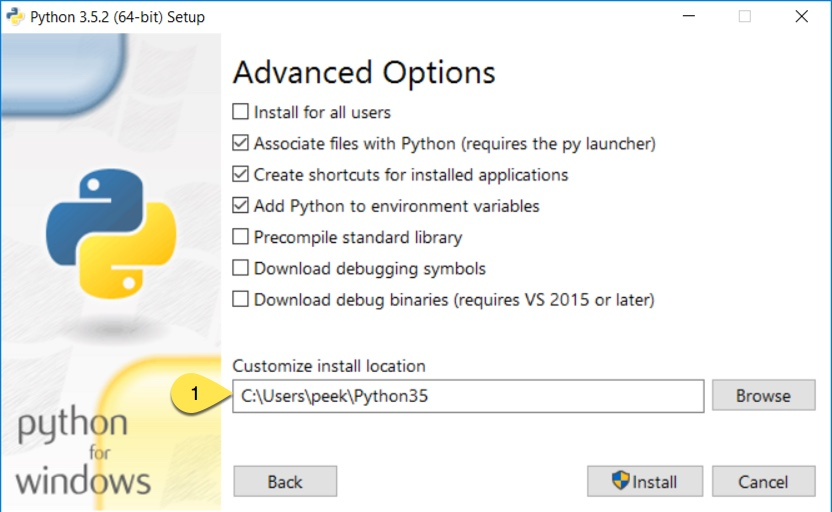
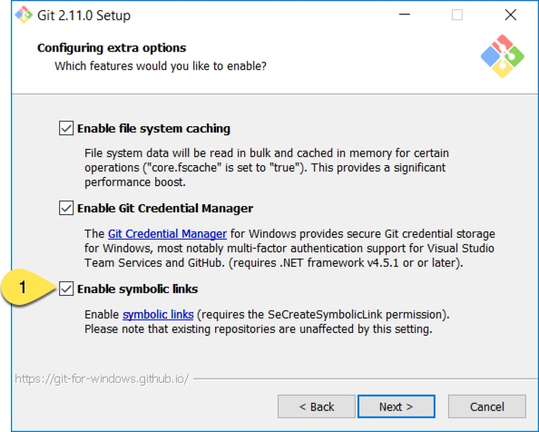
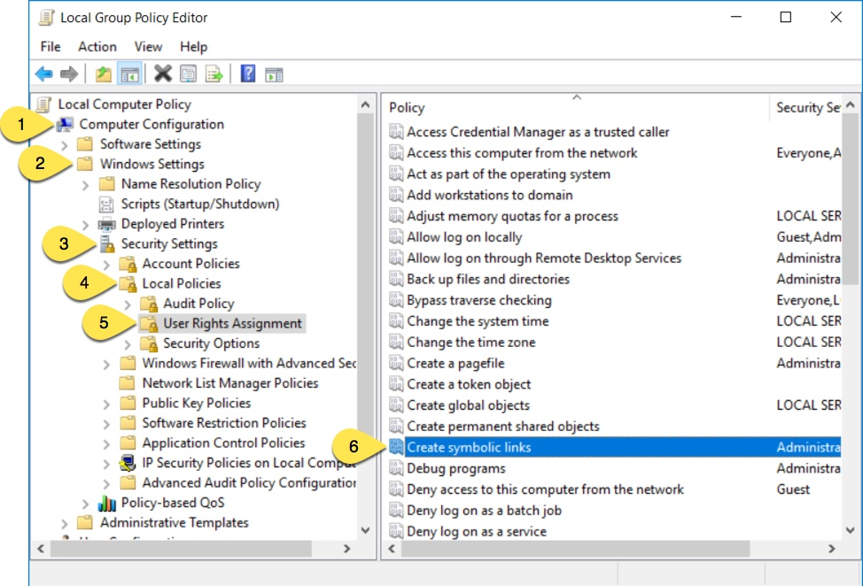
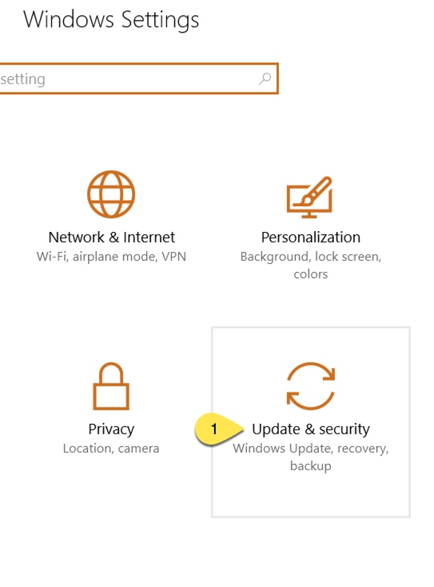

==================================
Windows Requirements Install Guide
==================================

The Peek platform is designed to run on Linux, however, it is compatible with windows.
Please read through all of the documentation before commencing the installation
procedure.

Installation Objective
----------------------

This *Installation Guide* contains specific Windows operating system requirements for the
configuring of synerty-peek.

Required Software
`````````````````

Some of the software to be installed requires internet access.  For offline installation
some steps are required to be installed on another online server for the files to be
packaged and transferred to the offline server.

Below is a list of all the required software:

*  Microsoft .NET Framework 3.5 Service Pack 1
*  Visual C++ Build Tools 2015
*  Microsoft® SQL Server® 2014 Express
*  Node.js 7+ and NPM 3+
*  Python 3.5
*  FreeTDS
*  GitBash
*  Shapely
*  Cygwin

Optional  Software
``````````````````

*  7zip
*  Notepad ++
*  Installing Oracle Libraries (Instructions in the procedure)

Installation of 7zip is optional. This tool will come in handy during the process but
is not required.

----

Installation of Notepad ++ is optional.  Notepad ++ is a handy tool for viewing
documents and has useful features.

----

Installing Oracle Libraries is required if you intend on installing the peek agent.
Instruction for installing the Oracle Libraries are in the *Online Installation Guide*.

OS Commands
-----------

The config file for each service in the peek platform describes the location of the BASH
interpreter. Peek is coded to use the bash interpreter and basic posix compliant utilities
for all OS commands.

When peek generates it's config it should automatically choose the right interpreter. ::

        "C:\Program Files\Git\bin\bash.exe" if isWindows else "/bin/bash"

Online Installation Guide
-------------------------

Create Account
``````````````

Create a windows user account for peek with admin rights.

----

:Account Type: Administrator
:Username: peek
:Password: PA$$W0RD

----

sign in to the peek account


Microsoft .NET Framework 3.5 Service Pack 1
```````````````````````````````````````````

**Online Installation:**

:Download: `<http://download.microsoft.com/download/2/0/e/20e90413-712f-438c-988e-fdaa79a8ac3d/dotnetfx35.exe>`_
:From: `<https://www.microsoft.com/en-ca/download>`_

**Offline Installation:**

:Download: `<https://download.microsoft.com/download/2/0/E/20E90413-712F-438C-988E-FDAA79A8AC3D/dotnetfx35.exe>`_

.. note:: Restart if prompted to restart.

|

Visual C++ Build Tools 2015
```````````````````````````

**Online Installation:**

:Download: `<http://go.microsoft.com/fwlink/?LinkId=691126>`_
:From: `<http://landinghub.visualstudio.com/visual-cpp-build-tools>`_

**Offline Installation:**

Install using the ISO

:Download: `<https://www.microsoft.com/en-US/download/details.aspx?id=48146>`_

Microsoft® SQL Server® 2014 Express
```````````````````````````````````

:From: `<https://www.microsoft.com/en-ca/download/details.aspx?id=42299>`_

----

Choose directory for extracted files: ::

        C:\SQLEXPRWT_x64_ENU\

----

Select "New SQL Server stand-alone installation"

----

Feature Selection: check all Features



----

Instance Configuration: change the named instance to 'peek'. This will update the
'Instance ID'

----

Server Configuration: Select browse from the 'Account Name' drop-list and check names
for 'peek'.  Select ok then enter the account password



----

Database Engine Configuration: Leave the default settings

----

Start Microsoft SQL Server Management Studio
    Connect to PEEK database engine
    Create new database 'peek'

----

Make Changes in SQL Server Configuration Manager (SQLServerManager12.msc).

Open the "SQL Server Configuration Manager" from the start menu
    Select the folowing:
        SQL Server Network Configuration
        Protocols for PEEK

----

Under the TCP/IP properties set 'IPALL' 'TCP PORT' to '1433'. Select 'Apply' then 'OK',

.. image:: windows_installation_screenshots/set_tcp_port.png

----

Enable the 'TCP/IP' Protocol

.. image:: windows_installation_screenshots/enable_tcpip.png

----

Restart the server service.



|

Node.js 7+ and NPM 3+
`````````````````````

:Download: `<https://nodejs.org/dist/v7.4.0/node-v7.4.0-x64.msi>`_
:From: `<https://nodejs.org/en/download/current/>`_

----

Change install path ::

        C:\Users\peek\nodejs

----

Edit the system PATH to environment variable, and add the following ::

        C:\Users\peek\AppData\Roaming\npm;
        C:\Users\peek\nodejs\

----

Install the required NPM packages

Run the Command Prompt as Administrator and run the following commands: ::

        npm -g install @angular\cli typescript tslint

Python 3.5
``````````

:Download: `<https://www.python.org/ftp/python/3.5.3/python-3.5.3rc1-amd64.exe>`_
:From: `<https://www.python.org/downloads/windows/>`_

----

Check the 'Add Python 3.5 to PATH' and select 'Customize Installation'

.. image:: windows_installation_screenshots/Python-Install.jpg

----

Update the 'Customize install location' to PATH C:\Users\peek\Python35\



----

Confirm PATH(s) to environment variables ::

        echo %PATH%

        ...

        C:\Users\peek\Python35\
        C:\Users\peek\Python35\Scripts\

----

Upgrade pip. Run the command prompt as Administrator and run the following command: ::

        python -m pip install --upgrade pip

.. note:: For Offline installation, install Python 3.5 on a machine with internet access.
    Copy the python directory to the destination server after the python packages and
    synerty-peek package(s) have been deployed and configured.  The environment
    variables will need to be checked and updated.

FreeTDS
```````

:Download: `<https://github.com/ramiro/freetds/releases/download/v0.95.95/freetds-v0.95.95-win-x86_64-vs2015.zip>`_
:From: `<https://github.com/ramiro/freetds/releases>`_

----

Unzip contents into ::

        C:\Users\peek\freetds-v0.95.95

----

Add PATH to environment variables ::

        C:\Users\peek\freetds-v0.95.95\bin

----

Create 'freetds.conf' in "C:\" ::

        [global]
            port = 1433
            instance = peek
            tds version = 7.0
            dump file = /tmp/freetds.log


dll files
~~~~~~~~~

:Download: `<http://indy.fulgan.com/SSL/openssl-1.0.2j-x64_86-win64.zip>`_
:From: `<http://indy.fulgan.com/SSL/>`_

----

Ensure these files are in the system32 folder:

*  libeay32.dll

*  ssleay32.dll

----

You will need to duplicate the above files and name them as per below:

*  libeay32MD.dll

*  ssleay32MD.dll

GitBash
```````

:Download: `<https://github.com/git-for-windows/git/releases/download/v2.11.0.windows.1/Git-2.11.0-64-bit.exe>`_
:From: `<https://git-for-windows.github.io>`_

----

Configuring Extra Options: check 'Enable Symbolic Links'



----

Add PATH to environment variables ::

        C:\Program Files\Git\bin

Shapely
```````

:Download: `<http://www.lfd.uci.edu/~gohlke/pythonlibs/#shapely>`_
:From: `<https://pypi.python.org/pypi/Shapely>`_

----

Download Shapely >= 1.5.17 and save in the Downloads directory

----

Open a command prompt as Administrator.
Run the following command: ::

        pip install \Users\peek\Downloads\Shapely-1.5.17-cp35-cp35m-win_amd64.whl

Cygwin
``````

**Online Installation:**

    :Download: `<https://cygwin.com/setup-x86_64.exe>`_
    :From: `<https://cygwin.com/install.html>`_

----

Download and run the Cygwin installer.

Use the default install options.

**Offline Installation:**

If you're installing offline, you can:

    *  Run the installer and select "download only",

    *  Zip up the install directory and move it to the offline server,

    *  Run the installer and select "install from local",

    *  Use the default install options.

**Configure Cygwin:**

Once cygwin is installed, Open "Cygwin64" from the desktop and run the following

::

        cd /home

        echo "Symlinking peek home"
        rm -rf peek
        ln -s /cygdrive/c/Users/peek .

        echo "Symlinking site-packages
        cd
        ln -s /home/peek/Python35/Lib/site-packages peek-site-packages

        exit

----

To check this has worked, run the following LS command, you should see the following

::

        ls -ld /home/peek /home/peek/peek-site-packages

        lrwxrwxrwx 1 peek None 22 Mar 13 11:24 /home/peek -> /cygdrive/c/Users/peek
        lrwxrwxrwx 1 peek None 37 Mar 13 11:28 /home/peek/peek-site-packages -> /home/peek/Python35/Lib/site-packages

SymLinks
````````

Enabling SymLinks.

`<https://github.com/git-for-windows/git/wiki/Symbolic-Links>`_

----

Launch: "gpedit.msc" and Navigate to
    Computer configuration
        Windows Settings
        Security Settings
        Local Policies
        User Rights Assignment



----

Double click on "Create symbolic links"

----

Click "Add User or Group", add "peek", then "OK" out of the dialogues.

.. image:: windows_installation_screenshots/gpedit-AddUser.jpg

----

You will need to logout and log back in for the change to take effect

.. Note:: This setting has no effect on user accounts that belong to the Administrators
    group.  Those users will always have to run mklink in an elevated environment as
    Administrator.

Enable Development
``````````````````

This applies to windows 10, and may apply to other windows versions as well.

`<https://msdn.microsoft.com/en-us/windows/uwp/get-started/enable-your-device-for-development>`_

Enable your device for development

----

Click the "Start" menu and select "Settings"

----

Select 'Update & Security'



----

Click on the "For developers" tab on the left.

----

Select 'Developer Mode', and acknowledge the warning.

.. image:: windows_installation_screenshots/DevMode-ForDevelopers.jpg

|


Installing Oracle Libraries
---------------------------

The oracle libraries are optional. Install them where the agent runs if you are going
to interface with an oracle database.

Oracle Instant Client
`````````````````````

:Download: `<http://download.oracle.com/otn/nt/instantclient/121020/instantclient-basic-windows.x64-12.1.0.2.0.zip>`_
:From: `<http://www.oracle.com/technetwork/topics/winx64soft-089540.html>`_

----

Unzip contents into ::

        C:\Users\peek\oracle\

----

Add 'ORACLE_HOME' to the environment variables and set the path ::

        C:\Users\peek\oracle\instantclient_12_1

----

Add to the 'PATH' to environment variables ::

        C:\Users\peek\oracle\instantclient_12_1

----

Reboot windows, or logout and login to ensure the PATH updates.


cx_Oracle
`````````

:Download: `<https://pypi.python.org/packages/50/c0/de24ec02484eb9add03cfbd28bd3c23fe137551501a9ca4498f30109621e/cx_Oracle-5.2.1-12c.win-amd64-py3.5.exe#md5=b505eaceceaa3813cf6bfe701ba92c3e>`_
:From: `<https://pypi.python.org/pypi/cx_Oracle/5.2.1>`_

----

Download cx_Oracle from the link above

----

Run the installer.
It should detect the correct python that was installed above.
Use all defaults suggested by the installer


Test cx_Oracle in Python
````````````````````````

----

Open the "Python 3.5 (64-bit)" application from the windows start menu.

----

Run the following commands in Python: ::

        import cx_Oracle
        con = cx_Oracle.connect('username/password@hostname/instance')
        print con.version
        # Expcect to see "12.1.0.2.0"
        con.close()

Offline Installation Guide
--------------------------

For offline installation
    #.  Complete the Online Installation on another online server first.
        This is because some software requires internet access to install.

    #.  Instructions for the software that requires internet access for installation are
        found tresthroughout the *Online Installation Guide* process.


Installing synerty-peek
-----------------------

From here you will be deploying either the *Production Platform Setup*
(ProductionSetup.rst) or the *Development Setup*
(DevelopmentSetup.rst).

.. note:: If offline installation is required, complete the Installing synerty-peek
    setup then return to the Offline Installation Guide.
