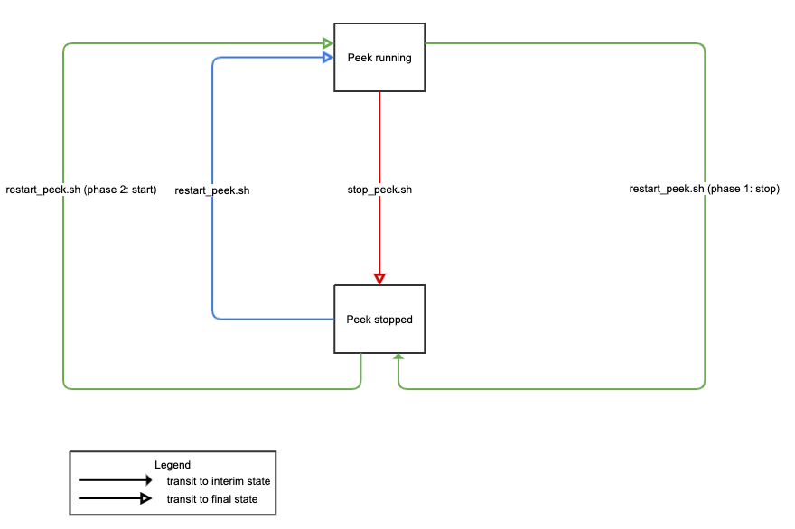

.. _admin_manage_synerty_peek_services:

Manage Peek Services
--------------------

This section describes the best practices for manage Peek services by management
commands.

----


Peek Services
`````````````

On a Peek instance, some or all of services are registered with the system,
as a result of your installation.

* Peek Agent
* Peek Field
* Peek Logic
* Peek Office
* Peek Worker


Peek Service State Transition
`````````````````````````````

Management commands can bulk-manage all services registered on a host. If you
would like to manage them individually, please refer to
:ref:`admin_run_synerty_peek`.

Below is a diagram that shows states of Peek and how the commands transit to
states.



Peek Service Management Commands
````````````````````````````````

.. note:: To run these commands on Linux, you need to login as user ``peek``.

restart_peek.sh
~~~~~~~~~~~~~~~

``restart_peek.sh`` (re)starts Peek services registered on a host.

::

    [peek@host:~]$ restart_peek.sh
    Stopping peek_agent
    Stopping peek_worker
    Stopping peek_office
    Stopping peek_field
    Stopping peek_logic
    Waiting for services to stop
    Killing anything left running
    Starting peek_agent
    Starting peek_worker
    Starting peek_office
    Starting peek_field
    Starting peek_logic
    [peek@host:~]$


stop_peek.sh
~~~~~~~~~~~~

``stop_peek.sh`` stops Peek services registered on a host.

::

    [peek@host:~]$ stop_peek.sh
    Stopping peek_agent
    Stopping peek_worker
    Stopping peek_office
    Stopping peek_field
    Stopping peek_logic
    Waiting for services to stop
    Killing anything left running
    [peek@host:~]$


Inspect Live Peek Processes
```````````````````````````
``pgrep -laf run_peek`` lists all Peek processes on a host.

.. note::
    There should be multiple worker processes because that is its job,
    to distribute python data crunching load to multiple processes.

::

    [peek@host:~]$ pgrep -laf run_peek
    13907 /home/peek/synerty-peek-0.0.0+b13976/bin/python /home/peek/synerty-peek-0.0.0+b13976/bin/run_peek_agent_service
    13915 /home/peek/synerty-peek-0.0.0+b13976/bin/python /home/peek/synerty-peek-0.0.0+b13976/bin/run_peek_worker_service
    13923 /home/peek/synerty-peek-0.0.0+b13976/bin/python /home/peek/synerty-peek-0.0.0+b13976/bin/run_peek_office_service
    13931 /home/peek/synerty-peek-0.0.0+b13976/bin/python /home/peek/synerty-peek-0.0.0+b13976/bin/run_peek_field_service
    13939 /home/peek/synerty-peek-0.0.0+b13976/bin/python /home/peek/synerty-peek-0.0.0+b13976/bin/run_peek_logic_service
    14229 /home/peek/synerty-peek-0.0.0+b13976/bin/python /home/peek/synerty-peek-0.0.0+b13976/bin/run_peek_worker_service
    14231 /home/peek/synerty-peek-0.0.0+b13976/bin/python /home/peek/synerty-peek-0.0.0+b13976/bin/run_peek_worker_service
    14232 /home/peek/synerty-peek-0.0.0+b13976/bin/python /home/peek/synerty-peek-0.0.0+b13976/bin/run_peek_worker_service
    14233 /home/peek/synerty-peek-0.0.0+b13976/bin/python /home/peek/synerty-peek-0.0.0+b13976/bin/run_peek_worker_service
    14244 /home/peek/synerty-peek-0.0.0+b13976/bin/python /home/peek/synerty-peek-0.0.0+b13976/bin/run_peek_worker_service
    [peek@host:~]$