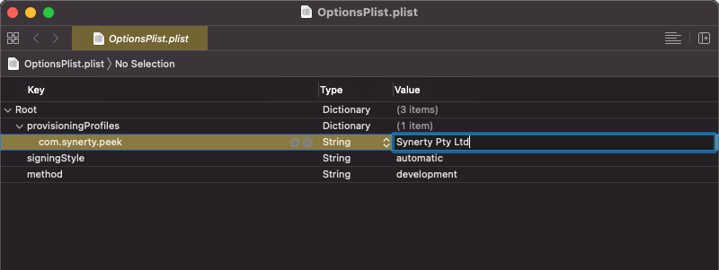

.. _build_capacitor_app:

===================
Build Capacitor App
===================

iOS
___

Capacitor iOS apps can be built either via the xcode interface, or by using the
xcodebuild cli. This document will cover building the app using the
xcodebuild cli. This section assumes that you have Pek set up in the Synerty
standard Development structure.

Setup
`````

Configure OptionsPlist.plist
~~~~~~~~~~~~~~~~~~~~~~~~~~~~

The information specified in this plist  will be used by xcode for building and
exporting the app.

Download the example plist found :download:`here <OptionsPlist.plist>` to your
:code:`~/Downloads` folder and open it with xcode. Then, double click the
fields and fill them out with the relevant information.



Save and close :code:`OptionsPlist.plist`.

----

Set Variables
~~~~~~~~~~~~~

Some custom environment variables should be set before building the App

.. list-table:: Variables
   :widths: 50 50
   :header-rows: 1

   * - Variable
     - Description
   * - CLIENT
     - The name of the client the App is being built for.
   * - VERSION
     - The tagged version of the App being built.
   * - EXPORT_DIR
     - The directory to export the App to.
   * - APP_PACKAGE_ID
     - The bundle identifier used to sign this app


----

When filled out, the environment variables should look similar to the below:

::

    CLIENT="Synerty"
    VERSION="3.1.0"
    EXPORT_DIR="$HOME/Peek_builds/$CLIENT/$VERSION"
    APP_PACKAGE_ID="com.synerty.peek"
    DEVELOPMENT_TEAM="XXXXXXXXXXX"


Copy and paste yours into your terminal


Create Necessary Directories
~~~~~~~~~~~~~~~~~~~~~~~~~~~~

These will be used for building and exporting the app

::

    cd
    mkdir -p $EXPORT_DIR


Move OptionsPlist.plist into place
~~~~~~~~~~~~~~~~~~~~~~~~~~~~~~~~~~

The configured OptionsPlist file must now be moved to a directory it can be
referenced from in the build. In our case, this is
:code:`${EXPORT_DIR}/OptionsPlist.plist`

::

    mv ~/Downloads/OptionsPlist.plist ${EXPORT_DIR}/OptionsPlist.plist


checkout the correct tag
~~~~~~~~~~~~~~~~~~~~~~~~

Checkout the tag of the Peek version that you are building an app for in all
peek development directories.

::

    cd ~/dev-peek
    for dir in */
    do
        pushd ${dir}
            NAME=${PWD##*/}
            echo "Checking out $NAME"
            git fetch --all --tags
            git checkout tags/$VERSION
        popd
    done


Move to the App folder
~~~~~~~~~~~~~~~~~~~~~~

Checkout the tag of the Peek version that you are building an app for.

::

    cd ~/dev-peek/peek-field-app/peek_field_app/ios/App


Configure the build
```````````````````
Perform the configuration changes required to build the app

----

The following folders are built when the services are run and will need to be
rebuilt every time an aspect of Peek is changed.

:code:`peek-field-app/src/@peek`

:code:`peek-field-app/src/@_peek`

----

.. important:: Run the Peek Field and Peek Logic services together and wait for
    them both to start before continuing.

----

Update the config files at
:code:`peek-field-app/ios/App/App/capacitor.config.json`
and
:code:`peek-field-app/ios/App/App.xcodeproj/project.pbxproj`
::

    # Edit the config
    sed -i "/\"appId\":/s/.*/  \"appId\": \"${APP_PACKAGE_ID}\",/g" \
    App/capacitor.config.json


    # Edit the pbxproj
    PADDING="                               "
    PBI="${PADDING} PRODUCT_BUNDLE_IDENTIFIER = ${APP_PACKAGE_ID};"
    DT="${PADDING} DEVELOPMENT_TEAM = ${DEVELOPMENT_TEAM};"

    sed -i "/PRODUCT_BUNDLE_IDENTIFIER/s/.*/${PBI}/g" \
    App.xcodeproj/project.pbxproj

    sed -i "/DEVELOPMENT_TEAM/s/.*/${DT}/g" \
    App.xcodeproj/project.pbxproj

    # Edit the Info.plist
    sed -i "s/<string>1.0<\/string>/<string>${VERSION}<\/string>/g" \
    App/Info.plist


----

Update the config html

::

    cd ../..
    sed -i "/v0.0.0/s/.*/            <div class=\"end-value\">v${VERSION}<\/div>/g" \
    src/app/pages/config/config.page.html


----

Build the App's front-end

::

    ng build --configuration production --optimization  --common-chunk --vendor-chunk


Build the App
`````````````

Now that the config files have been updated, the App can be configured.

Set up Capacitor
~~~~~~~~~~~~~~~~

Capacitor will need to be prepared to build an iOS App. Ignore any warnings that
an ios directory already exists.

::

    npm install @capacitor/core @capacitor/cli --save
    npx cap init peek_ios_app_v${VERSION} $APP_PACKAGE_ID
    npx cap add ios
    npx cap sync


Install build prerequisites
~~~~~~~~~~~~~~~~~~~~~~~~~~~

::

    cd ios/App
    pod install
    npm i
    mkdir -p public


Prepare an App archive
~~~~~~~~~~~~~~~~~~~~~~

An archive is a more general build that can be used to speed up subsequent
builds with small config changes, e.g specifying new certificates.

::

    xcodebuild \
      -workspace App.xcworkspace \
      -scheme App archive \
      -archivePath ${EXPORT_DIR}/peek.xcarchive \
      -allowProvisioningUpdates


Build from the archive
~~~~~~~~~~~~~~~~~~~~~~

Perform the actual build.

::

    xcodebuild -exportArchive \
      -archivePath ${EXPORT_DIR}/peek.xcarchive \
      -exportPath ${EXPORT_DIR}/Peek \
      -exportOptionsPlist ${EXPORT_DIR}/OptionsPlist.plist


Done
~~~~
Once the build is finished, the resulting App can be found in the
:code:`EXPORT_DIR` directory defined earlier.


Build Android App
-----------------

** ToDo **

Build Windows App
-----------------

** ToDo **

Further Reading
---------------

Further documentation on Capacitor can be found on their website.
https://capacitorjs.com/docs

What Next?
----------

Refer back to the :ref:`how_to_use_peek_documentation` guide to see which document to
follow next.
