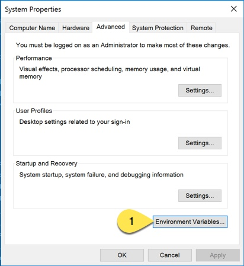
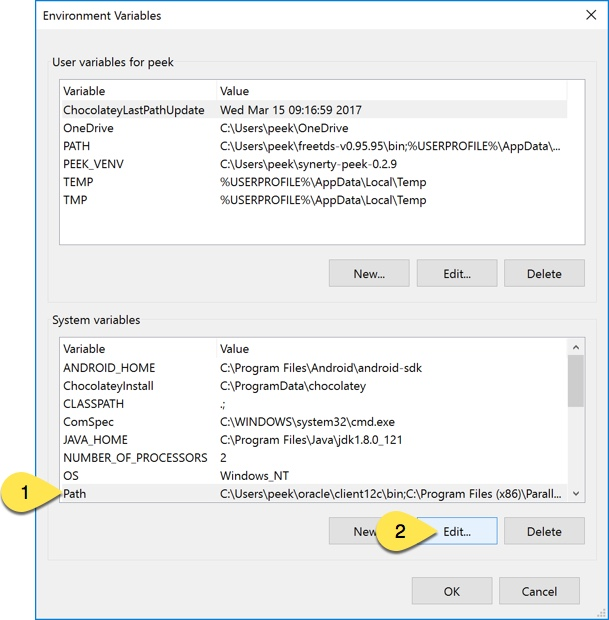
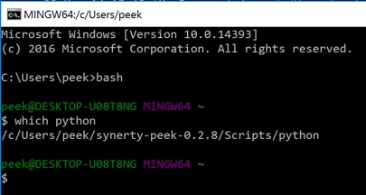

.. _deploy_peek_platform:

====================
Deploy Peek Platform
====================

.. note:: The Windows or Debian requirements must be followed before following this guide.

Deploy Platform Release
-----------------------

This section describes how to deploy a peek platform release.

Peek is deployed into python virtual environments, a new virtual environment is created
for every deployment.

This ensures that each install is clean, has the right dependencies and there is a
rollback path (switch back to the old virtual environment.

To build your own platform release, see the following document

    **Package Peek Platform**

Windows
```````

Open a PowerShell windows.

----

Download the platform deploy script.
This is the only step in this section that requires the internet.

::

        $file = "deploy_platform_win.ps1"
        $uri = "https://raw.githubusercontent.com/Synerty/synerty-peek/master/$file";
        Invoke-WebRequest -Uri $uri -UseBasicParsing -OutFile $file;

----

Run the platform deploy script.
At the end it will print out where it has deployed the new environment to.
Ensure you update the **$dist** variable with the path to your release.

The script will deploy to C:\\Users\\peek.

::

        $dist = "C:\Users\peek\Downloads\peek_dist_win_0.1.0.zip"
        PowerShell.exe -ExecutionPolicy Bypass -File deploy_platform_win.ps1 $dist

.. note:: Once the script has completed running you will see the message "Activate the
    new environment from ...".  These commands temporarily configure the environment to
    use the synerty-peek virtual environment that was just deployed.  For a permanent
    change you will need to edit your 'Environment Variables'.  See
    :ref:`configuring_environment_variables` for more details.

----

The platform is now deployed.

.. _configuring_environment_variables:

Configuring Environment Variables
~~~~~~~~~~~~~~~~~~~~~~~~~~~~~~~~~

Follow this procedure to configure your system to use the synerty-peek virtual
environment that you have deployed.

These steps can also be followed to roll back to a previous deployed synerty-peek virtual
environment.

----

Go to 'System Properties' and select 'Environment Variables...'



----

In the 'System Variables' section, highlight 'PATH' and select 'Edit...'



----

In the Edit window select 'New' and paste the script:

::

        C:\Users\peek\synerty-peek-#.#.#\Scripts

Click 'Move Up'.  It is important that the variable you have added is above any other
variables that contain similar script or programs.

.. image:: EnvVar-EditVariables.jpg

----

Select 'OK' on all three windows

----

Confirm that your changes have worked.  In a new command prompt enter the bash shell
and run:

::

        which python

It should return the variable you have added into the PATH



.. NOTE:: If you are developing, run: 'npm -g install nativescript'.  This is required
    after every deploy.


Linux
`````

**TODO**
