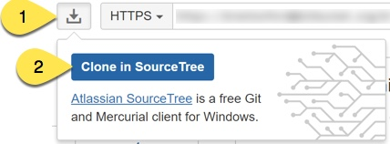
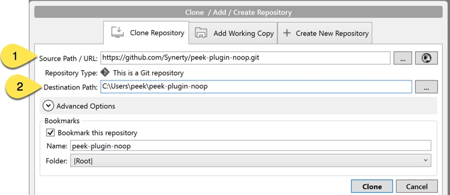
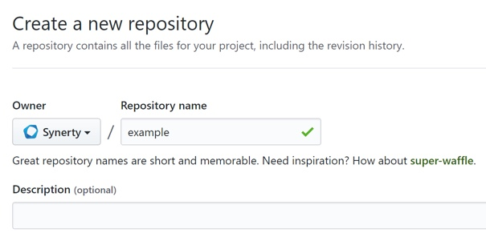
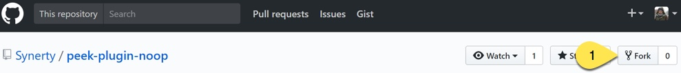

.. _develop_peek_plugins:

====================
Develop Peek Plugins
====================

Synerty recommends the Atlassian suite of developer tools.

Bitbucket to manage and share your Git repositories

:URL: `<https://bitbucket.org>`_

SourceTree to visually manage and interact with your Git repositories

:URL: `<https://www.sourcetreeapp.com>`_

Bitbucket can be integrated with Jira (issue management) and Bamboo (continuous
integration).

.. note::   The reader needs be familiar with, or will become familar with the following:

            *   `GIT <https://git-scm.com>`_
            *   `Python3.5+ <https://www.python.org>`_
            *   `Python Twisted <http://twistedmatrix.com>`_
            *   HTML
            *   CSS
            *   `Bootstrap3 <http://getbootstrap.com>`_
            *   `TypeScript <https://www.typescriptlang.org>`_
            *   `Angular <https://angular.io>`_ (Angular2+, not AngularJS aka Angular1)
            *   `NativeScript <https://www.nativescript.org>`_


.. note:: This a cross platform development guide, all commands are writen for bash.

    Bash is installed by default on Linux.

    Windows users should use bash from msys, which comes with git for windows,
    :ref:`msys_git`.

Clone a New Peek Plugin
-----------------------

If you're creating a new plugin you can copy from "peek-plugin-noop" and rename.

Copy peek-plugin-noop
`````````````````````

:Clone: `<https://github.com/Synerty/peek-plugin-noop.git>`_

Go to, peek-plugin-noop repository on Bitbucket



----

Clone the repository

#.  This URL will be automatically populated from Bitbucket.
#.  **Alter this name to end with peek-plugin-example.**



----

Remove the git references into new directory structure, run the following commands in the bash shell: ::

        cd peek-plugin-example
        rm -rf .git .idea .vscode

Rename to New Plugin
````````````````````

Edit the :file:`rename_plugin.sh` file in the plugin root project folder.


Update the variables near the top with the new names: ::

        caps="EXAMPLE"
        underscore="_example"
        hyphen="-example"
        camelL="example"
        camelU="Example"

----

Run :file:`rename_plugin.sh`, run the following command in the bash shell: ::

        bash ./rename_plugin.sh

----

Remove the "rename_plugin.sh" script, run the following command in the bash shell: ::

        rm rename_plugin.sh

Add to GIT
``````````

Create new repository on GitHub.



.. note:: Bitbucket will also provide instructions on how to do the following.

Get the git url, it will look something like: ::

        https://{account username}@bitbucket.org/{account username}/example.git

----

Run the following commands in bash shell to add the plugin to the git repository: ::

        git init
        git add .

----

Create your first commit: ::

        git commit -m "Scaffolded example plugin"

----

Add remote: ::

        git remote add origin {insert your GitHub link}

----

Push your changes: ::

        git push -u origin master

Cloning an Existing Peek Plugin
-------------------------------

Create your own fork of the plugins if you don't already have one.

.. warning:: Be sure to check your fork syncing is enabled and up to date,
    Otherwise you'll run into issues.



----

Clone the fork


Setup an IDE
------------

An integrated development environment (IDE), is an advanced text editor with the
following features.

*   Syntax highlighting
*   Error highlighting
*   Integrating build tools
*   Debugging
*   Linting - checking code for quality.

The Peek documentation has procedures for IDE setup:

*   :ref:`setup_pycharm_ide`
*   :ref:`setup_vs_code_ide`


Setup the Plugin
----------------

Setup Plugin for Development.

Plugins need to be installed as python packages for the Peek Platform to run them.
This is typically done with a command similar to :command:`pip install peek-plugin-noop`
in the :ref:`deploy_peek_plugins`.

Python packages can be installed in "development" mode, where your code being developed
is only linked into the python environment.

This is achived with the following command in the plugin project root directory, where
setup.py is: ::

        # Check to ensure we're using the right python
        which python

        python setup.py develop


----

Configure Peek Services.

The python peek services, **worker**, **agent**, **client** and **server** need to have
the plugin enabled in their :file:`~/peek-{service}/config.json`.

For exampple: ::

        "plugin": {
            "enabled": [
                "peek_plugin_example"
            ]
        }

----

Run the Plugin.

Now that the plugin has been setup for development and the platform has been configured
to run it, running the platform will run the plugin.

See the Setup IDE procedures to run the platform and debug plugins under those.

If a platform service, (:command:`run_peek_server` for example) is run under the IDEs
debugger, it will also debug the plugins the platform loads.

Run the platform services from bash with the following commands: ::

        # Check to ensure we're using the right python
        which python

        # Run the peek server
        run_peek_server

        # Run the peek client
        run_peek_client

        # Run the peek agent
        run_peek_agent

        # Run the peek worker
        run_peek_worker


Continue Development
--------------------

To learn more about plugin development from scratch, or the basic setup of plugins,
see :ref:`learn_plugin_development`.