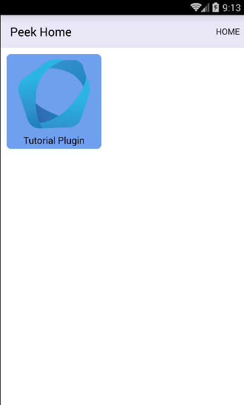

.. _learn_plugin_development_add_mobile:

==================
Add Mobile Service
==================

The mobile service is for the users. It's the interface designed for mobile devices.

The Mobile service is known as the "frontend" in web terminology.
The backend for the Mobile service is the Client service.

The Peek Mobile Service has two builds, a
`NativeScript <https://docs.nativescript.org/angular/start/introduction.html>`_ build
and a `web build <https://angular.io/docs/ts/latest/>`_.

In this document, we'll add the start of both the mobile and web builds for the plugin.

We only scratch the surface of using Angular, that`s outside the scope of this guide.

See :ref:`developing_with_the_frontends` to learn more about how Peek
pieces together the frontend code from the various plugins.

Mobile File Structure
---------------------

Add Directory :file:`mobile-app`
````````````````````````````````

The :file:`mobile-app` directory will contain the plugins the mobile Angular application requires.

Angular "Lazy Loads" this part of the plugin, meaning it only loads it when the user
navigates to the page, and unloads it when it's finished.

This allows large, single page web applications to be made. Anything related to the user
interface should be lazy loaded.

----

Create directory :file:`peek_plugin_tutorial/_private/mobile-app`

Add File :file:`tutorial.component.mweb.html`
`````````````````````````````````````````````

The :file:`tutorial.component.mweb.html` file is the web app HTML **view** for
the Angular component :file:`tutorial.component.ts`.

This is standard HTML that is compiled by Angular. Angular compiles the HTML,
looking for Angular directives, and alters it in place in the browser.

For more information about Angular directives, See:

*   `Attribute Directives <https://angular.io/docs/ts/latest/guide/attribute-directives.html>`_
*   `Structural Directives <https://angular.io/docs/ts/latest/guide/structural-directives.html>`_

----

Create the file
:file:`peek_plugin_tutorial/_private/mobile-app/tutorial.component.mweb.html`
and populate it with the following contents.

::

        <div class="container">
            <h1 class="text-center">Tutorial Plugin</h1>
            <p>Angular2 Lazy Loaded Module</p>
            <p>This is the root of the mobile app for the Tutorial plugin</p>
        </div>


Add File :file:`tutorial.component.ns.html`
```````````````````````````````````````````

The :file:`tutorial.component.ns.html` file is the default NativeScript **view** for
the Angular component :file:`tutorial.component.ts`.

This is standard NativeScript, it's actually XML, but the IDE provides better assistance
and autocomplete for the angular directives if the file ends in .html.

NativeScript doesn't run in a browser. It's a native mobile app running NodeJS, and many
special bindings that allow JavaScript/TypeScript to call native Android and iOS
libraries.

Using this technique, NativeScript can call native UI libraries, allowing developers
to write code with Javascript, yet still have smooth, responsive and offline
user interfaces.

See `Adding UI elements <http://docs.nativescript.org/angular/tutorial/ng-chapter-2#24-adding-ui-elements>`_
, for the NativeScript introduction of their views.

.. important::  NativeScript is nothing like HTML, It's important to understand this.
                The only common element is that they both have Angular directives.

                NativeScript has a completely different layout system, there are no
                :code:`<p>` tags, and plain text outside of tags won't just show up in
                the app.

----

Create the file :file:`peek_plugin_tutorial/_private/mobile-app/tutorial.component.ns.html`
and populate it with the following contents.

::

        <StackLayout class="p-20" >
            <Label text="Tutorial Plugin" class="h1 text-center"></Label>
            <Label text="Angular2 Lazy Loaded Module" class="h3 text-center"></Label>
            <Label text="This is the root of the mobile app for the Tutorial plugin"
                class="h3 text-center"></Label>
        </StackLayout>


Add File :file:`tutorial.component.ts`
``````````````````````````````````````

The :file:`tutorial.component.ts` is the Angular Component for the mobile page.
It's loaded by the default route defined in :file:`tutorial.module.ts`.

.. note::   The one Angular component drives both the NativeScript and Web app views.
            More on this later.

----

Create the file :file:`peek_plugin_tutorial/_private/mobile-app/tutorial.component.ts`
and populate it with the following contents.

::

        import {Component} from "@angular/core";

        @Component({
            selector: 'plugin-tutorial',
            templateUrl: 'tutorial.component.mweb.html',
            moduleId: module.id
        })
        export class TutorialComponent {

            constructor() {

            }

        }


Add File :file:`tutorial.module.ts`
```````````````````````````````````

The :file:`tutorial.module.ts` is the main Angular module of the plugin.

This file can describe other routes, that will load other components.
This is standard Angular.

`See NgModule for more <https://angular.io/docs/ts/latest/guide/ngmodule.html>`_


----

Create the file :file:`peek_plugin_tutorial/_private/mobile-app/tutorial.module.ts`
and populate it with the following contents.

::

        import {CommonModule} from "@angular/common";
        import {NgModule} from "@angular/core";
        import {Routes} from "@angular/router";

        // Import a small abstraction library to switch between nativescript and web
        import {PeekModuleFactory} from "@synerty/peek-util-web";

        // Import the default route component
        import {TutorialComponent} from "./tutorial.component";


        // Define the child routes for this plugin
        export const pluginRoutes: Routes = [
            {
                path: '',
                pathMatch:'full',
                component: TutorialComponent
            }

        ];

        // Define the root module for this plugin.
        // This module is loaded by the lazy loader, what ever this defines is what is started.
        // When it first loads, it will look up the routs and then select the component to load.
        @NgModule({
            imports: [
                CommonModule,
                PeekModuleFactory.RouterModule,
                PeekModuleFactory.RouterModule.forChild(pluginRoutes),
                ...PeekModuleFactory.FormsModules
            ],
            exports: [],
            providers: [],
            declarations: [TutorialComponent]
        })
        export class TutorialModule
        {
        }


Download Icon :file:`icon.png`
``````````````````````````````

The Peek mobile interface has a home screen with apps on it, this icon will be the
tutorial plugins app icon.

.. image:: TutorialExampleIcon.png
   :scale: 30 %

----

Create directory :file:`peek_plugin_tutorial/_private/mobile-assets`

----

Download this plugin app icon
`TutorialExampleIcon.png <http://synerty-peek.readthedocs.io/en/latest/_images/TutorialExampleIcon.png>`_
to :file:`peek_plugin_tutorial/_private/mobile-assets/icon.png`


Edit File :file:`plugin_package.json`
`````````````````````````````````````

Finally, Edit the file :file:`peek_plugin_tutorial/plugin_package.json` to tell the
platform that we want to use the mobile service:

#.  Add **"mobile"** to the requiresServices section so it looks like ::

        "requiresServices": [
            "mobile"
        ]

#.  Add the **mobile** section after **requiresServices** section: ::

        "mobile": {
            "showHomeLink": true,
            "appDir": "_private/mobile-app",
            "appModule": "tutorial.module#TutorialModule",
            "assetDir": "_private/mobile-assets",
            "icon": "/assets/peek_plugin_tutorial/icon.png"
        }


#.  Ensure your JSON is still valid (Your IDE may help here)

Here is an example ::

        {
            ...
            "requiresServices": [
                ...
                "mobile"
            ],
            ...
            "mobile": {
                "showHomeLink": true,
                "appDir": "_private/mobile-app",
                "appModule": "tutorial.module#TutorialModule",
                "assetDir": "_private/mobile-assets",
                "icon": "/assets/peek_plugin_tutorial/icon.png"
            }
        }

Running the Mobile Web App
--------------------------

The Peek Client service provides the web service that serves the mobile angular
web app.

The Peek Client service takes care of combining all the plugin files into the build
directories in the peek_mobile package. We will need to restart Peek Client for it to
include our plugin in the mobile UI.

See :ref:`developing_with_the_frontends` for more details.

Check File :file:`~/peek-client.home/config.json`
`````````````````````````````````````````````````

Check the :file:`~/peek-client.home/config.json` file:

#.  Ensure **frontend.webBuildEnabled** is set to **true**, with no quotes
#.  Ensure **frontend.webBuildPrepareEnabled** is set to **true**, with no quotes

.. note:: It would be helpful if this is the only plugin enabled at this point.

Example: ::

        {
            ...
            "frontend": {
                ...
                "webBuildEnabled": true,
                "webBuildPrepareEnabled": true
            },
            ...
        }


Run :file:`run_peek_client`
```````````````````````````

You can now run the peek client, you should see your plugin load. ::

        peek@peek:~$ run_peek_client
        ...
        INFO peek_platform.frontend.WebBuilder:Rebuilding frontend distribution
        ...
        INFO txhttputil.site.SiteUtil:Peek Client is alive and listening on http://10.211.55.14:8000
        ...

----

Now bring up a web browser and navigate to
`http://localhost:8000 <http://localhost:8000>`_ or the IP mentioned in the output of
:command:`run_peek_client`.

If you see this, then congratulations, you've just enabled your plugin to use the
Peek Platform, Mobile Service Web App.

.. image:: LearnAddMobileWebHomeScreen.png

----

Click on the Tutorial app, you should then see your plugins default route component.

.. image:: LearnAddMobileWebPluginScreen.png


Running the Mobile NativeScript App
-----------------------------------

The Peek Client service provides the websocket that the NativeScript app uses.
The NativeScript application uses all the same code to run as the Web App, The only
difference is the view file.

With Peek, you can develop a web app and a native app, with little more effort.

The Peek Client service takes care of combining all the plugin files into the build
directories in the peek_mobile package. We will need to restart Peek Client for it to
include our plugin in the mobile UI.

See :ref:`developing_with_the_frontends` for more details.


Check File :file:`~/peek-client.home/config.json`
`````````````````````````````````````````````````

Check the :file:`~/peek-client.home/config.json` file:

#.  Ensure **frontend.nativescriptBuildPrepareEnabled** is set to **true**, with no quotes

.. note:: It would be helpful if this is the only plugin enabled at this point.

Example: ::

        {
            ...
            "frontend": {
                ...
                "nativescriptBuildPrepareEnabled": true,
            },
            ...
        }


Run :file:`run_peek_client`
```````````````````````````

Run the peek client, The NativeScript will be offline with out it. ::

        peek@peek:~$ run_peek_client
        ...
        INFO txhttputil.site.SiteUtil:Peek Field Site is alive and listening on http://0.0.0.0:8000
        ...

tns run android
```````````````

This section runs the NativeScript app on an Emulator, or a real Device.
NativeScript must be installed before proceeding.

*   :ref:`setup_nativescript_windows`
*   :ref:`setup_nativescript_debian`


See
`Running NativeScript Apps <http://docs.nativescript.org/angular/tutorial/ng-chapter-1#12-running-apps>`_
for some details on :command:`tns run`.

We use the Android platform to test the apps as it runs on Windows, Mac and Linux.

In this example, NativeScript will run in all connected devices and emulators, or it
will start an emulator.

----

Change directory to the build-ns directory under the peek_mobile python package.
Run the following in bash to get the path of the build-ns directory: ::

        python << EOPY
        import os.path as p
        import peek_mobile
        print("Using peek_mobile version %s, located at:" % peek_mobile.__version__)
        print("    " + p.join(p.dirname(peek_mobile.__file__), 'build-ns'))
        EOPY

Now CD to that directory, Example: ::

        cd /home/peek/project/peek-mobile/peek_mobile/build-ns

----

Check the devices that are connected, if one isn't connected, NativeScript will try to
start the standard android emulator. ::

        peek@peek:~/project/peek-mobile/peek_mobile/build-ns$ tns device list
        iTunes is not available for this operating system. You will not be able to work with connected iOS devices.
        ┌───┬─────────────┬──────────┬───────────────────┬──────────┬───────────┐
        │ # │ Device Name │ Platform │ Device Identifier │ Type     │ Status    │
        │ 1 │ vbox86p     │ Android  │ emulator-5554     │ Emulator │ Connected │
        └───┴─────────────┴──────────┴───────────────────┴──────────┴───────────┘

----

Run :command:`tns run android` ::

    tns run android

It will take up to two minutes to build, install and run.

----

You should see the app start, with a splash screen. Then you will see your plugin on the
home screen. Touch the App/Plugin icon.




----

If you see this, then congratulations, you've just enabled your plugin to use the
Peek Platform, Mobile Service NativeScript App.

And if this is your first Native mobile app, Congratulations, the sky is your limit.

.. image:: LearnAddMobileNSPluginScreen.png

