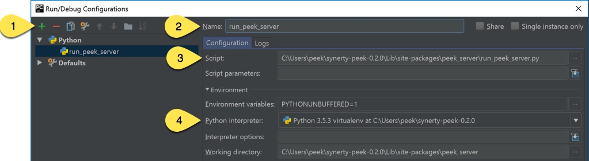

.. _setup_pycharm_ide:

=================
Setup Pycharm IDE
=================

#.  Open pycharm,

    #.  Open the peek project, open in new window
    #.  Open each of the other projects mentioned above, add to current window

#.  File -> Settings (Ctrl+Alt+S with eclipse keymap)

    #. Editor -> Inspection (use the search bar for finding the inspections)

        #.  Disable Python -> "PEP8 Naming Convention Violation"
        #.  Change Python -> "Type Checker" from warning to error
        #.  Change Python -> "Incorrect Docstring" from warning to error
        #.  Change Python -> "Missing type hinting ..." from warning to error
        #.  Change Python -> "Incorrect call arguments" from warning to error
        #.  Change Python -> "Unresolved references" from warning to error

    #. Project -> Project Dependencies

        #.  peek_platform depends on -> plugin_base
        #.  peek_logic_service depends on -> peek_platform, peek_admin_app
        #.  peek_office_service depends on -> peek_platform, peek_field_app
        #.  peek_agent_service depends on -> peek_platform
        #.  peek_worker_service depends on -> peek_platform

    #.  Project -> Project Structure

        #.  peek-field-app -> Excluded
        #.  peek-office-app -> Excluded
        #.  peek-admin-app -> Excluded

        .. image:: PyCharmSettingsProjectStructureExclude.jpg

    #.  Languages & Frameworks -> Node.js and NPM

        #.  Node interpreter -> ~/node-v10.20.0/bin/node
        #.  Remove other node interpreters

        .. image:: settings_nodejs_and_npm.png

    #.  Languages & Frameworks -> TypesScript

        #.  Node interpreter -> ~/node-v18.16.1/bin/node
        #.  Enable TypeScript Compiler -> Checked
        #.  Set options manually -> Checked
        #.  Command line options -> --target es5 --experimentalDecorators --lib es6,dom --sourcemap --emitDecoratorMetadata
        #.  Generate source maps -> Checked

        .. image:: settings_typescript.png

Configure your developing software to use the virtual environment you wish to use

Here is an example of the setting in PyCharm:

.. image:: PycharmProjectInterpreter.png

----

Restart the services that use the plugin

.. NOTE:: The plugins that aren't being developed should be installed with pip.

----

This is an example of running the peek logic service in debug mode using **PyCharm**

Under the drop down "Run" then "Edit Configurations..."

1.  Add new configuration, select "Python"
2.  Update the "Name:"
3.  Locate the script you wish to run
4.  Check that the "Python Interpreter" is correct

