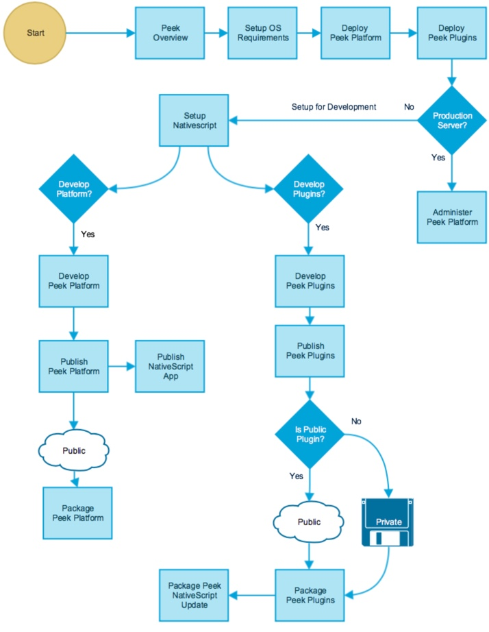

.. _how_to_use_peek_documentation:

How to Use Peek Documentation
-----------------------------

The Peek platform documentation is designed like code (IE, Modular).

Each blue square represents a document, follow this flow diagram to streamline your use
of the Peek documentation.

