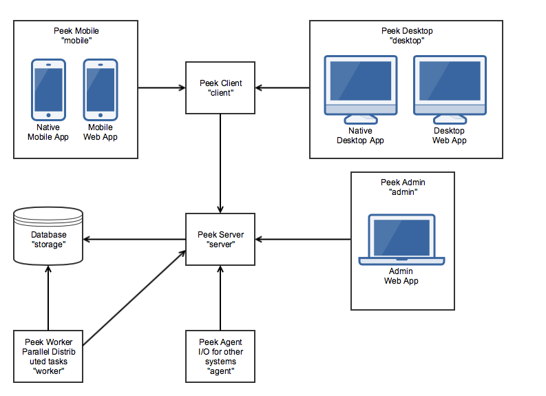
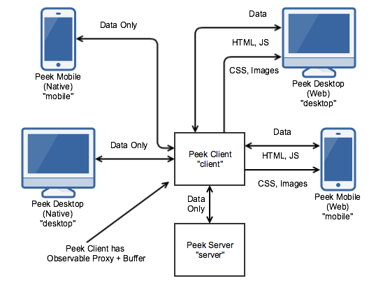
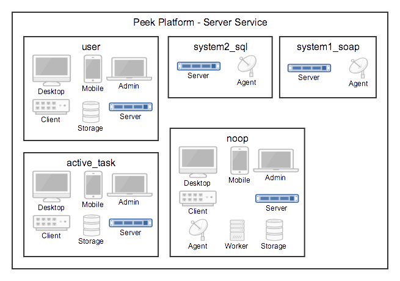
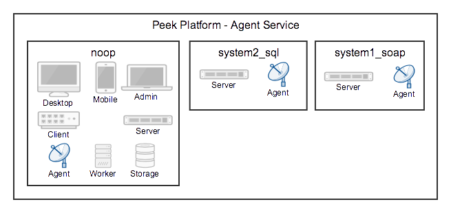
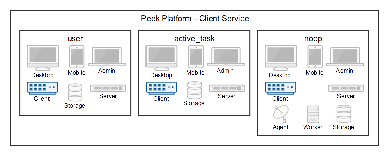

.. _overview:

========
Overview
========

Peek Platforms primary goal is to manage, run and provide services to, hundreds of
small units of code. We call these units of code, plugins.

These plugins build upon each others functionality to provide highly maintainable,
testable and enterprise grade environment.

Plugins can publish APIs for other plugins to use, and one plugin can run across all
services in the platform if it chooses.

The Peek Platform provides low level services, such as data transport,
database access, web server, etc. It effectively just bootstraps plugins.

With the Peek Platform up and running, plugins can be added and updated by dropping zip
files onto the peek admin web page. The platform then propagates the new plugin, loads
and runs it.

Higher level functionality is added by creating plugins.

Architecture
------------

The platform is distributed across several services, these services can be run all on
one server, or distributed across different hardware and split across firewalls.

Peek supports distribution across multiple servers and network segregation.

For example, if you want to provide a means of integrating with external, less secure
systems, you can place a "Peek Agent Service" in a DMZ to interface with the less secure
networks. The Peek Agent will talk upstream to the Peek Server.

The following diagram describes the architecture of the platform and the services
it provides.



Services
--------

This section describes the services which peek platform provides.

We use the term "service" with the meaning "the action of helping or doing
work for someone".
Each service is it's own entity which plugins can choose to run code on.

The exception is the "storage" service. The database can be accessed from the worker
and server services. The database upgrade scripts are run from the "server" service.
You could consider the database server to be the storage service.

Each service has it's logical place with in the architecture. (See the architecture
diagram above)


The services are as follows:

.. csv-table:: Peek Platform Services
    :header: "Service", "Language", "Description"
    :widths: auto

    "server", "python", "The center of the Peek Platform, ideal for central logic."
    "storage", "python", "This refers to support for persisting and retrieving database data."
    "client", "python", "The client service handles requests from 'desktop' and 'mobile'."
    "agent", "python", "The agent is a satellite service, integrating with external systems."
    "worker", "python", "The worker service provides parallel processing for computational intensive tasks"
    "admin", "typescript", "A web based admin interface for the peek platform"
    "mobile", "typescript", "The user interface for mobile devices."
    "desktop", "typescript", "The user interface for desktops"

.. note:: Where we refer to "Angular" this means Angular version 2+. Angular1 is known
            as "AngularJS"

Server Service
``````````````

The Peek Server Service is the central / main / core server in the peek architecture.
This is the ideal place for plugins to integrate with each other.

All other python services talk directly to this service, and only this service.

The main coordinating logic of the plugins should run on this service.


Storage Service
```````````````
The storage service is provided by a SQLAlchemy database library, supporting anywhere
from low level database API access to working with the database using a high level ORM.

Database schema versioning is handled by Alembic, allowing plugins to automatically
update their database schemas, or patch data as required.

The database access is available on the Peek Worker and Peek Server services.


Client Service
``````````````

The Client service was introduced to handle all requests from desktop, mobile and web
apps. Reducing the load on the Peek Server.

Multiple Client services can connect to one Server service, improving the maximum number
of simultaneous users the platform can handle.

The Peek Client server handles all the live data, and serves all the resources to
the Peek Desktop and Peek Mobile services.

The live data is serialised payloads, transferred over HTTP or Websockets. This is the
VortexJS library at work.

The Client service buffers observable data from the server. The client will ask the server
for data once, and then notifyDeviceInfo multiple users connected to the Client service when the
data arrives. However, Plugins can implement their own logic for this if required.

The Client serves all HTTP resources to the Desktop web apps and Mobile web apps,
this includes HTML, CSS, Javascript, images and other assets.

The following diagram gives an overview of the clients communications.




Mobile Service
``````````````


The mobile service provides two user interfaces, a native mobile app backed by
Telerik Nativescript + Angular, and an Angular web app.

VortexJS provides data serialisation and transport to the Peek Client service via
a websockets or HTTP connection.

VortexJS provides a method for sending actions to, and observing data from the
Peek Client service. Actions and observer data can be cached in the web/native app,
allowing it to work offline.

In web developers terminology, the Mobile service is called the frontend, and
the Client service is called the backend.

The Mobile service codes structure allows Angualar components to be reused to drive both
nativescript and web based interfaces. For example :

*   **my-component.ns.html**    (View for Nativescipt XML)
*   **my-component.ts**    (Angular component, written in Typescript)
*   **my-component.web.html**   (View for Browser HTML)


Desktop Service
```````````````


The Peek Desktop service is almost identical to the Mobile service, using
Electron + Angular for Native desktop apps and Angular for the web app.

The Desktop service has a different user interface, designed for desktop use.

The Desktop service codes structure allows Angualar components to be reused to drive both
electron and web based interfaces. For example :

*   **my-component.tron.html**    (View for Nativescipt XML)
*   **my-component.ts**    (Angular component, written in Typescript)
*   **my-component.web.html**   (View for Browser HTML)

Plugins can be structured to reuse code and Angular components between the Mobile
and Desktop services if they choose.

Worker Service
``````````````

The Peek Worker service provides parallel processing support for the platform using the
Celery project.

The Worker service is ideal for computationally or IO expensive operations.

The Peek Server queues tasks for the Worker service to process via a rabbitmq messaging
queue, the tasks are performed and the results are returned to the Peek Service via redis.

Tasks are run in forks, meaning there is one task per an operating system process, which
achives better performance.

Multiple Peek Worker services can connect to one Peek Server service.

Agent Service
`````````````
The Peek Agent service provides support for integrations with external system.

The Agent allows Peek to connect to other systems. There is nothing special about the
agent implementation, it's primary purpose is to separate external system integrations
from the Peek Server service.

Peek Agent can be placed in other networks, allowing greater separation and security from
Peek Server.

Here are some example use cases :

*   Quering and opdate Oracle databases.
*   Providing and connecting to SOAP services
*   Providing HTTP REST interfaces
*   Interfacing with other systems via SSH.

Admin Service
`````````````
The Peek Admin service is the Peek Administrators user interface, providing administration
for plugins and the platform.

The Peek Admin service is almost identical to the Desktop service, however it only has
the web app.

The Peek Admin service is an Angular web app.

Plugins
-------

The Peek Platform doesn't do much by it's self. It starts, makes all it's connections,
initialises databases and then just waits.

The magic happens in the plugins, plugins provide useful functionality to Peek.

A plugin is a single, small project focuses on providing one feature.

Enterprise Extensible
`````````````````````

The peek platform provides support for plugins to share the APIs with other plugins.

This means we can build functionality into the platform, by writing plugins.
For example, here are two publicly release plugins for Peek that add functionality :

    * Active Task Plugin - Allowing plugins to notifyDeviceInfo mobile device users
    * User Plugin - Providing simple user directory and authentication.

The "Active Task plugin" requires the "User Plugin".

Plugins can integrate with other plugins in the following services:

.. csv-table:: Peek Plugin Integration Support
    :header: "Service", "Plugin APIs"
    :widths: auto


    "server", "YES"
    "storage", "no"
    "client", "YES"
    "agent", "YES"
    "worker", "no"
    "admin", "YES"
    "mobile", "YES"
    "desktop", "YES"


You could create other "User Plugins" with the same exposed plugin API for different
backends, and the "Active Task" plugin wouldn't know the difference.

Stable, exposed APIs make building enterprise applications more manageable.

The next diagram provides an example of how plugins can integrate to each other.

Here are some things of interest :

*   The SOAP plugin is implemented to talk specifically to system1. It handles the burdon
    of implementing the system 1 SOAP interface.

*   The SOAP, User and Active Task plugins provide APIs on the server service that can
    be multiple feature plugins.

*   A feature plugin is just a name we've given to the plugin that provides features to
    the user. It's no different to any other plugin other than what it does.

.. image:: PluginIntegration.png

One Plugin, One Package
```````````````````````

All of the code for one plugin exists within a single python package. This one package
is installed on all of the services, even though only part of the plugin will run on each
service.

There are multiple entry hooks with in the plugin, one for each peek service
the plugin chooses to run on.

Each service will start a piece of the plugin, for example : Part of the plugin may run
on the server service, and part of the plugin may run on the agent service.

Here are some plugin examples, indicating the services each platform has been designed to
run on. Here are some things of interest :

*   The User and Active Task plugins don't require the agent or worker services, so they
    don't have implementation for them.

*   All plugins have implementation for the server service, this is an ideal place for
    plugins to integrate with each other.

.. image:: PluginArchitecture.png


This diagram illustrates how the plugins will run on the server service.

Each plugins python package is fully installed in the server services environment.
Plugins have entry points for the server service.
The server calls this server entry hook when it loads each plugin.



There are only two plugins that require the agent service, so the agent will only load
these two. Again, the whole plugin is installed in the agents python environment.



There are three plugins that require the client service, so the client will only load
these three. Again, the whole plugin is installed in the clients python environment.

The client, agent, worker and server services can and run from the one python
environment. This is the standard setup for single server environments.



There are three plugins that require the mobile service. The mobile service is a python
package that contains the build skeletins for the nativescript and web apps.

The client service combines (copies) the files required from each of the plugins into the
build environments, and then compiles the web app. (The Nativescript app is compiled
manually by developers)

The client and server services
prepare and compile the desktop, mobile and admin services, as these are all HTML,
Typescript and Nativescript.

The desktop, mobile and admin interfaces need the client and server python services to
run, so this compile arrangement makes sense.

.. image:: PluginsRunningOnMobile.png

.. _overview_noop_plugin_example:

Noop Plugin Example
-------------------

The NOOP plugin is a testing / example plugin.

It's designed to test the basic operations of the platform and runs on every service.
All of the code for the plugin is within one python packaged, named "peek-plugin-noop".

.. image:: OverviewNoopPlugin.png

The code is available here:
`Peek Plugin Noop, on bitbucket <https://bitbucket.org/synerty/peek-plugin-noop>`_,
It's folder structure looks like this :

*   :file:`peek-plugin-noop` (Root project dir, pypi package name)

    *   :file:`peek_plugin_noop` (The plugin root, this is the python package)

        *   :file:`_private` (All protected code lives in here)

            *   :file:`admin-app`   (The admin web based user interface)

            *   :file:`admin-assets`   (Static assets for the admin web UI)

            *   :file:`agent` (The code that runs on the agent service)

            *   :file:`alembic` (Database schema versioning scripts)

            *   :file:`client`  (The code that runs on the client service)

            *   :file:`desktop-app`   (The user interface that runs on the desktop/web)

            *   :file:`desktop-assets`    (Images for the desktop/web)

            *   :file:`mobile-app`   (The user interface that runs on the mobile/web devices)

            *   :file:`mobile-assets`    (Images for the mobile/web UI)

            *   :file:`server`  (The code that runs on the server service)

            *   :file:`storage`     (SQLAlchemy ORM classes for db access, used by server,worker)

            *   :file:`tuples`  (Private data structures)

            *   :file:`worker`  (The parallel processing  Celery tasks that are run on the worker)

        *   :file:`plugin-modules`   (Exposed API, index.ts will expose public declarations.
            Plugins can structure the subfolders however they like, this dir is available
            from node_modules/@peek/peek_plugin_noop)

            *   :file:`desktop`   (Exposed API, index.ts exposes desktop only declarations)

            *   :file:`mobile`   (Exposed API, index.ts exposes mobile only declarations)

            *   :file:`admin`   (Exposed API, index.ts exposes admin only declarations)

            *   :file:`_private`   (Code only used by this plugin)

                *   :file:`desktop`   (Private desktop declarations)

                *   :file:`mobile`   (Private mobile declarations)

                *   :file:`admin`   (Private admin declarations)

        *   :file:`agent`  (Exposed API, plugins on the agent service use this)

        *   :file:`client`  (Exposed API, plugins on the client service use this)

        *   :file:`server`  (Exposed API, plugins on the server service use this)

        *   :file:`tuples`  (Exposed Tuples, Tuples on any service use these data structures)


.. note:: Random Fact : Did you know that python can't import packages with hypons in them?

