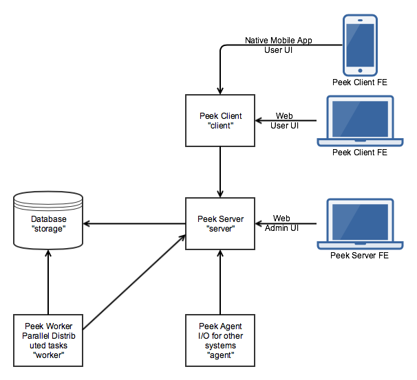

========
Overview
========

Peek Platforms primary goal is to manage, run and provide services to, hundreds of
small units of code. We call these units of code, plugins.

These plugins build upon each others functionality to provide highly maintainable,
testable and enterpise grade environment.

Plugins can publish APIs for other plugins to use, and one plugin can run across all
services in the platform if it chooses.

The Peek Platform provides low level services, such as data transport,
database access, web server, etc. It effectively just bootstraps plugins.

With the Peek Platform up and running, plugins can be added and updated by dropping zip
files onto the peek admin web page. The platform then propogates the new plugin, loads
and runs it.

Higher level functionality is added by creating plugins.

Architecture
------------

The platform is distributed across several services, these services can be run all on
one server, or distributed across different hardware and split across firewalls.

Peek supports distribution across multiple servers and network segregation.

For example, if you want to provide a means of integrating with external, less secure
systems, you can place a "Peek Agent Service" in a DMZ to interface with the less secure
networks. The Peek Agent will talk upstream to the Peek Server.

The following diagram describes the architecture of the platform and the services it
it provides.



Services
--------

This section describes the services which peek platform provides.

We use the term "service" with the meaning "the action of helping or doing
work for someone".
Each service is it's own entity which plugins can choose to run code on.

The exception is the "storage" service. The database can be accessed from the worker
and server services. The database upgrade scripts are run from the "server" service.
You could consider the database server to be the storage service.

Each service has it's logical place with in the architecture. (See the architecture
diagram above)


The services are as follows:

.. csv-table:: Peek Platform Services
    :header: "Service", "Language", "Description"
    :widths: auto

    "server", "python", "The center of the Peek Platform, ideal for central logic."
    "storage", "python", "This refers to support for persisting and retrieving database data."
    "client", "python", "The client service handles requests from 'desktop' and 'mobile'."
    "agent", "python", "The agent is a satelite service, integrating with external systems."
    "worker", "python", "The worker service provides parallel processing for computational intensive tasks"
    "admin", "typescript", "A web based admin interface for the peek platform"
    "mobile", "typescript", "The user interface for mobile devices."
    "desktop", "typescript", "The user interface for desktops"


Server Service
``````````````

The Peek Server Service is the central / main / core server in the peek architecture.
This is the ideal place for plugins to integrate with each other.

All other python services talk directly to this service, and only this service.

The main coordinating logic of the plugins should run on this service.


Storage Service
```````````````
The storage service is provided by a SQLAlchemy database library, supporting anywhere
from low level database API access to working with the database using a high level ORM.

Database schema versioning is handled by Alembic, allowing plugins to automatically
updage their database schemas, or patch data as required.

The database access is availible on the Peek Worker and Peek Server services.

Mobile Service
``````````````

Desktop Service
```````````````


Client Service
``````````````

Worker Service
``````````````

Agent Service
`````````````

Admin Service
`````````````


Plugins
-------

The Peek Platform doesn't do much by it's self. It starts, makes all it's connections,
initilises databases and then just waits.

The magic happens in the plugins, plugins provide useful functionality to Peek.

A plugin is a single, small project focuses on providing one feature.

One Plugin, Many Services
`````````````````````````

All of the code for one plugin exists within a single python package. This one package
is installed on all of the services, even though only part of the plugin will run on each
service.

There are muliple entry hooks with in the plugin, one for each peek service
the plugin chooses to run on.

Each service will start a peice of the plugin, for example : Part of the plugin may run
on the server service, and part of the plugin may run on the agent service.

Plugins, Integrating with Plugins
`````````````````````````````````

The peek platform provides support for plugins to share the APIs with other plugins.

This means we can build functionality into the platform, by writing plugins.
For example, there are two publicly release plugins for Peek that add functionality :

    * Active Task Plugin - Allowing plugins to notify mobile device users
    * User Plugin - Providing simple user directory and authentication.

The "Active Task plugin" requires the "User Plugin".

Plugins can integrate with other plugins in the following services:

.. csv-table:: Peek Plugin Integration Support
    :header: "Service", "Plugin APIs"
    :widths: auto


    "server", "YES"
    "storage", "no"
    "client", "YES"
    "agent", "YES"
    "worker", "no"
    "admin", "YES"
    "mobile", "YES"
    "desktop", "YES"

Enterprise Extensible
`````````````````````

You could create other "User Plugins" with the same exposed plugin API for different
backends, and the "Active Task" plugin wouldn't know the difference.

Stable, exposed APIs make building enterprise applications more managable.


Noop Plugin Example
-------------------

The NOOP plugin is a testing / example plugin.

It's folder structure looks like this

*   peek-plugin-noop (Root project dir, pypi package name)

    *   peek_plugin_noop (The plugin root, this is the python package)

        *   _private (All protected code lives in here)

            *   alembic (Database schema versioning scripts)

            *   client  (The code that runs on the client servce)

            *   client_fe_app   (The user interface that runs on the mobile/web devices)

            *   client_fe_assets    (Images for the mobile/web UI)

            *   server  (The code that runs on the server service)

            *   server_fe_app   (The admin web based user interface)

            *   storage     (SQLAlchemy ORM classes for db access, used by server,worker)

            *   worker  (The parallel processing  Celery tasks that are run on the worker)

        *   server  (Exposed API, plugins on the server service use this)

        *   client_fe_modules   (Exposed API, plugins in the mobile/web app can use this)


.. note:: Did you know that python can't import packages with hypons in them?