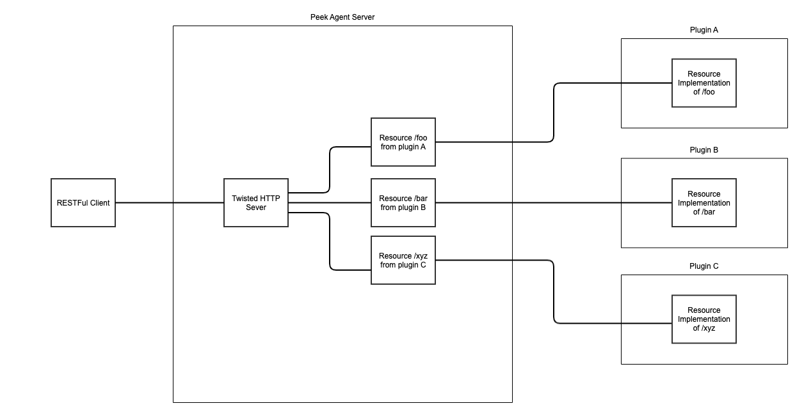
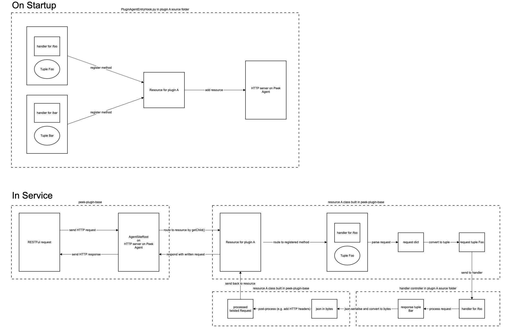

.. _peep7_overview:

==============
PEEP7 Overview
==============

Motivation
----------

This is designed to retrieve field assessments data by a RESTful API from an external service (works management system)
where stakeholders can view field assessments assigned to a field engineer instead of fetching it from ADMS.

PEEP7: Add RESTFul Service on Peek Agent Service
------------------------------------------------

In PEEP7, RESTful Service was added to the :code:`peek-agent-service` to allow data access via HTTP for
services external to the Peek stack.

----

The overall architecture is explained in the diagram below:

----

The structure of a RESTful Resource is explained in the diagram below:

