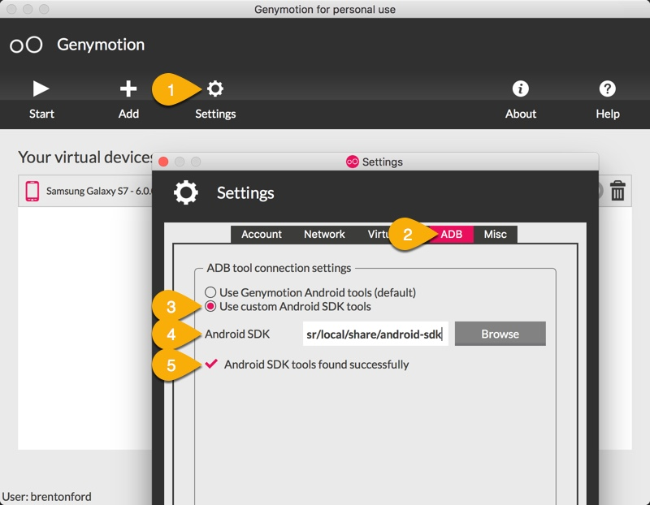

.. _setup_nativescript_macos:

========================
Setup Nativescript MacOS
========================

The Peek platform is designed to run on Linux, however, it is compatible with macOS.
Please read through all of the documentation before commencing the installation
procedure.

Installation Objective
----------------------

This *Installation Guide* contains specific macOS operating system requirements for the
configuring of synerty-peek.

Dependencies
````````````

This install procedure requires software installed by the prerequisites steps.


Optional  Software
``````````````````

*   Android Studio

*   VirtualBox

*   Geny Motion

Required Software
`````````````````

Below is a list of all the required software:

*   nativescript NPM package


Installation Guide
------------------


Android Studio
``````````````

Android Studio is required if you intend to develop the Android NativeScript app.

:Download: `Android Studio <https://developer.android.com/studio/index.html>`_

----

Launch the Android Studio DMG file.

----

Drag and drop Android Studio into the Applications folder, then launch Android Studio.

----

Select whether you want to import previous Android Studio settings, then click OK.

----

The Android Studio Setup Wizard guides you though the rest of the setup, which includes downloading Android SDK
components that are required for development.

----

Installation Type

:Select: Custom

----

SDK Component Setup

:Check: Performance

.. note:: If you're install inside a virtual machine you'll get the following message during the installation of
    Android Studio.

    Unable to install Intel HAXM
    HAXM doesn't support nested virtual machines.
    Unfortunately, the Android Emulator can't support virtual machine acceleration from within a virtual machine.


SDK Manager
```````````

In the Android Manager Welcome screen open the :code:`Configure` drop down at the bottom of the window and select
:code:`SDK Manager`

----

Go to the :code:`SDK Tools` tab

----

At the bottom of the window:

:Check: :code:`Show Package Details`

----

In the list:

:check: Android SDK Build-Tools :code:`25.0.3`

----

Select 'ok' and confirm the install

----

Close Android Studio


Nativescript Package
````````````````````

Install the required NPM packages

----

Create android dummy repositories file: ::

        touch ~/.android/repositories.cfg


----

Create symlinks for NativeScript install: ::

        ln -s /Users/peek/Library/Android/sdk /usr/local/opt/android-sdk
        sudo ln -s /Library/Java/JavaVirtualMachines/jdk1.8.0_144.jdk/Contents/Home /Library/Java/Home


----

Edit :file:`~/.bash_profile` and insert the following after the first block comment.

Make sure these are before any lines like: ::

        # If not running interactively, don't do anything

Insert : ::

        ##### SET THE ANDROID ENVIRONMENT #####
        export ANDROID_HOME="/Users/peek/Library/Android/sdk"


----

Run the following command in a new terminal: ::

        npm -g install nativescript@latest typescript tslint node-sass


----

Do you want to run the setup script?

:Answer: Y

----

Do you have Xcode installed (Xcode was installed during the OS Requirements Setup)?

:Answer: Y

----

software license agreements:

:Answer: Type :code:`q`, :code:`agree` and hit 'enter'

----

Allow the script to install Homebrew?

:Answer: N

----

Allow the script to install Java SE Development Kit?

:Answer: N

----

Allow the script to install Android SDK?

:Answer: N

----

Allow the script to install CocoaPods?

:Answer: Y

----

Allow the script to install xcodeproj?

:Answer: Y

----

Do you want to install Android emulator?

:Answer: N

----

Check the installation with :code:`tns` in a new terminal: ::

        tns doctor


.. note:: At this point you may find your self in a real life infinite loop.
    as tns doctor may ask you to run the setup script again if the setup is broken.


.. _android_emulator_setup:

Android Emulator Setup
----------------------

You can use any emulator.  Synerty has written instructions for GenyMotion.

.. warning:: If you've setup your development console in a VM, you'll need to install the Android emulator on the host
    machine.  Skip to these instructions: :ref:`android_emulator_setup_for_vm`.

----

Download and Install VirtualBox

:Download: `<http://download.virtualbox.org/virtualbox/5.1.26/VirtualBox-5.1.26-117224-OSX.dmg>`_

----

Install GenyMotion, all default options

:Download: `<https://www.genymotion.com/download/>`_

----

Run GenyMotion

----

Create Android device

1.  Select the 'Add' button to create a virtual device

2.  Select a device and select next

3.  Update the "Virtual device name" to something shorter (easier to remember and type) and
    select next

Your virtual device will be retrieved and deployed

----

ABD Tool Connection Settings



1.  Select 'Settings'

2.  Select the 'ABD' tab

3.  Check the 'Use custom Android SDK tools'

4.  Paste :code:`/Users/peek/Library/Android/sdk`

5.  Confirm the the Android SDK tools are found successfully

----

With a device selected in the "Your virtual devices" list select the "Start" button

Your device emulation will start in a new window

In a terminal run :code:`tns device` to check tns can find your device.


.. _android_emulator_setup_for_vm:

Android Emulator Setup for VM
-----------------------------

If you've setup your development console in a VM, you'll need to install the Android emulator on the **HOST MACHINE**.

Follow the :ref:`android_emulator_setup` instructions on the host machine then continue the following these
instructions.

.. warning:: If you are **NOT** using a VM these instructions are not required.

----

Go to the **HOST MACHINE**.

With your emulator device started, run the following commands in terminal: ::

        adb shell ifconfig
        adb tcpip 5556


----

Go to the **VM** and run the following commands in terminal.

Install Android Platform Tools: ::

        brew cask install android-platform-tools


----

Connect to your genyMotion device: ::

        adb connect <ip_of_genymotion>:5556


----

List attached devices: ::

        adb devices


----

Change to the :code:`build_ns` directory, check that tns can find the device: ::

        tns devices


What Next?
----------

Refer back to the :ref:`how_to_use_peek_documentation` guide to see which document to
follow next.
