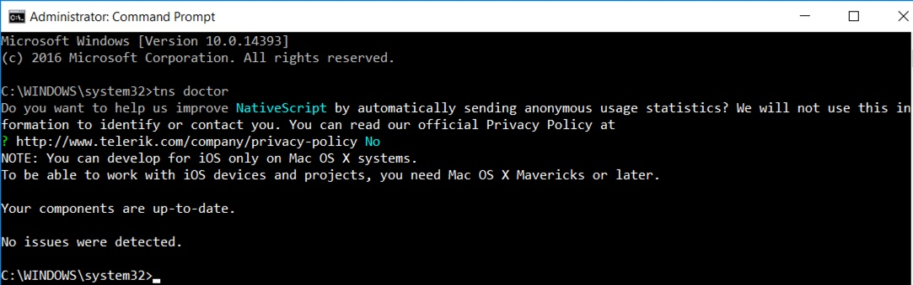

==========================
Setup Nativescript Windows
==========================

This page contains a list of all system requirements needed to build and run
NativeScript apps on Windows.

Installation Objective
----------------------

This *Windows Nativescript Install Guide* contains specific Windows operating system
requirements for development of synerty-peek.

Dependencies
````````````

This install procedure requires "Node.js 7+ and NPM 3+" as documented in the *Windows
Requirements Install Guide* (WindowsRequirementsSetup.rst).

Required Software
`````````````````

Below is a list of all the required software:

*  Google Chrome
*  chocolatey
*  Java JDK
*  Android SDK
*  nativescript NPM package
*  Android Emulator


Optional  Software
``````````````````

*   VirtualBox
*   GenyMotion (Synerty uses GenyMotion)

Online Installation Guide
-------------------------

Install google Chrome
`````````````````````

Install google chrome

Install Chocolatey
``````````````````

Run the command prompt as an Administrator

----

Copy and paste the following script in the command prompt ::

    @powershell -NoProfile -ExecutionPolicy unrestricted -Command "iex ((new-object net.webclient).DownloadString('https://chocolatey.org/install.ps1'))" && SET PATH=%PATH%;%ALLUSERSPROFILE%\chocolatey\bin

----

Restart the command prompt.

Java JDK
````````

In the command prompt, run the following command ::

    choco install jdk8 -y

Android SDK
```````````

In the command prompt, run the following command ::

    choco install android-sdk -y

----

Restart the command prompt.

----

Install the required Android SDKs and the Local Maven repository for Support Libraries ::

    echo yes | "%ANDROID_HOME%\tools\android" update sdk --filter tools,platform-tools,android-23,build-tools-23.0.3,extra-android-m2repository,extra-google-m2repository,extra-android-support --all --no-ui

    echo yes | "%ANDROID_HOME%\tools\android" update sdk --filter tools,platform-tools,android-25,build-tools-25.0.2,extra-android-m2repository,extra-google-m2repository,extra-android-support --all --no-ui

Nativescript Package
````````````````````

Run the following command ::

    npm i -g nativescript

----

Do you want to run the setup script?

:Answer: N

----

Restart the command prompt

----

Confirm Environment Variable ANDROID_HOME ::

        C:\Users\peek\AppData\Local\Android\android-sdk

----

Confirm Environment Variable JAVA_HOME ::

        C:\Program Files\Java\jdk1.8.0_121

----

Check the installation with tns ::

    tns doctor



Android Emulator Setup
``````````````````````

You can use any emulator.  Synerty has written instructions for GenyMotion.

:Download - with Virtualbox: `<https://www.genymotion.com/download/>`_

Install GenyMotion with Virtualbox, all default options

----

Run both GenyMotion and Virtualbox

----

In GenyMotion select the add button to create a virtual device

----

Select a device and select next

----

Update the "Virtual device name" to something shorter (easier to remember and type) and
select next

Your virtual device will be retrieved and deployed

----

With a device selected in the "Your virtual devices" list select the "Start" button

Your device emulation will start in a new window
