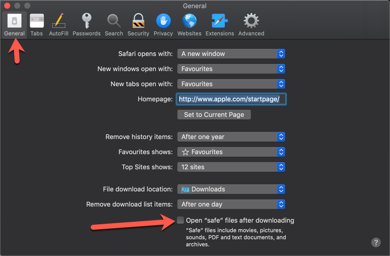

.. _setup_os_requirements_macos:

===========================
Setup OS Requirements macOS
===========================

This section describes how to perform the setup for macOS (previously OSX).

Please read through all of the documentation before commencing the installation procedure.


Installation Objective
----------------------

This Installation Guide contains specific Mac 11.2.1 Big Sur operating system requirements
for the configuring of synerty-peek.


Required Software
`````````````````

Some of the software to be installed requires internet access. For offline installation
some steps are required to be installed on another online server for the files to be
packaged and transferred to the offline server.

Below is a list of all the required software:

*   Xcode (from the app store)

*   Homebrew

*   Python 3.6.x

*   Postgres 12.x


Optional Software
`````````````````

- Oracle Client

Installing Oracle Libraries is required if you intend on installing the peek agent.
Instruction for installing the Oracle Libraries are in the Online Installation Guide.

- FreeTDS

FreeTDS is an open source driver for the TDS protocol, this is the protocol used to
talk to the MSSQL SQLServer database.

.. _macos_install_prerequisites:

Installation Guide
------------------

Follow the remaining section in this document to prepare your macOS operating system
to run the Peek Platform.

The instructions on this page don't install the peek platform, that's done later.

Set Terminal shell to Bash
--------------------------

Press :code:`Command + Space` to bring up preferences.

----

Type “terminal”

----

Run the following command and enter the password when prompted

----

code::

    chsh -s /bin/bash

This will change your chosen shell from zsh to Bash.


Safari Open Safe Files
----------------------

If you're using safari on the mac (which you probably are), make sure
**Open "Safe" files after downloading** is turned off.

This will cause Safari to unzip files that have been downloaded, and invalidate
some of the install steps.

----

In Safari, press :code:`Command + ,` to bring up preferences.

----

Uncheck the **Open "Safe" files after downloading** checkbox.



----

Close safari preferences.


Create Peek Platform OS User
----------------------------

Alternatively to creating a :code:`peek` user, if you are developing with peek you
might want to Symlink the :code:`/Users/*developerAccount*` to :code:`/Users/peek`.
If doing this run: :code:`sudo ln -s /Users/*developerAccount*/ /Users/peek` then
skip to the next step :ref:`installing_xcode`.

Create a user account for :code:`peek` with admin rights. ::

    sudo ln -s /Users/*developerAccount*/ /Users/peek


----

:Account Type: Administrator
:Username: peek
:Password: PA$$W0RD

----

Sign in to the peek account.

.. important:: All steps after this point assume you're logged in as the peek user.

.. _installing_xcode:

Install Xcode
-------------

From the app store, install Xcode.

----

Run Xcode and accept 'Agree' to the license.  Xcode will then install components.

----

Exit Xcode

----

Run Terminal

----

Apple's Command Line Developer Tools can be installed on recent OS versions by
running this command in the Terminal: ::

        sudo xcode-select -r

----

A popup will appear, select 'Install' then 'Agree' to the license.

----

Agree to the Xcode license in Terminal run: ::

        sudo xcodebuild -license


Type :code:`q`, type :code:`agree` and hit 'Enter'

Install Homebrew
----------------

Edit :file:`~/.bash_profile` and insert the following: ::

        #### USE THE GNU TOOLS ####
        # Set PATH to gnu tools
        export PATH="`echo ~/bin:$PATH`"

----

To install Homebrew, run the following command in terminal: ::

        /usr/bin/ruby -e "$(curl -fsSL https://raw.githubusercontent.com/Homebrew/install/master/install)"

----

Install gnu-sed for the build scripts ::

        brew install gnu-sed

----

Install wget, needed for python download ::

        brew install wget

----

Create the symlinks to prefer the GNU tools ::

        mkdir ~/bin
        ln -s `which gsed` ~/bin/sed

----

Install the dev libs that the python packages will need to compile ::

        brew install openssl@1.1 zlib openldap freetds


----

Install libgeos ::

    wget https://raw.githubusercontent.com/Homebrew/homebrew-core/master/Formula/geos.rb
    brew install geos.rb
    rm geos.rb


Preparing .bash_profile
-----------------------

Edit :file:`~/.bash_profile` and insert the following: ::

        ##### SET THE PEEK ENVIRONMENT #####
        # Setup the variables for PYTHON
        export PEEK_PY_VER="3.9.1"
        export PATH="/Users/peek/opt/bin:$PATH"

        # Set the variables for the platform release
        # These are updated by the deploy script
        export PEEK_ENV=""
        export PATH="${PEEK_ENV}/bin:$PATH"

----

.. warning:: Restart your terminal you get the new environment.


Install Python 3.9.1
--------------------

Download and unarchive the supported version of Python ::

        cd ~
        source .bash_profile
        wget https://github.com/python/cpython/archive/v${PEEK_PY_VER}.zip
        unzip v${PEEK_PY_VER}.zip
        cd cpython-${PEEK_PY_VER}

----

Configure the build ::

        export LDFLAGS="-L/usr/local/opt/openssl/lib -L/usr/local/opt/zlib/lib"
        export CPPFLAGS="-I/usr/local/opt/openssl/include -I/usr/local/opt/zlib/include"
        export PKG_CONFIG_PATH="/usr/local/opt/openssl/lib/pkgconfig:/usr/local/opt/zlib/lib/pkgconfig"

        ./configure \
            --prefix=$HOME/opt \
            --enable-optimizations \
            --enable-shared \
            --with-openssl=$(brew --prefix openssl)

----

Make and Make install the software ::

        make install

----

Cleanup the download and build dir ::

        cd
        rm -rf cpython-${PEEK_PY_VER}
        rm v${PEEK_PY_VER}.zip

----

Symlink the python3 commands so they are the only ones picked up by path. ::

        cd /Users/peek/opt/bin
        ln -s pip3 pip
        ln -s python3 python
        cd


----

Open a new terminal and test that the setup is working ::

        pass="/Users/peek/opt/bin/python"
        [ "`which python`" == "$pass" ] && echo "Success" || echo "FAILED"

        pass="Python ${PEEK_PY_VER}"
        [ "`python --version`" == "$pass" ] && echo "Success" || echo "FAILED"

        pass="/Users/peek/opt/bin/pip"
        [ "`which pip`" == "$pass" ] && echo "Success" || echo "FAILED"


        pass="pip 20.2.3 from /Users/peek/opt/lib/python3.9/site-packages/pip (python 3.9)"
        [ "`pip --version`" == "$pass" ] && echo "Success" || echo "FAILED"


----

Upgrade pip: ::

    pip install --upgrade pip

----

The following packages are required to package/deploy the macOS release.

.. note:: This is required for the pymysql setup.py
         ::

            pip install Cython

----

synerty-peek is deployed into python virtual environments.
Install the virtualenv python package ::

        pip install virtualenv


----

The Wheel package is required for building platform and plugin releases ::

        pip install wheel

.. _macos_install_postgresql:

Install PostgreSQL
------------------

Install the relational database Peek stores its data in.
This database is PostgreSQL 12.

.. note:: Run the commands in this step as the :code:`peek` user.

Download the PostgreSQL source code ::

    PEEK_PG_VER=12.5
    SRC_DIR="$HOME/postgresql-${PEEK_PG_VER}"

    # Remove the src dir and install file
    rm -rf ${SRC_DIR} || true
    cd $HOME

    wget https://ftp.postgresql.org/pub/source/v${PEEK_PG_VER}/postgresql-${PEEK_PG_VER}.tar.bz2
    tar xjf postgresql-${PEEK_PG_VER}.tar.bz2

    cd ${SRC_DIR}


----

Configure and build PostGresQL ::

    export CPPFLAGS=" -I$(brew --prefix openssl@1.1)/include "
    export LDFLAGS=" -L$(brew --prefix openssl@1.1)/lib "

    ./configure \
          --disable-debug \
          --prefix=$HOME/opt \
          --enable-thread-safety \
          --with-openssl \
          --with-python

    make -j4

    make install-world

    # this is required for timescale to compile
    cp ${SRC_DIR}/src/test/isolation/pg_isolation_regress ~/opt/bin


----

Remove install files to clean up the home directory ::

    # Remove the src dir and install file
    cd
    rm -rf ${SRC_DIR}*

----

Initialise a PostgreSQL database ::

    #Refresh .bash_profile so initdb can find postgres
    source .bash_profile

    initdb --pgdata=$HOME/pgdata/12 --auth-local=trust  --auth-host=md5


----

Tune the :file:`postgresql.conf` ::

    F="$HOME/pgdata/12/postgresql.conf"

    sed -i 's/max_connections = 100/max_connections = 200/g' $F


----

Install CMake
`````````````

Download CMake source code::

    cd $HOME
    PEEK_CMAKE_VER=3.19.2
    SRC_DIR="$HOME/CMake-${PEEK_CMAKE_VER}"
    wget https://github.com/Kitware/CMake/archive/v${PEEK_CMAKE_VER}.zip

    unzip v${PEEK_CMAKE_VER}.zip
    cd ${SRC_DIR}


Compile CMake from source::

    ./configure --prefix=$HOME/opt

    make -j6 install

    # Remove the src dir and install file
    cd
    rm -rf ${SRC_DIR}*
    rm v${PEEK_CMAKE_VER}.zip


Install PostgreSQL Timescaledb
``````````````````````````````

Next install timescaledb, this provides support for storing large amounts of historical
data.

`www.timescale.com <https://www.timescale.com>`_

----

Download the timescaledb source code ::

    PEEK_TSDB_VER=1.7.4

    cd
    wget https://github.com/timescale/timescaledb/archive/${PEEK_TSDB_VER}.zip
    unzip ${PEEK_TSDB_VER}.zip
    cd timescaledb-${PEEK_TSDB_VER}


----

Install the packages: ::

    export CPPFLAGS=`pg_config --cppflags`
    export LDFLAGS=`pg_config --ldflags`
    export OPENSSL_ROOT_DIR="/usr/local/opt/openssl/"


    # Bootstrap the build system
    ./bootstrap -DAPACHE_ONLY=1

    # To build the extension
    cd build && make

    # To install
    make install

    # Cleanup the source code
    cd
    rm -rf ${PEEK_TSDB_VER}.zip
    rm -rf timescaledb-${PEEK_TSDB_VER}


----

Install timescaledb-tune: ::

    wget https://timescalereleases.blob.core.windows.net/homebrew/timescaledb-tools-0.8.1.tar.lzma
    tar xf timescaledb-tools-0.8.1.tar.lzma
    cp timescaledb-tools/timescaledb-tune $HOME/opt/bin
    rm -rf timescaledb-tools
    rm timescaledb-tools-0.8.1.tar.lzma

----

Tune the database: ::

    PGVER=12
    FILE="$HOME/pgdata/${PGVER}/postgresql.conf"
    timescaledb-tune -quiet -yes -conf-path ${FILE} -pg-version ${PGVER}


Finish PostgreSQL Setup
````````````````````````

Make PostgreSQL a service :

.. note:: This will require sudo permissions

Run the following command ::

    # Make sure there is a LaunchAgents folder
    mkdir -p ~/Library/LaunchAgents/

    # Create the plist file
    cat <<EOF > ~/Library/LaunchAgents/postgresql.plist
    <?xml version="1.0" encoding="UTF-8"?>
    <!DOCTYPE plist PUBLIC "-//Apple//DTD PLIST 1.0//EN" "http://www.apple.com/DTDs/PropertyList-1.0.dtd">
    <plist version="1.0">
    <dict>
      <key>KeepAlive</key>
      <true/>
      <key>Label</key>
      <string>postgresql</string>
      <key>ProgramArguments</key>
      <array>
        <string>${HOME}/opt/bin/postgres</string>
        <string>-D</string>
        <string>${HOME}/pgdata/12</string>
      </array>
      <key>RunAtLoad</key>
      <true/>
      <key>WorkingDirectory</key>
      <string>${HOME}/opt</string>
      <key>StandardOutPath</key>
      <string>${HOME}/pgdata/12/postgres.log</string>
      <key>StandardErrorPath</key>
      <string>${HOME}/pgdata/12/postgres.log</string>
    </dict>
    </plist>
    EOF

    # Tell launchctl to use the plist
    launchctl load ~/Library/LaunchAgents/postgresql.plist


----

Check that the service has started: ::

    pgrep -laf postgres


Finish configuring and starting PostgreSQL.

----

Allow the peek OS user to login to the database as user peek with no password ::

        F=/usr/local/var/postgres/pg_hba.conf
        cat | sudo tee $F <<EOF
        # TYPE  DATABASE        USER            ADDRESS                 METHOD
        local   all             postgres                                peer
        local   all             peek                                    trust

        # "local" is for Unix domain socket connections only
        local   all             all                                     peer
        # IPv4 local connections:
        host    all             all             127.0.0.1/32            md5
        # IPv6 local connections:
        host    all             all             ::1/128                 md5
        EOF


----

Create the database ::

        createdb -O peek peek

.. note:: If you already have a database, you may now need to upgrade the timescale
          extension. ::

                psql peek <<EOF
                ALTER EXTENSION timescaledb UPDATE;
                EOF


----

Set the PostgreSQL peek users password ::

        psql -d postgres -U peek <<EOF
        \password
        \q
        EOF

        # Set the password as "PASSWORD" for development machines
        # Set it to a secure password from https://xkpasswd.net/s/ for production

----

Cleanup traces of the password ::

        [ ! -e ~/.psql_history ] || rm ~/.psql_history


----

Finally, Download pgAdmin4 - A graphically PostgreSQL database administration tool.

Download the latest version of pgAdmin4 for macOS from the following link

https://www.pgadmin.org/download/pgadmin-4-macos/

Install Worker Dependencies
---------------------------

Install the parallel processing queue we use for the peek-worker-service tasks.


Redis
`````

Install Redis via Homebrew with the following command: ::

        brew install redis


----

Start redis and create a start at login launchd service: ::

        brew services start redis


----

Open new terminal and test that Redis setup is working ::

        pass="/usr/local/bin/redis-server"
        [ "`which redis-server`" == "$pass" ] && echo "Success" || echo "FAILED"


----

Increase the size of the redis client queue ::

        BEFORE="client-output-buffer-limit pubsub 64mb 16mb 90"
        AFTER="client-output-buffer-limit pubsub 32mb 8mb 60"
        sed -i "s/${BEFORE}/${AFTER}/g" /usr/local/etc/redis.conf

        brew services restart redis

RabbitMQ
````````

Install RabbitMQ via Homebrew with the following command: ::

        brew install rabbitmq


----

Start rabbitmq and create a start at login launchd service: ::

        brew services start rabbitmq


----

Edit :file:`~/.bash_profile` and insert the following: ::

        ##### SET THE RabbitMQ ENVIRONMENT #####
        # Set PATH to include RabbitMQ
        export PATH="/usr/local/sbin:$PATH"


----

Refresh the bash_profile: ::

        source $HOME/.bash_profile


----

Open new terminal and test that RabbitMQ setup is working ::

        pass="/usr/local/sbin/rabbitmq-server"
        [ "`which rabbitmq-server`" == "$pass" ] && echo "Success" || echo "FAILED"


----

Enable the RabbitMQ management plugins: ::

        rabbitmq-plugins enable rabbitmq_mqtt
        rabbitmq-plugins enable rabbitmq_management


Install Oracle Client (Optional)
--------------------------------

The oracle libraries are optional. Install them where the agent runs if you are going to
interface with an oracle database.

Make the directory where the oracle client will live ::

        mkdir ~/oracle


----

Download the following from `oracle <http://www.oracle.com/technetwork/topics/intel-macsoft-096467.html>`_.

The version used in these instructions is :code:`19.8.0.0.0`.

#.  Download the "Basic Package" from
    https://download.oracle.com/otn_software/mac/instantclient/instantclient-basic-macos.zip

#.  Download the "SDK Package" from
    https://download.oracle.com/otn_software/mac/instantclient/instantclient-sdk-macos.zip

Copy these files to :file:`~/oracle` on the peek server.

----

Extract the files. ::

        cd ~/oracle
        unzip instantclient-basic-macos.zip
        unzip instantclient-sdk-macos.zip

----

Add links to $HOME/lib to enable applications to find the libraries: ::

        mkdir ~/lib
        ln -s ~/oracle/instantclient_19_8/libclntsh.dylib ~/lib/


----

Edit :file:`~/.bash_profile` and insert the following: ::

        ##### SET THE ORACLE ENVIRONMENT #####
        # Set PATH to include oracle
        export ORACLE_HOME="`echo ~/oracle/instantclient_19_8`"
        export PATH="$ORACLE_HOME:$PATH"

        ##### SET THE DYLD_LIBRARY_PATH #####
        export DYLD_LIBRARY_PATH="$DYLD_LIBRARY_PATH:$ORACLE_HOME"


Change Open File Limit on macOS
-------------------------------

macOS has a low limit on the maximum number of open files.  This becomes an issue when running node applications.

Make sure the sudo password timer is reset ::

        sudo echo "Sudo is done, lets go"

Run the following commands in terminal: ::

        echo kern.maxfiles=65536 | sudo tee -a /etc/sysctl.conf
        echo kern.maxfilesperproc=65536 | sudo tee -a /etc/sysctl.conf
        sudo sysctl -w kern.maxfiles=65536
        sudo sysctl -w kern.maxfilesperproc=65536


----

Edit :file:`~/.bash_profile` and insert the following: ::

        ##### Open File Limit #####
        ulimit -n 65536 65536


----

Restart the terminal


What Next?
----------

Refer back to the :ref:`how_to_use_peek_documentation` guide to see which document to
follow next.
