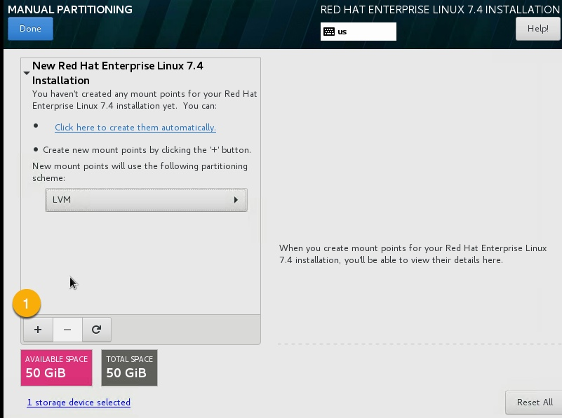
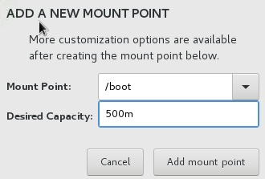
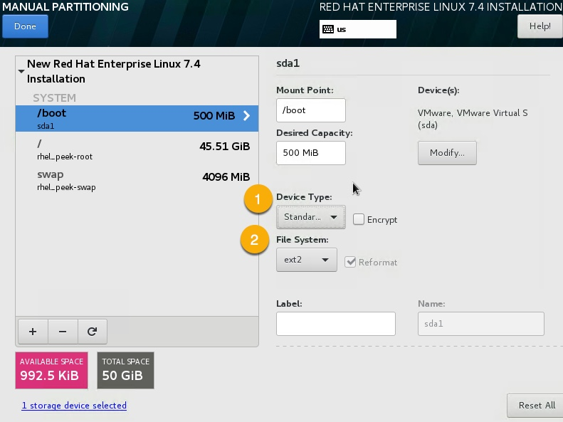
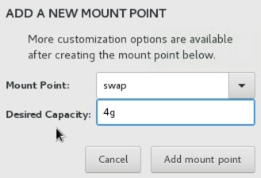
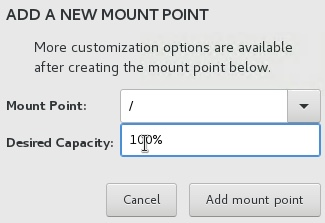
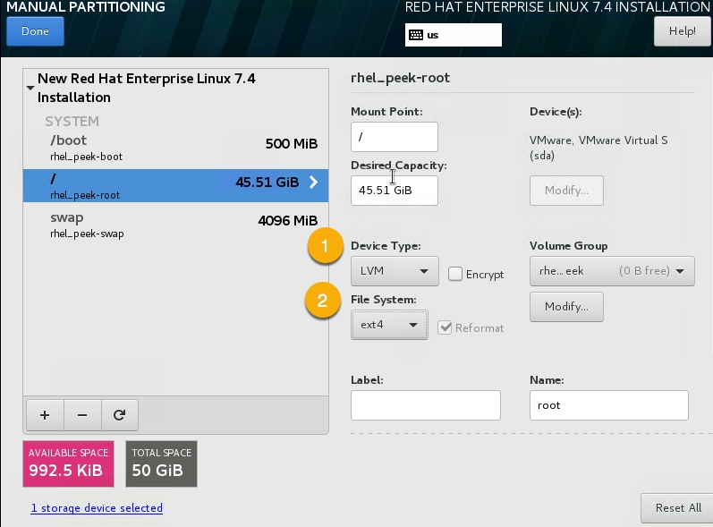
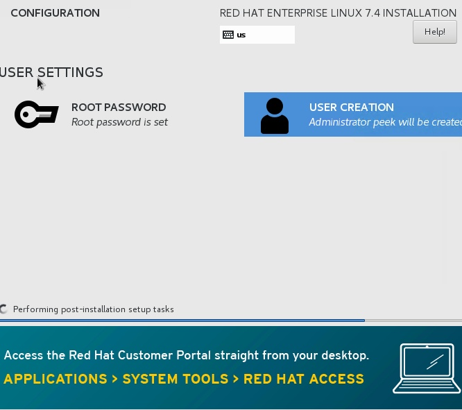
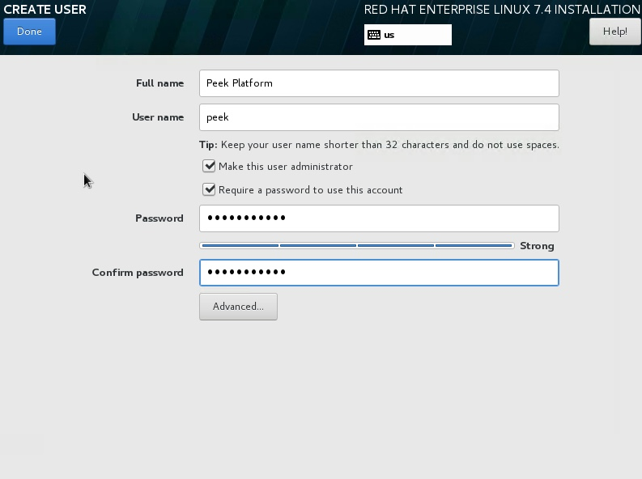

==========================
Setup OS Requirements RHEL
==========================

This section describes how to perform the setup for Red Hat Linux Server 7.4.  The Peek platform
is designed to run on Linux.

Please read through all of the documentation before commencing the installation procedure.

Installation Objective
----------------------

This Installation Guide contains specific Red Hat Linux Server 7.4 operating system requirements
for the configuring of synerty-peek.

Required Software
`````````````````

Some of the software to be installed requires internet access. For offline installation
some steps are required to be installed on another online server for the files to be
packaged and transferred to the offline server.

Below is a list of all the required software:


*   Python 3.6.x

*   Postgres 10.4.x

Suggested Software
``````````````````

The following utilities are often useful.

*   rsync

*   git

*   unzip


Optional Software
`````````````````

- Oracle 12c Client

Installing Oracle Libraries is required if you intend on installing the peek agent.
Instruction for installing the Oracle Libraries are in the Online Installation Guide.

- FreeTDS

FreeTDS is an open source driver for the TDS protocol, this is the protocol used to
talk to the MSSQL SQLServer database.

Installation Guide
------------------

Follow the remaining section in this document to prepare your RHEL operating system for
to run the Peek Platform.

The instructions on this page don't install the peek platform, that's done later.

Install Red Hat Linux Server 7.4 OS
-----------------------------------

This section installs the Red Hat Linux Server 7.4 64bit operating system.

Create VM
`````````

Create a new virtual machine with the following specifications

*   2 CPUs
*   4gb of ram
*   50gb of disk space

Install OS
``````````

Download the RHEL ISO

`Download RHEL <https://access.redhat.com/site/downloads/content/271/>`_

----

Mount the ISO in the virtual machine and start the virtual machine.

Run through the installer manually, do not let your virtual machine software perform
a wizard or express install.

Staring Off
~~~~~~~~~~~

At the **Red Hat Enterprise Linux 7.4 installer boot menu** screen, select: ::

    Install Red Hat Enterprise Linux 7.4

----

At the language selection screen, select: ::

    English

----

Goto **SOFTWARE SELECTION** screen, select Minimal Install or Server with GUI if 
you'd like a GUI.

.. image:: rhel_software_selection.jpg

----

Goto **DATE & TIME** screen, select the appropriate time location.

.. image:: rhel_date_and_time.jpg

----

Goto **KEYBOARD** screen, select the appropriate keyboard,
or leave as default.

----

Goto **NETWORK & HOST NAME** screen,

.. image:: rhel_network_hostname.jpg

1. enter your desired hostname or: ::

    peek

2. configure IP address,

    Configure IP address:

    .. image:: rhel_network_static_ip.jpg

    a. Goto IPv4 Settings tab,

    b. Set Method to `Manual`,

    c. Add static IP address,

    d. Save.

3. enable network.

----

Goto **INSTALLATION DESTINATION** screen, 

.. image:: rhel_installation_destination.jpg

1. for partitioning select: ::

    I will configure partitioning.

2. Select Done.

Partition Table
~~~~~~~~~~~~~~~

We'll be creating three partitions, `/boot`, `/` and `swap`. For a heavily used production
server you may want to create more virtual disks and separate out `/var`, `/home`, and `/tmp`.
With one file system per disk.

Having one file system per disk removes the need for the overhead of LVM, and the VM
software can still expand the disk and filesystem as required.



1. Add partition,

repeat for each partition.

/boot
~~~~~

Select the following disk from the **ADD NEW MOUNT POINT** menu:



Mount Point: ::

    /boot


Desired Capacity: ::

    500m




1. Set Device Type to `standard`,

2. Set File System to `ext2`.

swap
~~~~

Select the following disk from the **ADD NEW MOUNT POINT** menu: 



Mount Point: ::

    swap


Desired Capacity: ::

    4g


/ (root)
~~~~~~~~

Select the following disk from the **ADD NEW MOUNT POINT** menu: 



Mount Point: ::

    /


Desired Capacity: ::

    100%




1. Set Device Type to `LVM`,

2. Set File System to `ext4`.

----

Select **DONE** review the **SUMMARY OF CHANGES**

----

**BEGIN INSTALLATION**

----

While Red Hat is installing you can configure the **USER SETTINGS**, 
set **ROOT PASSWORD** and go to the **USER CREATION** screen.



Create the **peek** user.



----

After the server has rebooted, deconfigure the RHEL ISO from DVD drive in the VM software.

----

The OS installtion is now complete.

Login as Peek
-------------

Login to the Debian VM as the :code:`peek` user, either via SSH, or the graphical desktop if it's
installed.

.. important:: All steps after this point assume you're logged in as the peek user.

Configure Static IP (Optional)
------------------------------

If this is a production server, oit's more than likely that you want to assign a static IP to the VM.
Here is how you do this.

.. note:: Only do this is it wasn't done during installation or requires updating.
    If you installed the GUI you can configure the static IP address with the GUI.

----

Edit file :file:`/etc/sysconfig/network-scripts/ifcfg-<device>`

----

Update the following lines: ::


    DEVICE=<device>
    BOOTPROTO=none
    ONBOOT=yes
    HWADDR=<MAC_ADDRESS>
    NETMASK=255.255.255.0
    IPADDR=<IP_ADDRESS>
    GATEWAY=<GATEWAY_ADDRESS>
    TYPE=Ethernet
    USERCTL=no
    IPV6INIT=no
    PEERDNS=yes

Installing General Prerequisites
--------------------------------

This section installs the OS packages required.

.. note:: Run the commands in this step as the `peek` user.

----

Install the C Compiler package, used for compiling python or VMWare tools, etc: ::

    PKG="gcc gcc-c++ kernel-devel make"
    sudo yum install $PKG

----

Install the Python build dependencies: ::

    PKG="curl git m4 ruby texinfo bzip2-devel libcurl-devel"
    PKG="$PKG expat-devel ncurses-libs zlib-devel libgmp-devel"
    sudo yum install -y $PKG


----

Install C libraries that some python packages link to when they install: ::

    PKG=""

    # For the cryptography package
    PKG="$PKG libffi-devel"

    # For the python Samba client
    PKG="$PKG samba-devel libsmbclient-devel"

    sudo yum install -y $PKG

    # For Shapely and GEOAlchemy
    sudo yum install -y http://dl.fedoraproject.org/pub/epel/7/x86_64/Packages/g/geos-3.4.2-2.el7.x86_64.rpm
    sudo yum install http://dl.fedoraproject.org/pub/epel/7/x86_64/Packages/g/geos-devel-3.4.2-2.el7.x86_64.rpm

    # For LXML and the Oracle client
    PKG="libxml2 libxml2-devel"
    PKG="$PKG libxslt libxslt-devel"
    PKG="$PKG libaio libaio-devel"

    sudo yum install -y $PKG

    # For the PostGresQL connector
    sudo yum install -y http://dl.fedoraproject.org/pub/epel/7/x86_64/Packages/l/libpqxx-4.0.1-1.el7.x86_64.rpm
    sudo yum install -y http://dl.fedoraproject.org/pub/epel/7/x86_64/Packages/l/libpqxx-devel-4.0.1-1.el7.x86_64.rpm

    # For the SQLite python connector
    sudo yum install -y http://dl.fedoraproject.org/pub/epel/7/x86_64/Packages/l/libsqlite3x-20071018-20.el7.x86_64.rpm
    sudo yum install -y http://dl.fedoraproject.org/pub/epel/7/x86_64/Packages/l/libsqlite3x-devel-20071018-20.el7.x86_64.rpm


----

Install rsync: ::

    PKG="rsync unzip"

    sudo yum install -y $PKG


----

Cleanup the downloaded packages: ::

    sudo yum clean all


What Next?
----------

Refer back to the :ref:`how_to_use_peek_documentation` guide to see which document to
follow next.
