.. _setup_os_requirements_rhel7:

============================
Setup OS Requirements RHEL 7
============================

This section describes how to perform the setup for Red Hat Linux Server 7.7.  The Peek platform
is designed to run on Linux.

Please read through all of the documentation before commencing the installation procedure.

Installation Objective
----------------------

This Installation Guide contains specific Red Hat Linux Server 7.4 operating system requirements
for the configuring of synerty-peek.

Required Software
`````````````````

Some of the software to be installed requires internet access. For offline installation
some steps are required to be installed on another online server for the files to be
packaged and transferred to the offline server.

Below is a list of all the required software:


*   Python 3.9.x

*   Postgres 12.x

Suggested Software
``````````````````

The following utilities are often useful.

*   rsync

*   git

*   unzip


Optional Software
`````````````````

- Oracle Client

Installing Oracle Libraries is required if you intend on installing the peek agent.
Instruction for installing the Oracle Libraries are in the Online Installation Guide.

- FreeTDS

FreeTDS is an open source driver for the TDS protocol, this is the protocol used to
talk to the MSSQL SQLServer database.

.. _rhel_install_prerequisites:

Installation Guide
------------------

Follow the remaining section in this document to prepare your RHEL operating system for
to run the Peek Platform.

The instructions on this page don't install the peek platform, that's done later.

Install Red Hat Linux Server 7.7 OS
-----------------------------------

This section installs the Red Hat Linux Server 7.7 64bit operating system.

Create VM
`````````

Create a new virtual machine with the following specifications

*   4 CPUs
*   8gb of ram
*   60gb of disk space

Install OS
``````````

Download the RHEL ISO **Red Hat Enterprise Linux 7.7 Binary DVD** from:

`Download RHEL <https://access.redhat.com/downloads/content/69/ver=/rhel---7/7.7/x86_64/product-software>`_

----

Mount the ISO in the virtual machine and start the virtual machine.

.. note::

    Run through the installer manually, do not let your virtual machine software perform
    a wizard or express install.

Staring Off
~~~~~~~~~~~

At the **Red Hat Enterprise Linux 7.7 installer boot menu** screen, select: ::

    Install Red Hat Enterprise Linux 7.7

----

At the language selection screen, select: ::

    English

----

Next you will see a screen that lets you jump to any area to configure.
The areas that need attention are numbered and explained in the following sections.

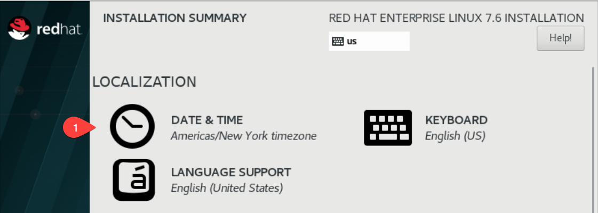

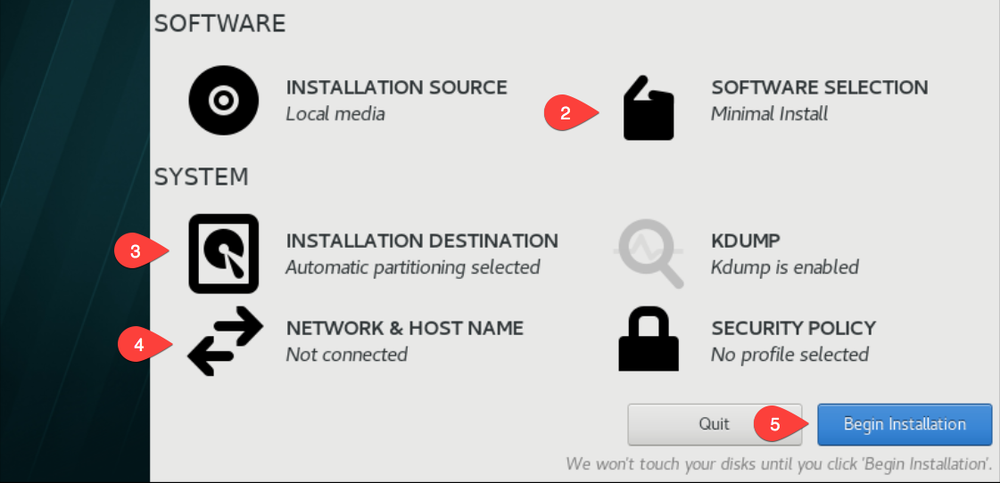

----

#1 Goto the  **DATE & TIME** screen, select the appropriate time location.

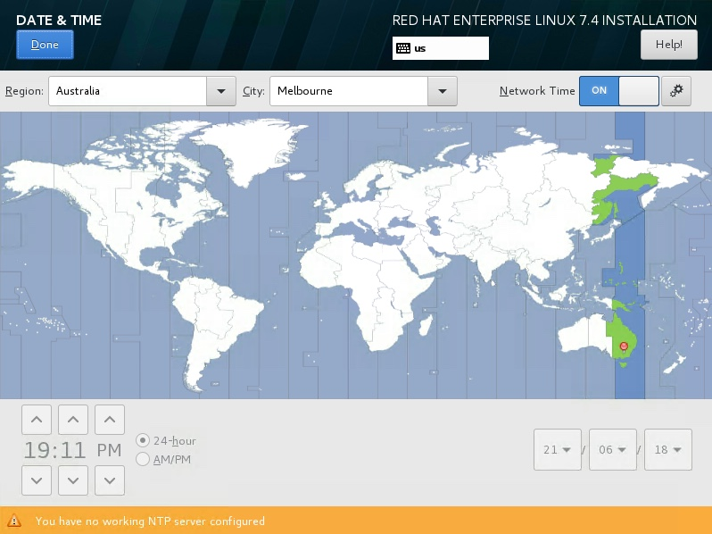

----

#2 Goto the **SOFTWARE SELECTION** screen, select **Minimal Install**
or **Server with GUI** if you'd like a GUI.

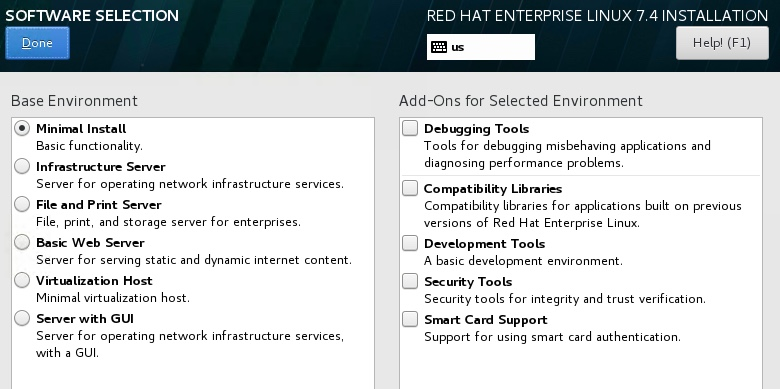

----

#3 Goto the **INSTALLATION DESTINATION** screen

The following partitioning is recommended for DEV peek virtual machines.

Select: ::

    I will configure partitioning.

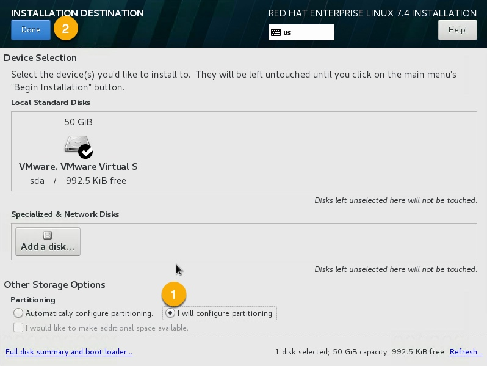

Select Done.

Partition Table
~~~~~~~~~~~~~~~

We'll be creating three partitions, `/boot`, `/` and `swap`. For a heavily used production
server you may want to create more virtual disks and separate out `/var`, `/home`, and `/tmp`.
With one file system per disk.

Having one file system per disk allows VM
software to easily expand the disk and filesystem as required.

----

Select **Standard Partition**

Again, This is to allow the virtual machine software to expand the DEV server
disks more easily.

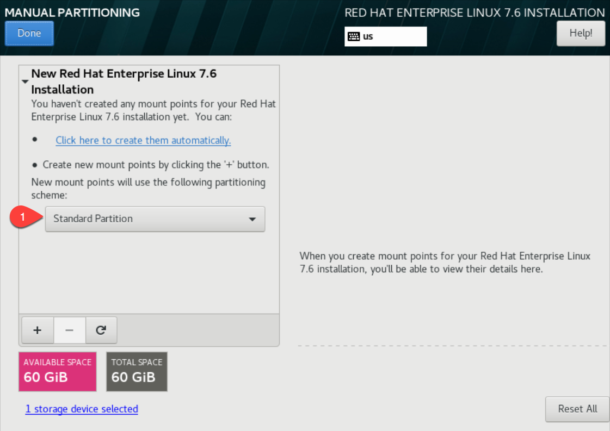

----

Add the partitions, for each partition, click the plus.

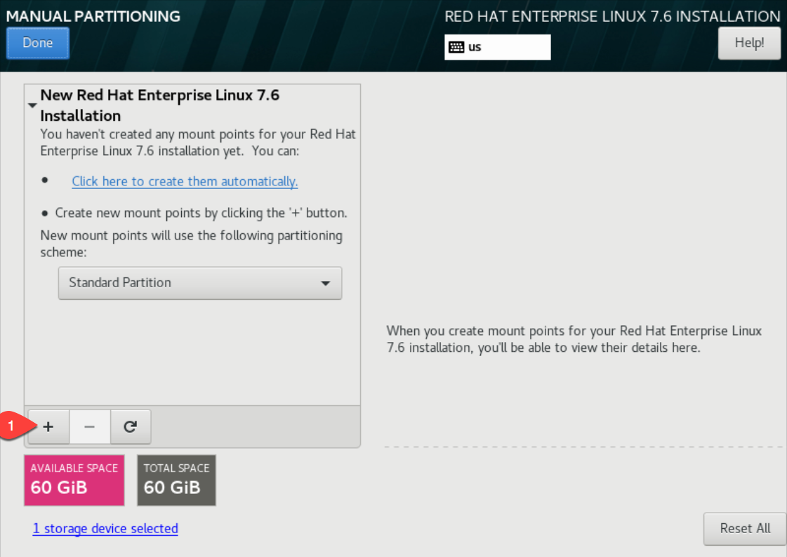

----

Set the Mount Point to **/boot**

Set the size to **1g**

Click **Add mount point**

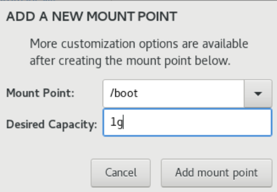

----

Set the Mount Point to **swap**

Set the size to **8g**

Click **Add mount point**

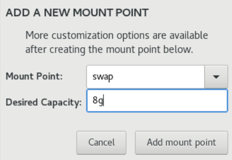

----

Set the Mount Point to **/**

Set the size to **100%**

Click **Add mount point**

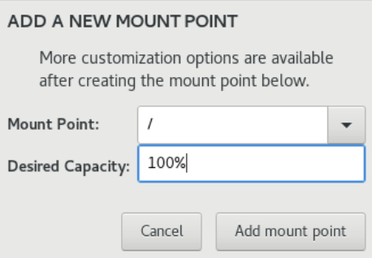

----

You should have a partition layout as follows, Click **Done**


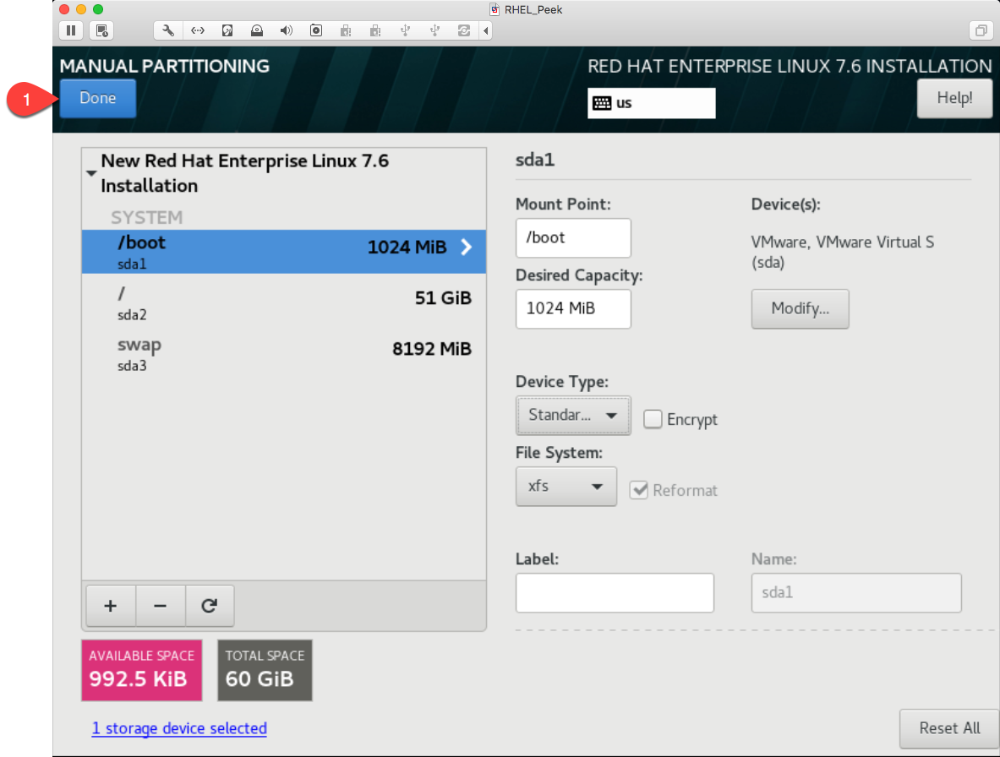

----

Click **Accept Changes**


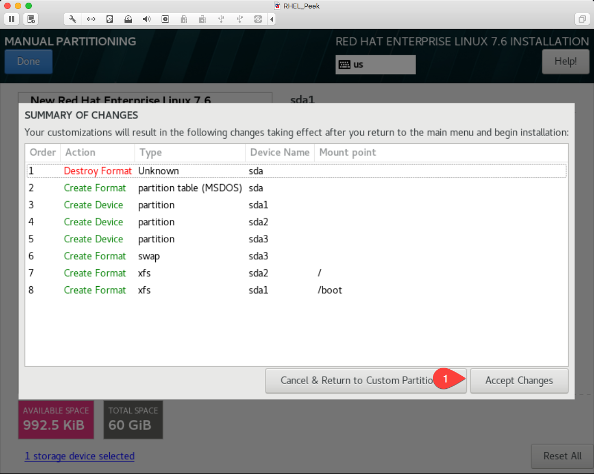

----

#4 Goto **NETWORK & HOST NAME** screen,

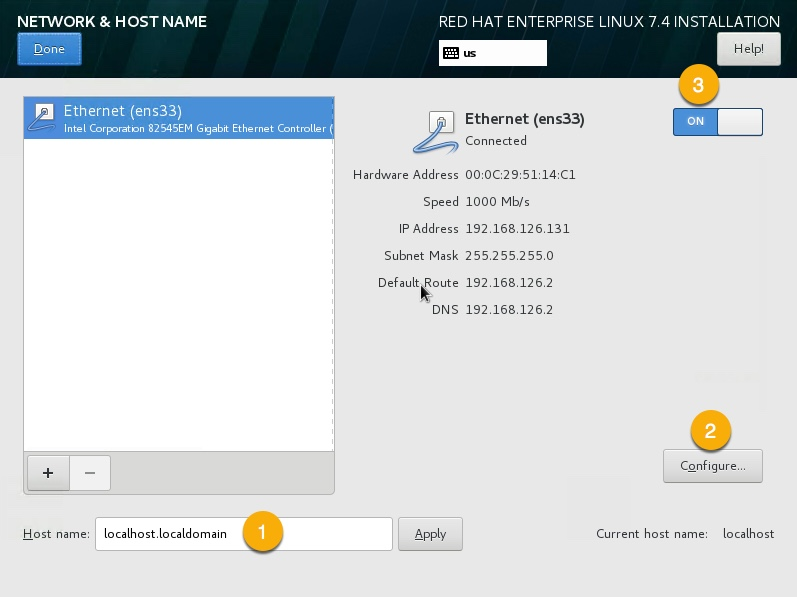

1. Enter your desired hostname, for example ::

    peek.localdomain

----

2. Turn on the Ethernet connection, this will get a DHCP IP Address.

.. note:: Make note of the DHCP IP Address

Otherwise, Configure a static IP address,

    a. Goto IPv4 Settings tab,

    b. Set Method to `Manual`,

    c. Add static IP address,

    d. Save.

    .. image:: rhel_network_static_ip.jpg

----

Select **DONE** review the **SUMMARY OF CHANGES**

----

Click **BEGIN INSTALLATION**

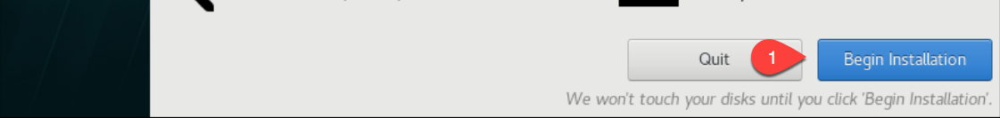

----

While RHEL is installing, further installation steps need to be completed.

Configure the **ROOT PASSWORD** and the **USER CREATION**

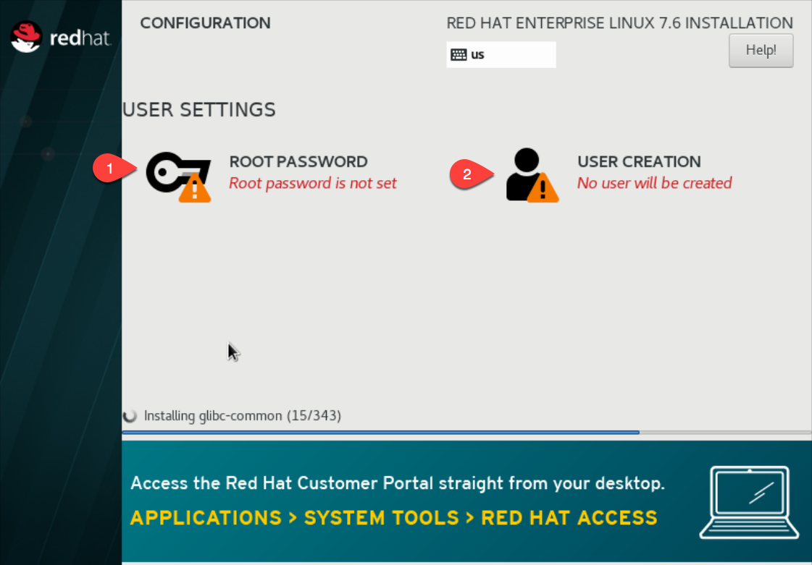

----

Configure the root password of the new RHEL VM.

Enter the root password twice, then click **Done**

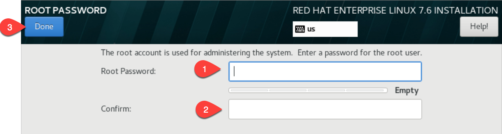

----

Create the **peek** user as follows.

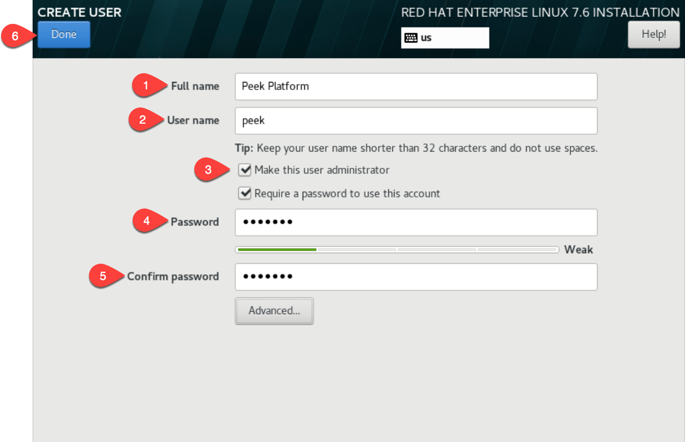

----

Click **Finish configuration**

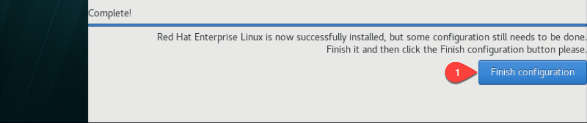

----

Click **Reboot**

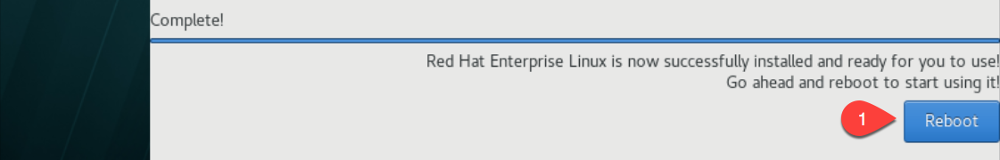

----

After the server has rebooted, disconnect and remove the RHEL ISO
from DVD drive in the VM software.


----

The OS installation is now complete.

Login as Peek
-------------

Login to the RHEL VM as the :code:`peek` user, either via SSH, or the graphical desktop
if it's installed.

.. important:: All steps after this point assume you're logged in as the peek user.

Registering RHEL
----------------

The RHEL server must have access to the redhat repositories at rhn.redhat.com to install
the required packages.

This section describes one way of registering a new RHEL server to a Redhat subscription.
This is a paid subscription.

----

Run the following command to register the system.
Replace MY_RHN_USERNAME with your redhat network username. ::

    sudo date
    # enter the password for peek

    sudo subscription-manager register --username MY_RHN_USERNAME
    # Enter the password for the RHN account

----

List the subscriptions, and select a pool. ::

    sudo subscription-manager list --available | grep Pool


Subscribe to the pool.
Replace POOL_ID_FROM_ABOVE_COMMAND with the Pool ID from the last command.  ::

    sudo subscription-manager subscribe --pool=POOL_ID_FROM_ABOVE_COMMAND


----

Test the subscription with a yum update, this will apply the latest updates. ::

    sudo yum update -y

.. note::

    If you want to remove the server from the pool, and unregister it, run the following.

    ::

        sudo subscription-manager remove --all
        sudo subscription-manager unregister


Removing IPv6 Localhost
-----------------------

Run the following command to ensure that localhost does not resolve to ::1
as this effects the PostgreSQL connection. ::

    F=/etc/sysctl.conf
    cat | sudo tee $F <<EOF
    # Disable IPv6
    net.ipv6.conf.all.disable_ipv6 = 1
    net.ipv6.conf.default.disable_ipv6 = 1
    EOF
    sudo sysctl -p
    sudo sed -i '/::1/d' /etc/hosts


Installing General Prerequisites
--------------------------------

This section installs the OS packages required.

.. note:: Run the commands in this step as the `peek` user.

----

To begin, make sure that all the packages currently installed on your RHEL
system are updated to their latest versions: ::

        sudo yum update -y


----

Install the C Compiler package, used for compiling python or VMWare tools, etc: ::

        PKG="gcc gcc-c++ kernel-devel make"
        sudo yum install -y $PKG

----

Install rsync: ::

        PKG="rsync"
        PKG="$PKG unzip"
        PKG="$PKG wget"
        PKG="$PKG git"
        PKG="$PKG bzip2"

        sudo yum install -y $PKG

----

Install the Python build dependencies: ::

        PKG="curl git m4 ruby texinfo bzip2-devel libcurl-devel"
        PKG="$PKG expat-devel ncurses-libs zlib-devel gmp-devel"
        PKG="$PKG openssl openssl-devel"
        sudo yum install -y $PKG

----

Install the PostgreSQL build dependencies: ::

        PKG="bison flex"
        PKG="$PKG readline-devel openssl-devel python-devel"
        sudo yum install -y $PKG


----

Install Libs that some python packages link to when they install. ::

        # For the cryptography package
        PKG="libffi-devel"

        sudo yum install -y $PKG

----

Install Libs required for LDAP. ::

        PKG="openldap-devel"

        sudo yum install -y $PKG

----

Install Libs that database access python packages link to when they install:

.. warning:: These packages are not from the Redhat Network.
     ::

            FEDORA_PACKAGES="https://dl.fedoraproject.org/pub/epel/7/x86_64/Packages"

            # For Shapely and GEOAlchemy
            PKG="${FEDORA_PACKAGES}/g/geos-3.4.2-2.el7.x86_64.rpm"
            PKG="$PKG ${FEDORA_PACKAGES}/g/geos-devel-3.4.2-2.el7.x86_64.rpm"

            # For the SQLite python connector
            PKG="$PKG ${FEDORA_PACKAGES}/l/libsqlite3x-20071018-20.el7.x86_64.rpm"
            PKG="$PKG ${FEDORA_PACKAGES}/l/libsqlite3x-devel-20071018-20.el7.x86_64.rpm"

            sudo yum install -y $PKG

----

Install Libs that the oracle client requires: ::

        # For LXML and the Oracle client
        PKG="libxml2 libxml2-devel"
        PKG="$PKG libxslt libxslt-devel"
        PKG="$PKG libaio libaio-devel"

        sudo yum install -y $PKG


----

Cleanup the downloaded packages: ::

    sudo yum clean all


Installing VMWare Tools (Optional)
----------------------------------

This section installs VMWare tools. The compiler tools have been installed from the section
above.

----

In the VMWare software, find the option to install VMWare tools.

----

Mount and unzip the tools: ::

    sudo rm -rf /tmp/vmware-*
    sudo mount /dev/sr0 /mnt
    sudo tar -xzf /mnt/VM*gz -C /tmp
    sudo umount /mnt


----

Install the tools with the default options: ::

    cd /tmp/vmware-tools-distrib
    sudo ./vmware-install.pl -f -d


----

Cleanup the tools install: ::

    sudo rm -rf /tmp/vmware-*


----

Reboot the virtual machine: ::

    sudo shutdown -r now


.. note:: Keep in mind, that if the static IP is not set, the IP address of the VM may
    change, causing issues when reconnecting with SSH.


Update Firewall
---------------

Allow Peek through the firewall and port forward to the non-privileged port ::

    # Peek Mobile website
    sudo firewall-cmd --add-forward-port=port=8000:proto=tcp:toport=8000

    # Peek Desktop website
    sudo firewall-cmd --add-forward-port=port=8002:proto=tcp:toport=8002

    # Peek Admin web site
    sudo firewall-cmd --add-forward-port=port=8010:proto=tcp:toport=8010

    # Persist the rules
    sudo firewall-cmd --runtime-to-permanent


.. _rhel_setup_bashrc:

Preparing .bashrc
-----------------

Open :file:`~/.bashrc` insert the following at the start: ::

    ##### SET THE PEEK ENVIRONMENT #####
    # Setup the variables for PYTHON and POSTGRESQL
    export PEEK_PY_VER="3.9.1"
    export PEEK_TSDB_VER="1.7.4"
    export PGDATA=~peek/pgdata/12

    export PATH="$HOME/opt/bin:$PATH"
    export LD_LIBRARY_PATH="$HOME/opt/lib:$LD_LIBRARY_PATH"

    # Set the variables for the platform release
    # These are updated by the deploy script
    export PEEK_ENV=""
    [ -n "${PEEK_ENV}" ] && export PATH="${PEEK_ENV}/bin:$PATH"


----

.. warning:: Restart your terminal to get the new environment.


Compile and Install Python 3.9.1
--------------------------------

The Peek Platform runs on Python. These instructions download, compile and install the
latest version of Python.

----

Download and unarchive the supported version of Python: ::

    cd
    source .bashrc
    wget https://github.com/python/cpython/archive/v${PEEK_PY_VER}.zip
    unzip v${PEEK_PY_VER}.zip
    cd cpython-${PEEK_PY_VER}


----


Configure the build: ::

    ./configure --prefix=/home/peek/opt/ --enable-optimizations --enable-shared


----

Make and Make install the software: ::

    make install


----

Cleanup the download and build dir: ::

    cd
    rm -rf cpython-${PEEK_PY_VER}
    rm v${PEEK_PY_VER}.zip


----

Symlink the python3 commands so they are the only ones picked up by path: ::

    cd /home/peek/opt/bin
    ln -s pip3 pip
    ln -s python3 python
    cd


----

Test that the setup is working: ::


    RED='\033[0;31m'
    GREEN='\033[0;32m'
    NC='\033[0m' # No Color

    SHOULD_BE="/home/peek/opt/bin/python"
    if [ `which python` == ${SHOULD_BE} ]
    then
        echo -e "${GREEN}SUCCESS${NC} The python path is right"
    else
        echo -e "${RED}FAIL${NC} The python path is wrong, It should be ${SHOULD_BE}"
    fi

    SHOULD_BE="/home/peek/opt/bin/pip"
    if [ `which pip` == ${SHOULD_BE} ]
    then
        echo -e "${GREEN}SUCCESS${NC} The pip path is right"
    else
        echo -e "${RED}FAIL${NC} The pip path is wrong, It should be ${SHOULD_BE}"
    fi


----

Upgrade pip: ::

    pip install --upgrade pip


----

synerty-peek is deployed into python virtual environments. Install the virtualenv
python package: ::

    pip install virtualenv

----

The Wheel package is required for building platform and plugin releases: ::

    pip install wheel


.. _rhel_install_postgresql:

Install PostgreSQL
------------------

Install the relational database Peek stores its data in.
This database is PostgreSQL 12.

.. note:: Run the commands in this step as the :code:`peek` user.

----

Download the PostgreSQL source code ::

        PEEK_PG_VER=12.5
        SRC_DIR="$HOME/postgresql-${PEEK_PG_VER}"

        # Remove the src dir and install file
        rm -rf ${SRC_DIR} || true
        cd $HOME

        wget https://ftp.postgresql.org/pub/source/v${PEEK_PG_VER}/postgresql-${PEEK_PG_VER}.tar.bz2
        tar xjf postgresql-${PEEK_PG_VER}.tar.bz2

        cd ${SRC_DIR}


----

Configure and build PostGresQL ::

        export CPPFLAGS=" -I`echo $HOME/opt/include/python*m` "
        export LDFLAGS=" -L$HOME/opt/lib "

        ./configure \
              --disable-debug \
              --prefix=$HOME/opt \
              --enable-thread-safety \
              --with-openssl \
              --with-python


        make -j4

        make install-world

        # this is required for timescale to compile
        cp ${SRC_DIR}/src/test/isolation/pg_isolation_regress ~/opt/bin


---

Remove install files to clean up the home directory ::

        # Remove the src dir and install file
        cd
        rm -rf ${SRC_DIR}*


----

Initialise a PostgreSQL database ::

    #Refresh .bashrc so initdb can find postgres
    source .bashrc

    initdb --pgdata=$HOME/pgdata/12 --auth-local=trust  --auth-host=md5


----

Tune the :file:`postgresql.conf` to increase the maximum number of connections allowed ::

    F="$HOME/pgdata/12/postgresql.conf"

    sed -i 's/max_connections = 100/max_connections = 200/g' $F


----

Make PostgreSQL a service :

.. note:: This will require sudo permissions


Run the following command ::

    touch postgresql-12.service

    F=postgresql-12.service

    cat <<"EOF" | sed "s,\$HOME,`echo ~peek`,g" > $F
    [Unit]
    Description=PostgreSQL 12 database server
    After=syslog.target
    After=network.target

    [Service]
    Type=forking
    User=peek
    Group=peek

    # Location of database directory
    Environment=PGDATA=$HOME/pgdata/12

    # Disable OOM kill on the postmaster
    OOMScoreAdjust=-1000
    Environment=PG_OOM_ADJUST_FILE=/proc/self/oom_score_adj
    Environment=PG_OOM_ADJUST_VALUE=0

    ExecStart=$HOME/opt/bin/pg_ctl -D ${PGDATA} start
    ExecStop=$HOME/opt/bin/pg_ctl -D ${PGDATA} stop
    ExecReload=/bin/kill -HUP $MAINPID
    KillMode=mixed
    KillSignal=SIGINT


    # Do not set any timeout value, so that systemd will not kill postmaster
    # during crash recovery.
    TimeoutSec=0

    [Install]
    WantedBy=multi-user.target
    EOF

    sudo mv $F /usr/lib/systemd/system/postgresql-12.service


----

Reload the daemon ::

    systemctl daemon-reload


Install CMake
`````````````

Download CMake source code ::

    PEEK_CMAKE_VER=3.19.2
    SRC_DIR="$HOME/CMake-${PEEK_CMAKE_VER}"
    wget https://github.com/Kitware/CMake/archive/v${PEEK_CMAKE_VER}.zip

    unzip v${PEEK_CMAKE_VER}.zip
    cd ${SRC_DIR}


Compile CMake from source ::

    ./configure --prefix=$HOME/opt

    make -j6 install

    # Remove the src dir and install file
    cd
    rm -rf ${SRC_DIR}*
    rm v${PEEK_CMAKE_VER}.zip


Install PostgreSQL Timescaledb
``````````````````````````````

Next install timescaledb, this provides support for storing large amounts of historical
data.

`www.timescale.com <https://www.timescale.com>`_

----

Download the timescaledb source code ::

    PEEK_TSDB_VER=1.7.4

    cd
    wget https://github.com/timescale/timescaledb/archive/${PEEK_TSDB_VER}.zip
    unzip ${PEEK_TSDB_VER}.zip
    cd timescaledb-${PEEK_TSDB_VER}


----

Install the packages: ::

    export CPPFLAGS=`pg_config --cppflags`
    export LDFLAGS=`pg_config --ldflags`

    # Bootstrap the build system
    ./bootstrap -DAPACHE_ONLY=1

    # To build the extension
    cd build && make

    # To install
    make install

    # Cleanup the source code
    cd
    rm -rf ${PEEK_TSDB_VER}.zip
    rm -rf timescaledb-${PEEK_TSDB_VER}


----

Add the timescale repository: ::

    curl -s https://packagecloud.io/install/repositories/timescale/timescaledb/script.rpm.sh | sudo bash


----

Install timescaledb-tune: ::

    sudo yum install -y timescaledb-tools-0.10.0-0.el7.x86_64


----

Tune the database: ::

    PGVER=12
    FILE="$HOME/pgdata/${PGVER}/postgresql.conf"
    timescaledb-tune -quiet -yes -conf-path ${FILE} -pg-version ${PGVER}


----

Start PostgreSQL: ::

    systemctl enable postgresql-12 --now


Finish PostgreSQL Setup
````````````````````````

Finish configuring and starting PostgreSQL.

----

Allow the peek OS user to login to the database as user peek with no password ::

    F=$HOME/pgdata/12/pg_hba.conf
    cat | sudo tee $F <<EOF
    # TYPE  DATABASE        USER            ADDRESS                 METHOD
    local   all             peek                                    trust

    # "local" is for Unix domain socket connections only
    local   all             all                                     peer
    # IPv4 local connections:
    host    all             all             127.0.0.1/32            md5
    # IPv6 local connections:
    host    all             all             ::1/128                 md5
    EOF


----

Create the database: ::

    createdb -O peek peek


----

Set the PostgreSQL peek users password: ::

    psql -d peek -U peek <<EOF
    \password
    \q
    EOF

    # Set the password as "PASSWORD" for development machines
    # Set it to a secure password from https://xkpasswd.net/s/ for production

----

.. note:: If you already have a database, you may now need to upgrade the timescale
          extension. ::

            psql peek <<EOF
            ALTER EXTENSION timescaledb UPDATE;
            EOF

----

Cleanup traces of the password: ::

    [ ! -e ~/.psql_history ] || rm ~/.psql_history


Grant PostgreSQL Peek Permissions
`````````````````````````````````
The PostgreSQL server now runs parts of peeks python code inside
the postgres/postmaster processes. To do this the postgres user
needs access to peeks home directory where the peek software is
installed.

----

Grant permissions ::

    sudo chmod g+rx ~peek


Install Worker Dependencies
---------------------------

Install the parallel processing queue we use for the peek-worker-service tasks.

.. note:: Run the commands in this section as the `peek` user.

Install redis: ::

    ATOMICORP_SITE="https://www6.atomicorp.com/channels/atomic/centos/7/x86_64/RPMS"

    # redis dependencies
    PKG="${ATOMICORP_SITE}/jemalloc-3.6.0-1.el7.art.x86_64.rpm"

    # redis
    PKG="$PKG ${ATOMICORP_SITE}/redis-3.0.7-4.el7.art.x86_64.rpm"

    # install redis and dependencies
    sudo yum install -y $PKG


----

Enable the Redis service: ::

    sudo systemctl enable redis.service
    sudo systemctl restart redis.service

----

Install rabbitmq: ::

    # install erlang
    curl -s https://packagecloud.io/install/repositories/rabbitmq/erlang/script.rpm.sh | sudo bash

    # install erlang
    sudo yum install -y erlang

    # Set rabbitmq repository
    curl -s https://packagecloud.io/install/repositories/rabbitmq/rabbitmq-server/script.rpm.sh | sudo bash

    # install rabbitmq
    sudo yum install -y rabbitmq-server

----

Enable the RabbitMQ service: ::

    sudo systemctl enable rabbitmq-server.service
    sudo systemctl restart rabbitmq-server.service

----

Cleanup the downloaded packages: ::

    sudo yum clean all

----

Enable the RabbitMQ management plugins: ::

    F="/var/lib/rabbitmq/.erlang.cookie"; [ ! -f $F ] || rm -f $F
    sudo rabbitmq-plugins enable rabbitmq_mqtt
    sudo rabbitmq-plugins enable rabbitmq_management
    sudo systemctl restart rabbitmq-server.service


----

Increase the size of the redis client queue ::

        BEFORE="client-output-buffer-limit pubsub 64mb 16mb 90"
        AFTER="client-output-buffer-limit pubsub 32mb 8mb 60"
        sudo sed -i "s/${BEFORE}/${AFTER}/g" /etc/redis.conf

        sudo systemctl restart redis

Install Oracle Client (Optional)
--------------------------------

The oracle libraries are optional. Install them where the agent runs if you are
going to interface with an oracle database.

----

Open :file:`~/.bashrc` insert the following at the start: ::

        # Setup the variables for ORACLE
        export LD_LIBRARY_PATH="/home/peek/oracle/instantclient_21_1:$LD_LIBRARY_PATH"
        export ORACLE_HOME="/home/peek/oracle/instantclient_21_1"

----

Source the new profile to get the new variables: ::

        source ~/.bashrc

----

Make the directory where the oracle client will live ::

        mkdir /home/peek/oracle

----

Download the following from oracle.

The version used in these instructions is **21.1.0.0.0**.

#.  Download the ZIP "Basic Package"
    :file:`instantclient-basic-linux.x64-21.1.0.0.0.zip` from
    http://www.oracle.com/technetwork/topics/linuxx86-64soft-092277.html

#.  Download the ZIP "SDK Package"
    :file:`instantclient-sdk-linux.x64-21.1.0.0.0.zip` from
    http://www.oracle.com/technetwork/topics/linuxx86-64soft-092277.html

Copy these files to :file:`/home/peek/oracle` on the peek server.

----

Extract the files. ::

        cd ~/oracle
        unzip instantclient-basic-linux.x64-21.1.0.0.0.zip*
        unzip instantclient-sdk-linux.x64-21.1.0.0.0.zip*


Install FreeTDS (Optional)
--------------------------

FreeTDS is an open source driver for the TDS protocol, this is the protocol used to
talk to a MSSQL SQLServer database.

Peek needs this installed if it uses the pymssql python database driver,
which depends on FreeTDS.

----

Open :file:`~/.bashrc` insert the following at the start: ::

    # Setup the variables for FREE TDS
    export LD_LIBRARY_PATH="/home/peek/freetds:$LD_LIBRARY_PATH"

----

.. warning:: Restart your terminal you get the new environment.

----

Install FreeTDS: ::

    PKG="https://dl.fedoraproject.org/pub/epel/7/x86_64/Packages/f/freetds-libs-1.1.20-1.el7.x86_64.rpm"
    PKG="$PKG https://dl.fedoraproject.org/pub/epel/7/x86_64/Packages/f/freetds-1.1.20-1.el7.x86_64.rpm"
    PKG="$PKG https://dl.fedoraproject.org/pub/epel/7/x86_64/Packages/f/freetds-devel-1.1.20-1.el7.x86_64.rpm"
    sudo yum install -y $PKG

----

Create file :file:`freetds.conf` in :code:`~/freetds` and populate with the following: ::

    mkdir ~/freetds
    cat > ~/freetds/freetds.conf <<EOF

    [global]
        port = 1433
        instance = peek
        tds version = 7.4

    EOF

----

If you want to get more debug information, add the dump file line to the [global] section
Keep in mind that the dump file takes a lot of space. ::

    [global]
        port = 1433
        instance = peek
        tds version = 7.4
        dump file = /tmp/freetds.log


What Next?
----------

Refer back to the :ref:`how_to_use_peek_documentation` guide to see which document to
follow next.
