.. _setup_os_requirements_rhel8:

============================
Setup OS Requirements RHEL 8
============================

Please follow the :ref:`setup_os_requirements_rhel7` **except for updates in
Section Starting off and Section Partition Table.**

Staring Off
~~~~~~~~~~~

#3 Goto the **INSTALLATION DESTINATION** screen

The following partitioning is recommended for DEV peek virtual machines.

Select: ::

    Custom

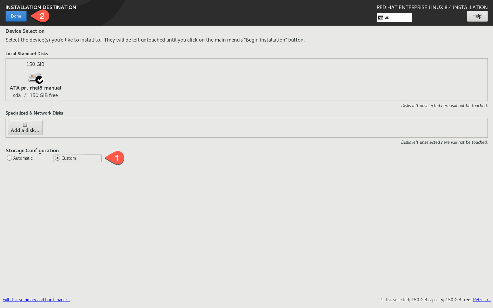

Select **Done**.

Partition Table
~~~~~~~~~~~~~~~

We'll be creating partitions, `/boot`, `/`, `swap`, `/var`, `/usr`, `/tmp` and
`/home`, with one virtual logical volume per mount point.

Having one virtual logical volume per mount point allows VM
software to easily expand the disk and filesystem as required.

----

Select **LVM**

Again, This is to allow the virtual machine software to expand the DEV server
disks more easily.

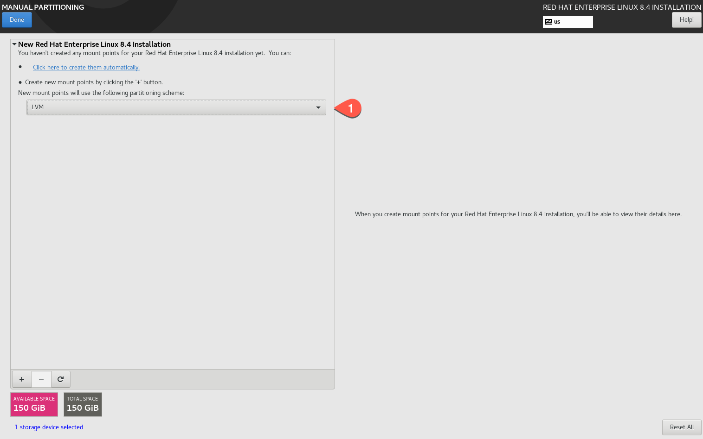

----

Add the partitions, for each partition, click the plus.

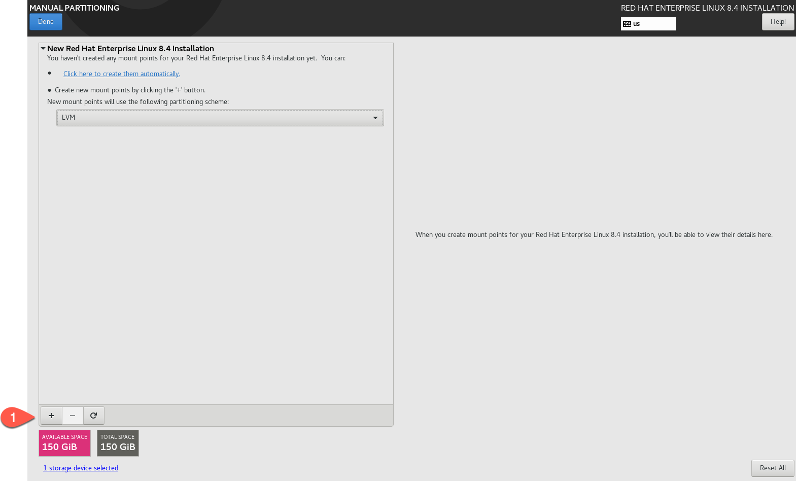

----

Set the Mount Point to **/boot**

Set the size to **1g**

Click **Add mount point**

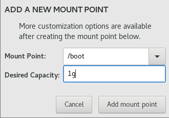

----

Set the Mount Point to **swap**

Set the size to **10g**

Click **Add mount point**

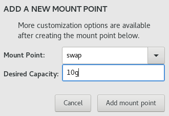

----

Set the Mount Point to **/**

Set the size to **5g**

Click **Add mount point**

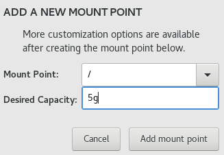

----

Set the Mount Point to **/tmp**

Set the size to **5g**

Click **Add mount point**

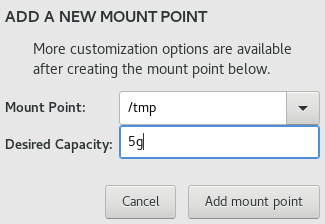

----

Set the Mount Point to **/usr**

Set the size to **5g**

Click **Add mount point**

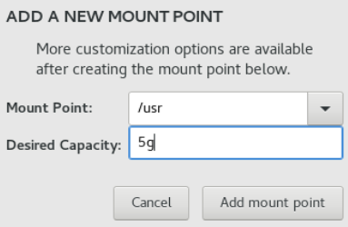

----

Set the Mount Point to **/var**

Set the size to **5g**

Click **Add mount point**

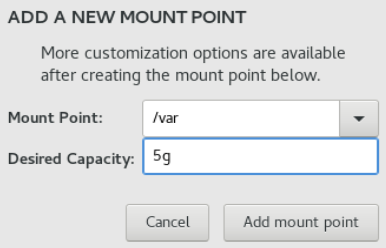

----

Set the Mount Point to **/home**

Set the size to **10g**

Click **Add mount point**

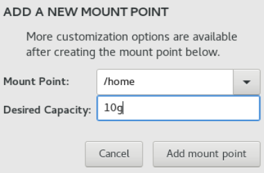

----

And finally, go to any mount point and click 'Modify' to rename Volume Group.

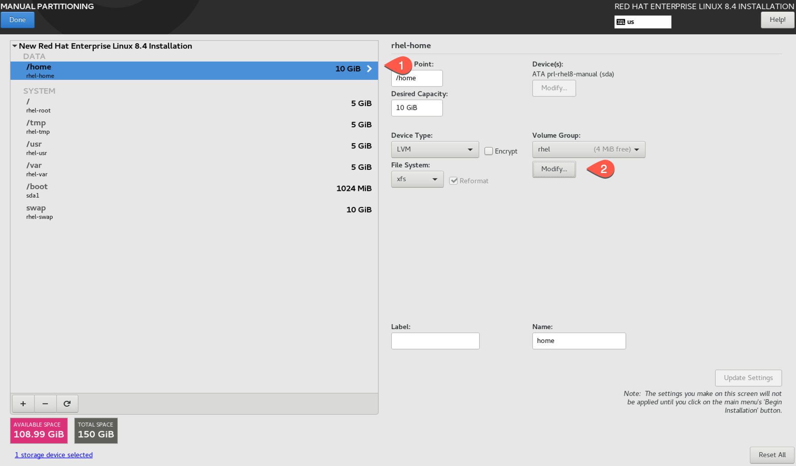

Rename it as `rootvg`

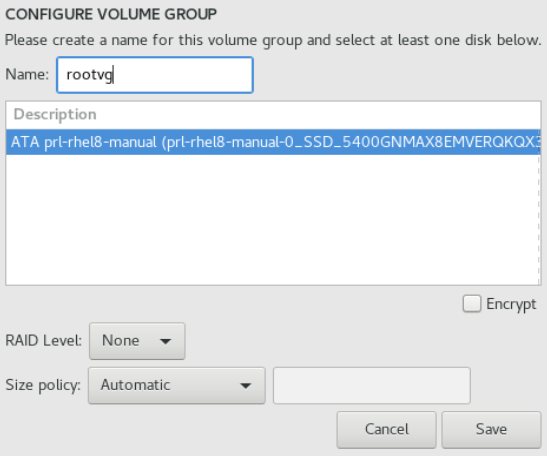

Click **Save**

----

You should have a partition layout as follows, Click **Done**

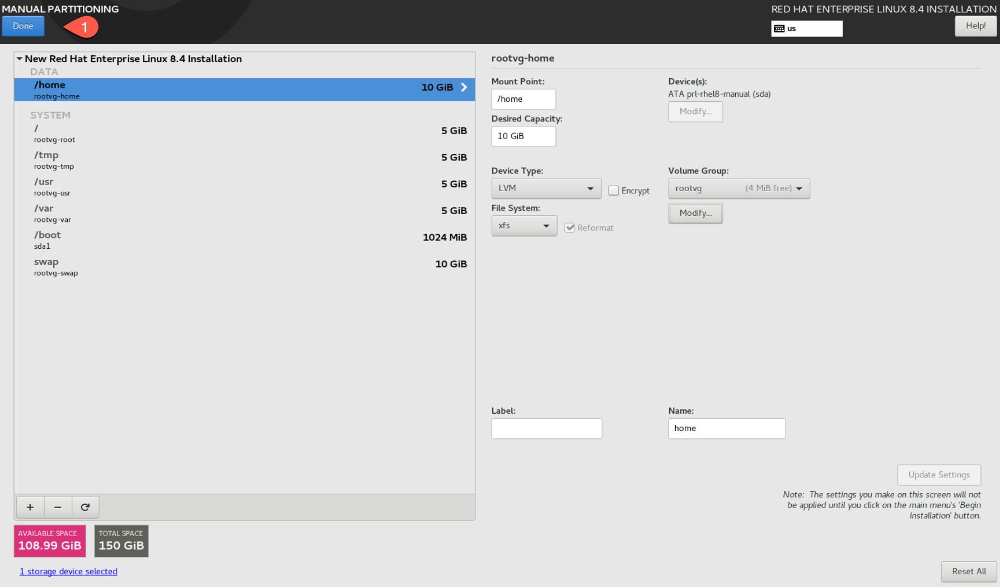

----

Click **Accept Changes**

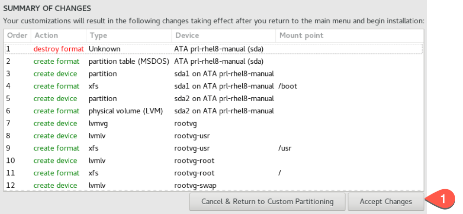

What Next?
----------

Refer back to the :ref:`how_to_use_peek_documentation` guide to see which document to
follow next.
