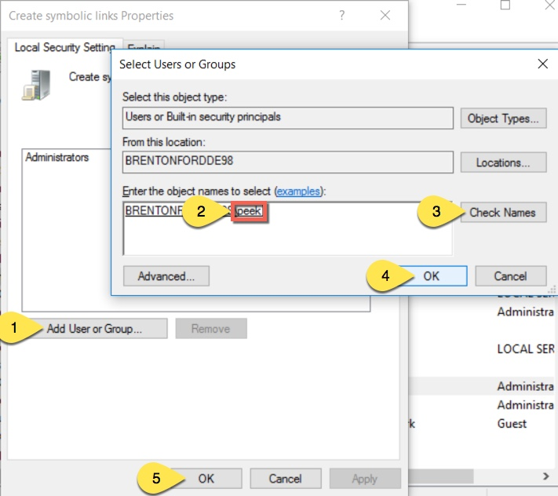

=============================
Setup OS Requirements Windows
=============================

The Peek platform is designed to run on Linux, however, it is compatible with windows.
Please read through all of the documentation before commencing the installation
procedure.

Installation Objective
----------------------

This *Installation Guide* contains specific Windows operating system requirements for the
configuring of synerty-peek.

Required Software
`````````````````

Some of the software to be installed requires internet access.  For offline installation
some steps are required to be installed on another online server for the files to be
packaged and transferred to the offline server.

Below is a list of all the required software:

*  Microsoft .NET Framework 3.5 Service Pack 1
*  Visual C++ Build Tools 2015
*  PostgresSQL 9.6.2+ or Microsoft® SQL Server® 2014 Express
*  Node.js 7+ and NPM 3+
*  Python 3.5
*  Virtualenv
*  FreeTDS

Optional  Software
``````````````````

*  7zip
*  Notepad ++
*  Installing Oracle Libraries (Instructions in the procedure)

Installation of 7zip is optional. This tool will come in handy during the process but
is not required.

----

Installation of Notepad ++ is optional.  Notepad ++ is a handy tool for viewing
documents and has useful features.

----

Installing Oracle Libraries is required if you intend on installing the peek agent.
Instruction for installing the Oracle Libraries are in the *Online Installation Guide*.

OS Commands
-----------

The config file for each service in the peek platform describes the location of the BASH
interpreter. Peek is coded to use the bash interpreter and basic posix compliant utilities
for all OS commands.

When peek generates it's config it should automatically choose the right interpreter. ::

        "C:\Program Files\Git\bin\bash.exe" if isWindows else "/bin/bash"

Installation Guide
------------------

The following sections begin the installation procedure.

Create Peek OS User
-------------------

Create a windows user account for peek with admin rights.

.. tip:: Search for **Computer Management** from the start menu, and use that.

----

:Account Type: Administrator
:Username: peek
:Password: PA$$W0RD

----

Sign in to the peek account.

.. important:: All steps after this point assume you're logged in as the peek user.

.. tip:: Run the ":command:`control userpasswords2`" command from the run window
            to have peek automatically login.
            This is useful for development virtual machines.

MS .NET Framework 3.5 SP1
-------------------------

**Online Installation:**

:Download: `<http://download.microsoft.com/download/2/0/e/20e90413-712f-438c-988e-fdaa79a8ac3d/dotnetfx35.exe>`_
:From: `<https://www.microsoft.com/en-ca/download>`_

**Offline Installation:**

:Download: `<https://download.microsoft.com/download/2/0/E/20E90413-712F-438C-988E-FDAA79A8AC3D/dotnetfx35.exe>`_

.. note:: Restart if prompted to restart.

Visual C++ Build Tools 2015
---------------------------

**Online Installation:**

:Download: `<http://go.microsoft.com/fwlink/?LinkId=691126>`_
:From: `<http://landinghub.visualstudio.com/visual-cpp-build-tools>`_

**Offline Installation:**

Install using the ISO

:Download: `<https://www.microsoft.com/en-US/download/details.aspx?id=48146>`_

Install Python 3.6
------------------

:Download: `<https://www.python.org/ftp/python/3.6.1/python-3.6.1-amd64.exe>`_
:From: `<https://www.python.org/downloads/windows/>`_

----

Check the 'Add Python 3.6 to PATH' and select 'Customize Installation'

.. image:: Python-Install.jpg

----

Update the 'Customize install location' to PATH C:\Users\peek\Python35\

.. image:: Python-AdvancedOptions.jpg

----

Confirm PATH(s) to environment variables ::

        echo %PATH%

        ...

        C:\Users\peek\Python36\
        C:\Users\peek\Python36\Scripts\


Virtual Environment
```````````````````

synerty-peek is deployed into python virtual environments.
Install the virtualenv python package

----

Open the command prompt and run the following command:

::

        pip install virtualenv


----

The Wheel package is required for building platform and plugin releases ::

        pip install wheel


Install Worker Dependencies
---------------------------

Install the parallel processing queue we use for the peek-worker tasks.

Download and install Redis:

:Download: https://github.com/MicrosoftArchive/redis/releases/download/win-3.0.504/Redis-x64-3.0.504.msi

----

Download and install Erlang:

:Download: http://erlang.org/download/otp_win64_20.0.exe

----

Download and install RabbitMQ:

:Download: https://github.com/rabbitmq/rabbitmq-server/releases/download/rabbitmq_v3_6_10/rabbitmq-server-3.6.10.exe

----

Under Control Panel -> System -> Advanced system settings

Add the following to PATH in the “System” environment variables ::

        C:\Program Files\RabbitMQ Server\rabbitmq_server-3.6.10\sbin

.. tip:: On Win 10, enter "environment" in the task bar search and select
            **Edit the system environment variables**


----

Enable the RabbitMQ management plugins: ::

        rabbitmq-plugins enable rabbitmq_mqtt
        rabbitmq-plugins enable rabbitmq_management


----

Confirm the RabbitMQ Management Console and the RabbitMQ MQTT Adaptor are listed under the :code:`running applications`: ::

        rabbitmqctl status


.. _requirements_windows_postgressql:

PostgresSQL
-----------

Peek requires PostGreSQL as it's persistent, relational data store.

:Download: `<https://www.enterprisedb.com/downloads/postgres-postgresql-downloads#windows>`_
:From: `<https://www.postgresql.org>`_

----

Install PostgresSQL with default settings.

Make a note of the postgres user password that you supply, you'll need this.

.. warning:: Generate a strong password for both peek and postgres users for
    production use.

    Synerty recommends 32 to 40 chars of  capitals, lower case and numbers, with some
    punctuation, best to avoid these ` / \\ ' "

    `<https://strongpasswordgenerator.com>`_

----

Run pgAdmin4

----

Open the Query Tool

.. image:: pgAdmin4-queryTool.jpg

----

Create the peek user, run the following script: ::

    CREATE USER peek WITH
        LOGIN
        CREATEDB
        INHERIT
        REPLICATION
        CONNECTION LIMIT -1
        PASSWORD 'PASSWORD';

.. note:: Replace :code:`PASSWORD` with a password of your choice or requirements

Example:

.. image:: pgAdmin4-userQuery.jpg

----

Create the peek database, run the following script: ::

    CREATE DATABASE peek WITH
        OWNER = peek
        ENCODING = 'UTF8'
        CONNECTION LIMIT = -1;

----

Confirm database was created

.. image:: pgAdmin4-refresh.jpg

.. image:: pgAdmin4-peekDatabase.jpg


Install Oracle Client (Optional)
--------------------------------

The oracle libraries are optional. Install them where the agent runs if you are going to
interface with an oracle database.

----

Download the following from oracle.

The version used in these instructions is **12.2.0.1.0**.

#.  Download the "Instant Client Package - Basic" from
    http://www.oracle.com/technetwork/topics/winx64soft-089540.html

#.  Download the "Instant Client Package - SDK" from
    http://www.oracle.com/technetwork/topics/winx64soft-089540.html

----

Extract both the zip files to :file:`C:\\Users\\peek\\oracle`

----

Under Control Panel -> System -> Advanced system settings

Add the following to **PATH** in the "User" environment variables ::

        C:\Users\peek\oracle\instantclient_12_2

.. tip:: On Win 10, enter "environment" in the task bar search and select
            **Edit the system environment variables**


----

The Oracle instant client needs :file:`msvcr120.dll` to run.

Download and install the x64 version from the following microsoft site.

`<https://www.microsoft.com/en-ca/download/details.aspx?id=40784>`_

----

Reboot windows, or logout and login to ensure the PATH updates.

Enable SymLinks
---------------

Enabling SymLinks for development.
Peek no longer uses Symlinks, so this step can be skipped.

Thanks to : `<https://github.com/git-for-windows/git/wiki/Symbolic-Links>`_
for the instructions.

----

Launch: "gpedit.msc" and Navigate to

#.  Computer configuration

#.  Windows Settings

#.  Security Settings

#.  Local Policies

#.  User Rights Assignment

#.  Double click on "Create symbolic links"

.. image:: gpedit-CreateSymlinks.jpg

----

Click "Add User or Group", add "peek", then "OK" out of the dialogues.



----

You will need to logout and log back in for the change to take effect

.. Note:: This setting has no effect on user accounts that belong to the Administrators
    group.  Those users will always have to run mklink in an elevated environment as
    Administrator.

Enable Development
------------------

This applies to windows 10, and may apply to other windows versions as well.

`<https://msdn.microsoft.com/en-us/windows/uwp/get-started/enable-your-device-for-development>`_

Enable your device for development

----

Click the "Start" menu and select "Settings"

----

Select 'Update & Security'

.. image:: DevMode-UpdateSecurity.jpg

----

Click on the "For developers" tab on the left.

----

Select 'Developer Mode', and acknowledge the warning.

.. image:: DevMode-ForDevelopers.jpg


What Next?
----------

Refer back to the :ref:`how_to_use_peek_documentation` guide to see which document to
follow next.


