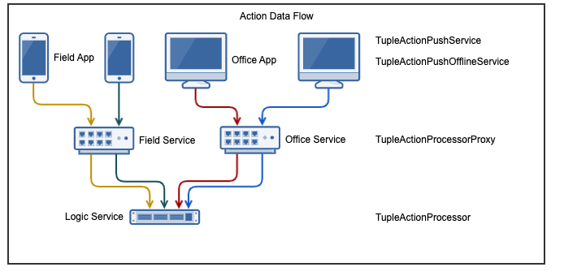
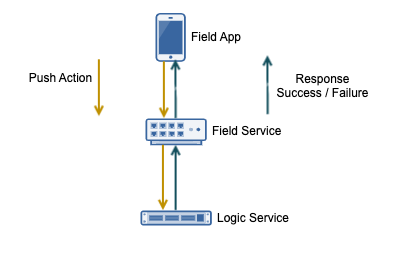

.. _learn_plugin_development_add_actions:

===========
Add Actions
===========

Outline
-------

In this document we setup the VortexJS Tuple Actions.

Since the Vortex serialisable base class is called a :code:`Tuple`, Actions
are referred to as "Action Tuples", and name :code:`DoSomethingActionTuple`.

A Tuple Action represents an action the user has taken, this can be:

*   Clicking a button (:code:`TupleGenericAction`)
*   Updating data (:code:`TupleUpdateAction`)
*   Some other action (extend :code:`TupleActionABC`)

The Action design is ideal for apps where there are many users observing
data more than altering it or performing actions against it.

Typically, users can only perform so many updates per a minute. TupleActions takes
the approach of having many small, discrete "Actions" that can be sent back to the
server as they are performed.

The Observable then ensures that all users watching the data are updated immediately,
Keeping all users working with the latest data as TupleActions processed.

This helps avoid issues,
such as one user's update overwriting another user's update.
These issues you will get if you're using the VortexJS TupleLoader for many users.

There are two Angular services that provide support for pushing Tuple Actions to the
Field service.

#.  :code:`TupleActionPushService`, for online only actions.

#.  :code:`TupleActionPushOfflineService`, for actions that will be stored locally and
    delivered when the device is next online.

Both these services have the same functional interface, :code:`pushAction()`.



On the Logic service, the :code:`TupleActionProcessorProxy` class receives
all the TupleActions, delegates
processing to a :code:`TupleActionProcessorDelegateABC` class. A delegate can be
registered to handle just one type of action, and/or a default delegate can be
registered to catch all.

Like the Observable, there is a :code:`TupleActionProcessorProxy` needed in the
field service that passes actions onto the Logic service for processing.

Unlike the Observable, the TupleAction Field or Office proxy passes every action onto the
Logic service, waits for a response from the Logic service then sends that back to
the Field or Office device.

Actions require responses. Callers of the :code:`TupleActionPushService` will receive a
promise which resolve regardless of if the push timed out or failed.

In the case of :code:`TupleActionPushOfflineService`, a promise is returned and resolved
on success of the commit to the database in the Field/Office device.

The :code:`TupleActionPushOfflineService` will continually retry until it receives
either a success or failure response from the Field service.

.. note:: The Field/Office devices don't and can't talk directly to the Logic service.




Advantages
``````````
#.  Reduces the risk of one update overwriting another.
#.  Atomic changes can more easily be buffered when the device is offline.
#.  Smaller, more immediate results for updates.

Disadvantages
`````````````

#.  This could lead to higher resource usage and less efficient commits.

Objective
---------

In this document, our plugin will provide the following actions to the user:

#.  Increase or decrease an Int
#.  Toggle capitals of a string

The action will be processed by the Logic Service which will update the table created in
:ref:`learn_plugin_development_add_storage_add_string_int_table`.

This is the order:

#.  Add the Action scaffolding for the project.
#.  Add the Logic side Action Processor
#.  Alter the Observable tutorial UI to incorporate buttons and send the actions.

Add Python Tuples
-----------------

Add File :file:`StringCapToggleActionTuple.py`
``````````````````````````````````````````````

The :file:`StringCapToggleActionTuple.py` defines a python action tuple.

----

Create the file
:file:`peek_plugin_tutorial/_private/tuples/StringCapToggleActionTuple.py`
and populate it with the following contents.

::

        from vortex.Tuple import addTupleType, TupleField
        from vortex.TupleAction import TupleActionABC

        from peek_plugin_tutorial._private.PluginNames import tutorialTuplePrefix


        @addTupleType
        class StringCapToggleActionTuple(TupleActionABC):
            __tupleType__ = tutorialTuplePrefix + "StringCapToggleActionTuple"

            stringIntId = TupleField()


Add File :file:`AddIntValueActionTuple.py`
``````````````````````````````````````````

The :file:`AddIntValueActionTuple.py` defines a python action tuple.

----

Create the file
:file:`peek_plugin_tutorial/_private/tuples/AddIntValueActionTuple.py`
and populate it with the following contents.

::

        from vortex.Tuple import addTupleType, TupleField
        from vortex.TupleAction import TupleActionABC

        from peek_plugin_tutorial._private.PluginNames import tutorialTuplePrefix


        @addTupleType
        class AddIntValueActionTuple(TupleActionABC):
            __tupleType__ = tutorialTuplePrefix + "AddIntValueActionTuple"

            stringIntId = TupleField()
            offset = TupleField()


Add TypeScript Tuples
---------------------

Add :file:`StringCapToggleActionTuple.ts`
`````````````````````````````````````````

The :file:`StringCapToggleActionTuple.ts` file defines a TypeScript class for our
:code:`StringCapToggleActionTuple` Tuple Action.

----

Create file
:file:`peek_plugin_tutorial/plugin-module/_private/tuples/StringCapToggleActionTuple.ts`,
with contents ::

        import {addTupleType, Tuple, TupleActionABC} from "@synerty/vortexjs";
        import {tutorialTuplePrefix} from "../PluginNames";

        @addTupleType
        export class StringCapToggleActionTuple extends TupleActionABC {
            static readonly tupleName = tutorialTuplePrefix + "StringCapToggleActionTuple";

            stringIntId: number;

            constructor() {
                super(StringCapToggleActionTuple.tupleName)
            }
        }


Add :file:`AddIntValueActionTuple.ts`
`````````````````````````````````````

The :file:`AddIntValueActionTuple.ts` file defines a TypeScript class for our
:code:`AddIntValueActionTuple` Tuple Action.

----

Create file
:file:`peek_plugin_tutorial/plugin-module/_private/tuples/AddIntValueActionTuple.ts`,
with contents ::

        import {addTupleType, Tuple, TupleActionABC} from "@synerty/vortexjs";
        import {tutorialTuplePrefix} from "../PluginNames";

        @addTupleType
        export class AddIntValueActionTuple extends TupleActionABC {
            public static readonly tupleName = tutorialTuplePrefix + "AddIntValueActionTuple";

            stringIntId: number;
            offset: number;

            constructor() {
                super(AddIntValueActionTuple.tupleName)
            }
        }


Edit File :file:`_private/index.ts`
```````````````````````````````````

The :file:`_private/index.ts` file will re-export the Tuples in a more standard way.
Developers won't need to know the exact path of the file.

----

Edit file :file:`peek_plugin_tutorial/plugin-module/_private/index.ts`,
Append the lines: ::

        export {StringCapToggleActionTuple} from "./tuples/StringCapToggleActionTuple";
        export {AddIntValueActionTuple} from "./tuples/AddIntValueActionTuple";


Logic Service Setup
-------------------

Add Package :file:`controller`
``````````````````````````````

The :file:`controller` python package will contain the classes that provide logic to
the plugin, like a brain controlling limbs.

.. note:: Though the tutorial creates "controllers", the plugin developer can decide how
    ever they want to structure this.

----

Create the :file:`peek_plugin_tutorial/_private/logic/controller` package, with
the commands ::

        mkdir peek_plugin_tutorial/_private/logic/controller
        touch peek_plugin_tutorial/_private/logic/controller/__init__.py


Add File :file:`MainController.py`
``````````````````````````````````

The :file:`MainController.py` will glue everything together. For large plugins there
will be multiple sub controllers.

In this example we have everything in MainController.

----

Create the file
:file:`peek_plugin_tutorial/_private/logic/controller/MainController.py`
and populate it with the following contents.

::

        import logging

        from twisted.internet.defer import Deferred
        from vortex.DeferUtil import deferToThreadWrapWithLogger

        from vortex.TupleSelector import TupleSelector
        from vortex.TupleAction import TupleActionABC
        from vortex.handler.TupleActionProcessor import TupleActionProcessorDelegateABC
        from vortex.handler.TupleDataObservableHandler import TupleDataObservableHandler

        from peek_plugin_tutorial._private.storage.StringIntTuple import StringIntTuple
        from peek_plugin_tutorial._private.tuples.StringCapToggleActionTuple import StringCapToggleActionTuple
        from peek_plugin_tutorial._private.tuples.AddIntValueActionTuple import AddIntValueActionTuple

        logger = logging.getLogger(__name__)


        class MainController(TupleActionProcessorDelegateABC):
            def __init__(self, dbSessionCreator, tupleObservable: TupleDataObservableHandler):
                self._dbSessionCreator = dbSessionCreator
                self._tupleObservable = tupleObservable

            def shutdown(self):
                pass

            def processTupleAction(self, tupleAction: TupleActionABC) -> Deferred:

                if isinstance(tupleAction, AddIntValueActionTuple):
                    return self._processAddIntValue(tupleAction)

                if isinstance(tupleAction, StringCapToggleActionTuple):
                    return self._processCapToggleString(tupleAction)

                raise NotImplementedError(tupleAction.tupleName())

            @deferToThreadWrapWithLogger(logger)
            def _processCapToggleString(self, action: StringCapToggleActionTuple):
                try:
                    # Perform update using SQLALchemy
                    session = self._dbSessionCreator()
                    row = (session.query(StringIntTuple)
                           .filter(StringIntTuple.id == action.stringIntId)
                           .one())

                    # Exit early if the string is empty
                    if not row.string1:
                        logger.debug("string1 for StringIntTuple.id=%s is empty")
                        return

                    if row.string1[0].isupper():
                        row.string1 = row.string1.lower()
                        logger.debug("Toggled to lower")
                    else:
                        row.string1 = row.string1.upper()
                        logger.debug("Toggled to upper")

                    session.commit()

                    # Notify the observer of the update
                    # This tuple selector must exactly match what the UI observes
                    tupleSelector = TupleSelector(StringIntTuple.tupleName(), {})
                    self._tupleObservable.notifyOfTupleUpdate(tupleSelector)

                finally:
                    # Always close the session after we create it
                    session.close()

            @deferToThreadWrapWithLogger(logger)
            def _processAddIntValue(self, action: AddIntValueActionTuple):
                try:
                    # Perform update using SQLALchemy
                    session = self._dbSessionCreator()
                    row = (session.query(StringIntTuple)
                           .filter(StringIntTuple.id == action.stringIntId)
                           .one())
                    row.int1 += action.offset
                    session.commit()

                    logger.debug("Int changed by %u", action.offset)

                    # Notify the observer of the update
                    # This tuple selector must exactly match what the UI observes
                    tupleSelector = TupleSelector(StringIntTuple.tupleName(), {})
                    self._tupleObservable.notifyOfTupleUpdate(tupleSelector)

                finally:
                    # Always close the session after we create it
                    session.close()


Add File :file:`TupleActionProcessor.py`
````````````````````````````````````````

The class in file :file:`TupleActionProcessor.py`, accepts all tuple actions for this
plugin and calls the relevant :code:`TupleActionProcessorDelegateABC`.

----

Create the file
:file:`peek_plugin_tutorial/_private/logic/TupleActionProcessor.py`
and populate it with the following contents.

::

        from vortex.handler.TupleActionProcessor import TupleActionProcessor

        from peek_plugin_tutorial._private.PluginNames import tutorialFilt
        from peek_plugin_tutorial._private.PluginNames import tutorialActionProcessorName
        from .controller.MainController import MainController


        def makeTupleActionProcessorHandler(mainController: MainController):
            processor = TupleActionProcessor(
                tupleActionProcessorName=tutorialActionProcessorName,
                additionalFilt=tutorialFilt,
                defaultDelegate=mainController)
            return processor


Edit File :file:`LogicEntryHook.py`
```````````````````````````````````

We need to update :file:`LogicEntryHook.py`, it will initialise the
 :code:`MainController` and :code:`TupleActionProcessor` objects.

----

Edit the file :file:`peek_plugin_tutorial/_private/logic/LogicEntryHook.py`:

#.  Add these imports at the top of the file with the other imports: ::

        from .TupleActionProcessor import makeTupleActionProcessorHandler
        from .controller.MainController import MainController

#.  Add these line just before :code:`logger.debug("started")` in
    the :code:`start()` method: ::


        mainController = MainController(
            dbSessionCreator=self.dbSessionCreator,
            tupleObservable=tupleObservable)

        self._loadedObjects.append(mainController)
        self._loadedObjects.append(makeTupleActionProcessorHandler(mainController))

----

The Action Processor for the Logic Service service is setup now.

Field Service Setup
-------------------

Add File :file:`DeviceTupleProcessorActionProxy.py`
```````````````````````````````````````````````````

The :file:`DeviceTupleProcessorActionProxy.py` creates the Tuple Action Processor Proxy.
This class is responsible for proxying action tuple data between the devices
and the Logic Service.

----

Create the file
:file:`peek_plugin_tutorial/_private/field/DeviceTupleProcessorActionProxy.py`
and populate it with the following contents.

::

        from peek_plugin_base.PeekVortexUtil import peekServerName
        from peek_plugin_tutorial._private.PluginNames import tutorialFilt
        from peek_plugin_tutorial._private.PluginNames import tutorialActionProcessorName
        from vortex.handler.TupleActionProcessorProxy import TupleActionProcessorProxy


        def makeTupleActionProcessorProxy():
            return TupleActionProcessorProxy(
                        tupleActionProcessorName=tutorialActionProcessorName,
                        proxyToVortexName=peekServerName,
                        additionalFilt=tutorialFilt)


Edit File :file:`FieldEntryHook.py`
```````````````````````````````````

We need to update :file:`FieldEntryHook.py`, it will initialise the tuple action proxy
object when the Plugin is started.

----

Edit the file :file:`peek_plugin_tutorial/_private/field/FieldEntryHook.py`:

#.  Add this import at the top of the file with the other imports: ::

        from .DeviceTupleProcessorActionProxy import makeTupleActionProcessorProxy

#.  Add this line after the docstring in the :code:`start()` method: ::

        self._loadedObjects.append(makeTupleActionProcessorProxy())


Office Service Setup
--------------------

Add File :file:`DeviceTupleProcessorActionProxy.py`
```````````````````````````````````````````````````

The :file:`DeviceTupleProcessorActionProxy.py` creates the Tuple Action Processor Proxy.
This class is responsible for proxying action tuple data between the devices
and the Logic Service.

----

Create the file
:file:`peek_plugin_tutorial/_private/office/DeviceTupleProcessorActionProxy.py`
and populate it with the following contents.

::

        from peek_plugin_base.PeekVortexUtil import peekServerName
        from peek_plugin_tutorial._private.PluginNames import tutorialFilt
        from peek_plugin_tutorial._private.PluginNames import tutorialActionProcessorName
        from vortex.handler.TupleActionProcessorProxy import TupleActionProcessorProxy


        def makeTupleActionProcessorProxy():
            return TupleActionProcessorProxy(
                        tupleActionProcessorName=tutorialActionProcessorName,
                        proxyToVortexName=peekServerName,
                        additionalFilt=tutorialFilt)


Edit File :file:`OfficeEntryHook.py`
````````````````````````````````````

We need to update :file:`OfficeEntryHook.py`, it will initialise the tuple action proxy
object when the Plugin is started.

----

Edit the file :file:`peek_plugin_tutorial/_private/office/OfficeEntryHook.py`:

#.  Add this import at the top of the file with the other imports: ::

        from .DeviceTupleProcessorActionProxy import makeTupleActionProcessorProxy

#.  Add this line after the docstring in the :code:`start()` method: ::

        self._loadedObjects.append(makeTupleActionProcessorProxy())


Field App Setup
---------------

Now we need to edit the Angular module in the field-app and add the providers:

Edit File :file:`tutorial.module.ts`
````````````````````````````````````

Edit the :file:`tutorial.module.ts` Angular module for the tutorial plugin to
add the provider entry for the TupleAction service.

----

Edit the file
:file:`peek_plugin_tutorial/_private/field-app/tutorial.module.ts`:

#.  Add the following imports: ::

        // Import the required classes from VortexJS
        import {
            TupleActionPushNameService,
            TupleActionPushOfflineService,
            TupleActionPushService
        } from "@synerty/vortexjs";

        // Import the names we need for the
        import {
            tutorialActionProcessorName
        } from "@peek/peek_plugin_tutorial/_private";


#.  After the imports, add this function ::

        export function tupleActionPushNameServiceFactory() {
            return new TupleActionPushNameService(
                tutorialActionProcessorName, tutorialFilt);
        }

#.  Finally, add this snippet to the :code:`providers` array in
    the :code:`@NgModule` decorator ::


        TupleActionPushOfflineService, TupleActionPushService, {
            provide: TupleActionPushNameService,
            useFactory: tupleActionPushNameServiceFactory
        },


It should look similar to the following: ::

        ...

        import {
            TupleActionPushNameService,
            TupleActionPushOfflineService,
            TupleActionPushService
        } from "@synerty/vortexjs";

        import {
            tutorialActionProcessorName
        } from "@peek/peek_plugin_tutorial/_private";

        ...

        export function tupleActionPushNameServiceFactory() {
            return new TupleActionPushNameService(
                tutorialActionProcessorName, tutorialFilt);
        }


        @NgModule({
            ...
            providers: [
                ...
                TupleActionPushOfflineService, TupleActionPushService, {
                    provide: TupleActionPushNameService,
                    useFactory: tupleActionPushNameServiceFactory
                },
                ...
            ]
        })
        export class TutorialModule {

        }


----

At this point, all of the Tuple Action setup is done. It's much easier to work with the
tuple action code from here on.

Add Mobile View
---------------

Finally, lets add a new component to the mobile screen.

Edit File :file:`string-int.component.ts`
`````````````````````````````````````````

Edit the file, :file:`string-int.component.ts` to connect the tuple action to the
frontend.

----

edit the file
:file:`peek_plugin_tutorial/_private/field-app/string-int/string-int.component.ts`

#.  Add the following imports:

::

        import {TupleActionPushService} from "@synerty/vortexjs";

        import {
            AddIntValueActionTuple,
            StringCapToggleActionTuple
        } from "@peek/peek_plugin_tutorial/_private";


#.  Add :code:`private actionService: TupleActionPushService` to the constructor
    argument:

::

        constructor(private actionService: TupleActionPushService,
            ...) {

#.  Finally, add the methods to the :code:`StringIntComponent` class after the
    :code:`constructor`:

::

        toggleUpperClicked(item) {
            let action = new StringCapToggleActionTuple();
            action.stringIntId = item.id;
            this.actionService.pushAction(action)
                .then(() => {
                    alert('success');

                })
                .catch((err) => {
                    alert(err);
                });
        }

        incrementClicked(item) {
            let action = new AddIntValueActionTuple();
            action.stringIntId = item.id;
            action.offset = 1;
            this.actionService.pushAction(action)
                .then(() => {
                    alert('success');

                })
                .catch((err) => {
                    alert(err);
                });
        }

        decrementClicked(item) {
            let action = new AddIntValueActionTuple();
            action.stringIntId = item.id;
            action.offset = -1;
            this.actionService.pushAction(action)
                .then(() => {
                    alert('success');

                })
                .catch((err) => {
                    alert(err);
                });
        }


It should look similar to the following:

::

        ...

        import {
            AddIntValueActionTuple,
            StringCapToggleActionTuple
        } from "@peek/peek_plugin_tutorial/_private";

        ...

            constructor(private actionService: TupleActionPushService,
                        ...) {

            ...

            incrementClicked(item) {
                let action = new AddIntValueActionTuple();
                action.stringIntId = item.id;
                action.offset = 1;
                this.actionService.pushAction(action)
                    .then(() => {
                        alert('success');

                    })
                    .catch((err) => {
                        alert(err);
                    });
            }


            decrementClicked(item) {
                let action = new AddIntValueActionTuple();
                action.stringIntId = item.id;
                action.offset = -1;
                this.actionService.pushAction(action)
                    .then(() => {
                        alert('success');

                    })
                    .catch((err) => {
                        alert(err);
                    });
            }

            mainClicked() {
                this.router.navigate([tutorialBaseUrl]);
            }

        }


Edit File :file:`string-int.component.mweb.html`
````````````````````````````````````````````````

Edit the web HTML view file, :file:`string-int.component.mweb.html` and insert buttons
that will change initiate the created tuple actions.

----

Edit the file
:file:`peek_plugin_tutorial/_private/field-app/string-int/string-int.component.mweb.html`
and populate it with the following contents:

::

        <div class="container">
            <Button class="btn btn-default" (click)="mainClicked()">Back to Main</Button>

            <table class="table table-striped">
                <thead>
                <tr>
                    <th>String</th>
                    <th>Int</th>
                    <th></th>
                </tr>
                </thead>
                <tbody>
                <tr *ngFor="let item of stringInts">
                    <td>{{item.string1}}</td>
                    <td>{{item.int1}}</td>
                    <td>
                        <Button class="btn btn-default" (click)="toggleUpperClicked(item)">
                            Toggle Caps
                        </Button>
                        <Button class="btn btn-default" (click)="incrementClicked(item)">
                            Increment Int
                        </Button>
                        <Button class="btn btn-default" (click)="decrementClicked(item)">
                            Decrement Int
                        </Button>
                    </td>
                </tr>
                </tbody>
            </table>
        </div>

Testing
-------

#.  Open Field web app

#.  Tap the Tutorial app icon

#.  Tap the "String Ints" button

#.  Expect to see the string ints data

#.  Select the "Toggle Caps" button

#.  If successful an alert will appear stating "success".  If you receive an error, go
    back through the "Add Actions" instructions.  Restart the logic service and retry
    step five

#.  You will see the data update instantly

#.  Return to step five for buttons "Increment Int" and "Decrement Int"

Offline Observable
------------------

The Synerty VortexJS library has an :code:`TupleDataOfflineObserverService`,
once offline storage has been setup,
(here :ref:`learn_plugin_development_add_offline_storage`),
the offline observable is a drop in replacement.

When using the offline observable, it will:

#.  Queue a request to observe the data, sending it to the field service

#.  Query the SQL db in the browser/field device, and return the data for the observer.
    This provides instant data for the user.

When new data is sent to the the observer (Field/Office service)
from the observable (Field Service), the offline observer does two things:

#.  Notifies the subscribers like normal

#.  Stores the data back into the offline db, in the browser / app.

Edit File :file:`string-int.component.ts`
`````````````````````````````````````````

:code:`TupleDataOfflineObserverService` is a drop-in replacement for
:code:`TupleDataObserverService`.

Switching to use the offline observer requires two edits to
:file:`string-int.component.ts`.

----

Edit file
:file:`peek_plugin_tutorial/_private/field-app/string-int/string-int.component.ts`.

Add the import for the TupleDataOfflineObserverService:

::

    import TupleDataOfflineObserverService from "@synerty/vortexjs";

Change the type of the :code:`tupleDataObserver` parameter in the component constructor,
EG,

From ::

        constructor(private tupleDataObserver: TupleDataObserverService, ...) {

To ::

        constructor(private tupleDataObserver: TupleDataOfflineObserverService, ...) {

----

That's it. Now the String Int data will load on the device, even when the Vortex between
the device and the field service is offline.

