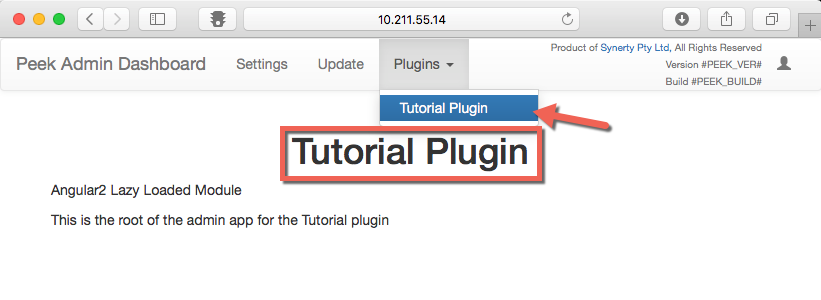

.. _learn_plugin_development_add_admin_app:

=============
Add Admin App
=============

The admin app is the admin user interface.
This is known as the "frontend" in web terminology.
The backend for the peek admin app is the peek logic service.

In this section we'll add the root admin page for the plugin.

We only scratch the surface of using Angular, that`s outside the scope of this guide.

See :ref:`developing_with_the_frontends` to learn more about how Peek
pieces together the frontend code from the various plugins.

Admin App File Structure
------------------------

Add Directory :file:`admin-app`
```````````````````````````````

The :file:`admin-app` directory will contain the plugins the Angular application.

Angular "Lazy Loads" this part of the plugin, meaning it only loads it when the user
navigates to the page, and unloads it when it's finished.

This allows large, single page web applications to be made. Anything related to the user
interface should be lazy loaded.

----

Create directory :file:`peek_plugin_tutorial/_private/admin-app`

Add File :file:`tutorial.component.html`
````````````````````````````````````````

The :file:`tutorial.component.html` file is the HTML file for the Angular component
(:file:`tutorial.component.ts`) we create next.

----

Create the file :file:`peek_plugin_tutorial/_private/admin-app/tutorial.component.html`
and populate it with the following contents.

::

        <div class="container">
          <!-- Nav tabs -->
          <ul class="nav nav-tabs" role="tablist">
            <!-- Home Tab -->
            <li role="presentation" class="active">
                <a href="#home" aria-controls="home" role="tab" data-toggle="tab">Home</a>
            </li>

          </ul>

          <!-- Tab panes -->
          <div class="tab-content">
            <!-- Home Tab -->
            <div role="tabpanel" class="tab-pane active" id="home">
                <h1 class="text-center">Tutorial Plugin</h1>
                <p>Angular2 Lazy Loaded Module</p>
                <p>This is the root of the admin app for the Tutorial plugin</p>
            </div>

          </div>
        </div>


Add File :file:`tutorial.component.ts`
``````````````````````````````````````

The :file:`tutorial.component.ts` is the Angular Component for the admin page.
It's loaded by the default route defined in :file:`tutorial.module.ts`.

`See NgModule for more <https://angular.io/docs/ts/latest/guide/ngmodule.html>`_

----

Create the file :file:`peek_plugin_tutorial/_private/admin-app/tutorial.component.ts`
and populate it with the following contents.

::

        import {Component, OnInit} from "@angular/core";

        @Component({
            selector: 'tutorial-admin',
            templateUrl: 'tutorial.component.html'
        })
        export class TutorialComponent  implements OnInit {

            ngOnInit() {

            }
        }


Add File :file:`tutorial.module.ts`
```````````````````````````````````

The :file:`tutorial.module.ts` is the main Angular module of the plugin.

This file can describe other routes, that will load other components. This is standard
Angular.

`See NgModule for more <https://angular.io/docs/ts/latest/guide/ngmodule.html>`_

----

Create the file :file:`peek_plugin_tutorial/_private/admin-app/tutorial.module.ts`
and populate it with the following contents.

::

        import {CommonModule} from "@angular/common";
        import {FormsModule} from "@angular/forms";
        import {NgModule} from "@angular/core";
        import {Routes, RouterModule} from "@angular/router";


        // Import our components
        import {TutorialComponent} from "./tutorial.component";

        // Define the routes for this Angular module
        export const pluginRoutes: Routes = [
            {
                path: '',
                pathMatch: 'full',
                component: TutorialComponent
            }

        ];

        // Define the module
        @NgModule({
            imports: [
                CommonModule,
                RouterModule.forChild(pluginRoutes),
                FormsModule
            ],
            exports: [],
            providers: [],
            declarations: [TutorialComponent]
        })
        export class TutorialModule {

        }


Edit File :file:`plugin_package.json`
`````````````````````````````````````

Finally, Edit the file :file:`peek_plugin_tutorial/plugin_package.json` to tell the
platform that we want to use the admin-app service:

#.  Add **"admin-app"** to the requiresServices section so it looks like ::

        "requiresServices": [
            "admin-app"
        ]

#.  Add the **admin-app** section after **requiresServices** section: ::

        "admin-app": {
            "showHomeLink": true,
            "appDir": "_private/admin-app",
            "appModule": "tutorial.module#TutorialModule"
        }

#.  Ensure your JSON is still valid (Your IDE may help here)

Here is an example ::

        {
            ...
            "requiresServices": [
                ...
                "admin"
            ],
            ...
            "admin": {
                ...

                "showHomeLink": true,
                "appDir": "_private/admin-app",
                "appModule": "tutorial.module#TutorialModule"
            }
        }


Running on the Admin App Service
--------------------------------

The Logic Service provides the web service that serves the admin angular
application.

The Logic Service takes care of combining all the plugin files into the build
directories in the peek_admin_app package. We will need to restart Logic Service for it to
include our plugin in the admin UI.

See :ref:`developing_with_the_frontends` for more details.

Check File :file:`~/peek-logic-service.home/config.json`
````````````````````````````````````````````````````````

Check the :file:`~/peek-logic-service.home/config.json` file:

#.  Ensure **frontend.webBuildEnabled** is set to **true**, with no quotes
#.  Ensure **frontend.webBuildPrepareEnabled** is set to **true**, with no quotes

.. note:: It would be helpful if this is the only plugin enabled at this point.

Example: ::

        {
            ...
            "frontend": {
                ...
                "webBuildEnabled": true,
                "webBuildPrepareEnabled": true
            },
            ...
        }


Run :file:`run_peek_logic_service`
``````````````````````````````````

You can now run the peek logic service, you should see your plugin load. ::

        peek@_peek:~$ run_peek_logic_service
        ...
        INFO peek_platform.frontend.WebBuilder:Rebuilding frontend distribution
        ...
        INFO txhttputil.site.SiteUtil:Peek Admin is alive and listening on http://10.211.55.14:8010
        ....

----

Now bring up a web browser and navigate to
`http://localhost:8010 <http://localhost:8010>`_ or the IP mentioned in the output of
:command:`run_peek_logic_service`.

If you see this, then congratulations, you've just enabled your plugin to use the
Peek Platform, Admin App Service.



