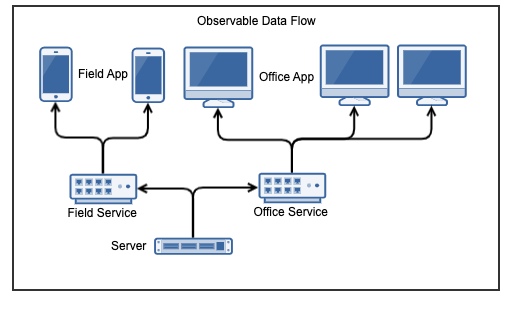

.. _learn_plugin_development_add_observable:

===============
Add Observables
===============

Outline
-------

In this document, we setup the Tuple Observable from VortexJS. The Field and Office
services use this to request and receive data updates from the Logic service.

We'll use the term "devices" interchangeably with Field/Office.

This is a one directional data flow once the initial request has been made, the
Server will send updates to the Field/Office with out the Field/Office services
polling for it.

In the example setup, the Field/Office Services proxy Observable requests/responses
between the Logic Service and Field/Office devices. The Proxy on the Field/Office service is aware
of all the Field/Office App devices that want to observe the data, the Logic Service only knows
that the Field/Office Service is observing the data.

.. note:: The Field/Office devices don't and can't talk directly to the Logic Service.

The :code:`TupleDataObservableHandler` class provides the "observable" functionality,
It receives request for data by being sent a :code:`TupleSelector`. The TupleSelector
describes the Tuple type and some conditions of the data the observer wants.

Advantages
``````````
#.  Instant and efficient data updates, data immediately sent to the devices
    with out the devices congesting bandwidth with polls.

Disadvantages
`````````````

#.  There is no support for updates.




Objective
---------

In this document, our plugin will observe updates made to the table created in
:ref:`learn_plugin_development_add_storage_add_string_int_table` via the admin
web app.

This is the order:

#.  Add the Observable scaffolding for the project.
#.  Add the Logic Service side Tuple Provider
#.  Tell the Admin TupleLoader to notifyDeviceInfo the Observable when it makes updates.
#.  Add a new Angular component to observe and display the data.

Server Service Setup
--------------------

Add Package :file:`tuple_providers`
```````````````````````````````````

The :file:`tuple_providers` python package will contain the classes that generate tuple
data to send via the observable.

----

Create the :file:`peek_plugin_tutorial/_private/server/tuple_providers` package, with
the commands ::

        mkdir peek_plugin_tutorial/_private/server/tuple_providers
        touch peek_plugin_tutorial/_private/server/tuple_providers/__init__.py

Add File :file:`TupleDataObservable.py`
```````````````````````````````````````

The :file:`TupleDataObservable.py` creates the Observable, registers the
tuple providers (they implement :code:`TuplesProviderABC`)

TupleProviders know how to get the Tuples.

----

Create the file
:file:`peek_plugin_tutorial/_private/server/TupleDataObservable.py`
and populate it with the following contents.

::

        from vortex.handler.TupleDataObservableHandler import TupleDataObservableHandler

        from peek_plugin_tutorial._private.PluginNames import tutorialFilt
        from peek_plugin_tutorial._private.PluginNames import tutorialObservableName


        def makeTupleDataObservableHandler(ormSessionCreator):
            """" Make Tuple Data Observable Handler

            This method creates the observable object, registers the tuple providers and then
            returns it.

            :param ormSessionCreator: A function that returns a SQLAlchemy session when called

            :return: An instance of :code:`TupleDataObservableHandler`

            """
            tupleObservable = TupleDataObservableHandler(
                        observableName=tutorialObservableName,
                        additionalFilt=tutorialFilt)

            # Register TupleProviders here

            return tupleObservable


Edit File :file:`LogicEntryHook.py`
``````````````````````````````````````````

We need to update :file:`LogicEntryHook.py`, it will initialise the observable object
when the Plugin is started.

----

Edit the file :file:`peek_plugin_tutorial/_private/logic/LogicEntryHook.py`:

#.  Add this import at the top of the file with the other imports: ::

        from .TupleDataObservable import makeTupleDataObservableHandler

#.  Add this line after the docstring in the :code:`start()` method: ::

        tupleObservable = makeTupleDataObservableHandler(self.dbSessionCreator)
        self._loadedObjects.append(tupleObservable)


----

The observable for the Logic Service is setup now. We'll add a TupleProvider later.

Field Service Setup
-------------------

Add File :file:`DeviceTupleDataObservableProxy.py`
``````````````````````````````````````````````````

The :file:`DeviceTupleDataObservableProxy.py` creates the Observable Proxy.
This class is responsible for proxying observable data between the devices and the Logic Service.

It reduces the load on the logic service, providing the ability to create more client (Field/Office, for example)
services to scale Peek out for more users, or speed up responsiveness for remote locations.

TupleProviders know how to get the Tuples.

----

Create the file
:file:`peek_plugin_tutorial/_private/field/DeviceTupleDataObservableProxy.py`
and populate it with the following contents.

::

        from peek_plugin_base.PeekVortexUtil import peekServerName
        from peek_plugin_tutorial._private.PluginNames import tutorialFilt
        from peek_plugin_tutorial._private.PluginNames import tutorialObservableName
        from vortex.handler.TupleDataObservableProxyHandler import TupleDataObservableProxyHandler


        def makeDeviceTupleDataObservableProxy():
            return TupleDataObservableProxyHandler(observableName=tutorialObservableName,
                                                   proxyToVortexName=peekServerName,
                                                   additionalFilt=tutorialFilt)


Edit File :file:`FieldEntryHook.py`
``````````````````````````````````````````

We need to update :file:`FieldEntryHook.py`, it will initialise the observable proxy
object when the Plugin is started.

----

Edit the file :file:`peek_plugin_tutorial/_private/field/FieldEntryHook.py`:

#.  Add this import at the top of the file with the other imports: ::

        from .DeviceTupleDataObservableProxy import makeDeviceTupleDataObservableProxy

#.  Add this line after the docstring in the :code:`start()` method: ::

        self._loadedObjects.append(makeDeviceTupleDataObservableProxy())


Field App Setup
---------------

Now we need to edit the Angular module in the field-app and add the providers:


Edit File :file:`tutorial.module.ts`
````````````````````````````````````

Edit the :file:`tutorial.module.ts` Angular module for the tutorial plugin to
add the provider entry for the Observer service.

----

Edit the file
:file:`peek_plugin_tutorial/_private/-app/tutorial.module.ts`:

#.  Add the following imports: ::

        // Import the required classes from VortexJS
        import {
                TupleDataObservableNameService,
                TupleDataObserverService,
                TupleDataOfflineObserverService
        } from "@synerty/vortexjs";

        // Import the names we need for the
        import {
                tutorialObservableName,
                tutorialFilt
        } from "@peek/peek_plugin_tutorial/_private";


#.  After the imports, add this function ::

        export function tupleDataObservableNameServiceFactory() {
            return new TupleDataObservableNameService(
                tutorialObservableName, tutorialFilt);
        }

#.  Finally, add this snippet to the :code:`providers` array in
    the :code:`@NgModule` decorator ::


        TupleDataObserverService, TupleDataOfflineObserverService, {
            provide: TupleDataObservableNameService,
            useFactory: tupleDataObservableNameServiceFactory
        },


It should look similar to the following:

::

        ...

        import {
            TupleDataObserverService,
            TupleDataObservableNameService,
            TupleDataOfflineObserverService,
        } from "@synerty/vortexjs";

        import {
            tutorialObservableName,
            tutorialFilt
        } from "@peek/peek_plugin_tutorial/_private";

        ...

        export function tupleDataObservableNameServiceFactory() {
            return new TupleDataObservableNameService(
                tutorialObservableName, tutorialFilt);
        }


        @NgModule({
            ...
            providers: [
                ...
                TupleDataObserverService, TupleDataOfflineObserverService, {
                    provide: TupleDataObservableNameService,
                    useFactory:tupleDataObservableNameServiceFactory
                },
                ...
            ]
        })
        export class TutorialModule {

        }


----

At this point, all of the observable setup is done. It's much easier to work with the
observable code from here on.

.. _learn_plugin_development_add_observable_add_tuple_provider:

Add Tuple Provider
------------------

Add File :file:`StringIntTupleProvider.py`
``````````````````````````````````````````

The Observable will be sent a :code:`TupleSelector` that describes the data the
sender wants to subscribe to.

Tuple Selectors have two attributes :

#.  A :code:`name`, the name/type of the Type
#.  And a :code:`selector`, this allows the subscriber to observe a filtered set of
    tuples.

The :file:`StringIntTupleProvider.py` loads data from the database, converts it to a
VortexMsg and returns it.

A VortexMsg is a :code:`bytes` python type. It's a serialised and compressed payload.
A Payload is the Vortex transport container.

----

Create the file
:file:`peek_plugin_tutorial/_private/server/tuple_providers/StringIntTupleProvider.py`
and populate it with the following contents.

::

        from txhttputil.util.DeferUtil import deferToThreadWrap
        from typing import Union

        from twisted.internet.defer import Deferred

        from vortex.Payload import Payload
        from vortex.TupleSelector import TupleSelector
        from vortex.handler.TupleDataObservableHandler import TuplesProviderABC

        from peek_plugin_tutorial._private.storage.StringIntTuple import StringIntTuple


        class StringIntTupleProvider(TuplesProviderABC):
            def __init__(self, ormSessionCreator):
                self._ormSessionCreator = ormSessionCreator

            @deferToThreadWrap
            def makeVortexMsg(self, filt: dict,
                              tupleSelector: TupleSelector) -> Union[Deferred, bytes]:
                # Potential filters can be placed here.
                # val1 = tupleSelector.selector["val1"]

                session = self._ormSessionCreator()
                try:
                    tasks = (session.query(StringIntTuple)
                        # Potentially filter the results
                        # .filter(StringIntTuple.val1 == val1)
                        .all()
                    )

                    # Create the vortex message
                    return Payload(filt, tuples=tasks).makePayloadEnvelope().toVortexMsg()

                finally:
                    session.close()


Edit File :file:`TupleDataObservable.py`
````````````````````````````````````````

Edit the :file:`TupleDataObservable.py` python module, and register the new
:code:`StringIntTupleProvider` tuple provider.

----

Edit the file
:file:`peek_plugin_tutorial/_private/server/TupleDataObservable.py`:

#.  Add the following imports: ::

        from .tuple_providers.StringIntTupleProvider import StringIntTupleProvider
        from peek_plugin_tutorial._private.storage.StringIntTuple import StringIntTuple

#.  Find the line :code:`# Register TupleProviders here` and add this line after it: ::

        tupleObservable.addTupleProvider(StringIntTuple.tupleName(),
                                    StringIntTupleProvider(ormSessionCreator))


Admin Update Notify
-------------------

This section notifies the observable when an admin updates a StringIntTuple via the Admin
service/UI.

This setup of the admin editing data, and having it change on Field/Office devices
won't be the only way the observable is notified, however, it is a good setup for admin
configurable items in dropdown lists, etc.


Edit File :file:`StringIntTableHandler.py`
``````````````````````````````````````````

Edit the :file:`StringIntTableHandler.py` file to accept the :code:`tupleObservable`
argument and notifyDeviceInfo the observable when an update occurs.

----

Edit the file
:file:`peek_plugin_tutorial/_private/server/admin_backend/StringIntTableHandler.py`

Add the import: ::

        from vortex.TupleSelector import TupleSelector
        from vortex.handler.TupleDataObservableHandler import TupleDataObservableHandler
        from vortex.sqla_orm.OrmCrudHandler import OrmCrudHandlerExtension


Insert the following class, after the class definition of :code:`class __CrudHandeler` ::


        class __ExtUpdateObservable(OrmCrudHandlerExtension):
            """ Update Observable ORM Crud Extension

            This extension is called after events that will alter data,
            it then notifies the observer.

            """
            def __init__(self, tupleDataObserver: TupleDataObservableHandler):
                self._tupleDataObserver = tupleDataObserver

            def _tellObserver(self, tuple_, tuples, session, payloadFilt):
                selector = {}
                # Copy any filter values into the selector
                # selector["lookupName"] = payloadFilt["lookupName"]
                tupleSelector = TupleSelector(StringIntTuple.tupleName(),
                                              selector)
                self._tupleDataObserver.notifyOfTupleUpdate(tupleSelector)
                return True

            afterUpdateCommit = _tellObserver
            afterDeleteCommit = _tellObserver


Update the instance of handler class

FROM ::

        def makeStringIntTableHandler(dbSessionCreator):


TO ::

        def makeStringIntTableHandler(tupleObservable, dbSessionCreator):


In the :code:`makeStringIntTableHandler` method, insert this line just before the :code:`return handler` ::

        handler.addExtension(StringIntTuple, __ExtUpdateObservable(tupleObservable))


Edit File :file:`admin_backend/__init__.py`
```````````````````````````````````````````

Edit `admin_backend/__init__.py` to take the observable parameter and pass it to the
tuple provider handlers.

----

Edit file :file:`peek_plugin_tutorial/_private/server/admin_backend/__init__.py`

Add the import: ::

        from vortex.handler.TupleDataObservableHandler import TupleDataObservableHandler

Add the function call argument:

FROM ::

        def makeAdminBackendHandlers(dbSessionCreator):


TO ::

        def makeAdminBackendHandlers(tupleObservable: TupleDataObservableHandler,
                                     dbSessionCreator):


Pass the argument to the :code:`makeStringIntTableHandler(...)` method:

FROM ::

        yield makeStringIntTableHandler(dbSessionCreator)


TO ::

        yield makeStringIntTableHandler(tupleObservable, dbSessionCreator)


Edit File :file:`ServerEntryHook.py`
````````````````````````````````````

We need to update :file:`ServerEntryHook.py`, to pass the new observable

----

Edit the file :file:`peek_plugin_tutorial/_private/server/ServerEntryHook.py`,
Add :code:`tupleObservable` to the list of arguments passed to the
:code:`makeAdminBackendHandlers()` method:

FROM: ::

         self._loadedObjects.extend(makeAdminBackendHandlers(self.dbSessionCreator))

TO: ::

         self._loadedObjects.extend(
                makeAdminBackendHandlers(tupleObservable, self.dbSessionCreator))


----

The tuple data observable will now notifyDeviceInfo its observers when an admin updates the
StringInt data.

.. _learn_plugin_development_add_observable_add_field_view:

Add Field View
---------------

Finally, lets add a new component to the Field screen.


Add Directory :file:`string-int`
````````````````````````````````

The :file:`string-int` directory will contain the Angular component and views for our
stringInt page.

----

Create the diretory
:file:`peek_plugin_tutorial/_private/field-app/string-int`
with the command: ::

        mkdir peek_plugin_tutorial/_private/field-app/string-int


Add File :file:`string-int.component.mweb.html`
```````````````````````````````````````````````

The :file:`string-int.component.mweb.html` file is the web app HTML **view** for
the Angular component :file:`string-int.component.ts`.

This is standard HTML with Angular directives.

----

Create the file
:file:`peek_plugin_tutorial/_private/field-app/string-int/string-int.component.mweb.html`
and populate it with the following contents.

::

        <div class="container">
            <Button class="btn btn-default" (click)="mainClicked()">Back to Main</Button>

            <table class="table table-striped">
                <thead>
                    <tr>
                        <th>String</th>
                        <th>Int</th>
                    </tr>
                </thead>
                <tbody>
                    <tr *ngFor="let item of stringInts">
                        <td>{{item.string1}}</td>
                        <td>{{item.int1}}</td>
                    </tr>
                </tbody>
            </table>
        </div>

Add File :file:`string-int.component.ts`
````````````````````````````````````````

The :file:`string-int.component.ts` is the Angular Component that
will be another route within the Tutorial plugin.


----

Create the file
:file:`peek_plugin_tutorial/_private/field-app/string-int/string-int.component.ts`
and populate it with the following contents.

::

        import {Component} from "@angular/core";
        import {Router} from "@angular/router";
        import {StringIntTuple, tutorialBaseUrl} from "@peek/peek_plugin_tutorial/_private";
        import { NgLifeCycleEvents } from "@synerty/peek-plugin-base-js"
        import {
            TupleDataObserverService,
            TupleSelector
        } from "@synerty/vortexjs";

        @Component({
            selector: 'plugin-tutorial-string-int',
            templateUrl: 'string-int.component.mweb.html',
            moduleId: module.id
        })
        export class StringIntComponent extends NgLifeCycleEvents {

            stringInts: Array<StringIntTuple> = [];

            constructor(private tupleDataObserver: TupleDataObserverService,
                        private router: Router) {
                super();

                // Create the TupleSelector to tell the obserbable what data we want
                let selector = {};
                // Add any filters of the data here
                // selector["lookupName"] = "brownCowList";
                let tupleSelector = new TupleSelector(StringIntTuple.tupleName, selector);

                // Setup a subscription for the data
                let sup = tupleDataObserver.subscribeToTupleSelector(tupleSelector)
                    .subscribe((tuples: StringIntTuple[]) => {
                        // We've got new data, assign it to our class variable
                        this.stringInts = tuples;
                    });

                // unsubscribe when this component is destroyed
                // This is a feature of NgLifeCycleEvents
                this.onDestroyEvent.subscribe(() => sup.unsubscribe());

            }

            mainClicked() {
                this.router.navigate([tutorialBaseUrl]);
            }

        }


Edit File :file:`tutorial.module.ts`
````````````````````````````````````

Edit the :file:`tutorial.module.ts`, to include the new component
and add the route to it.


----

Edit :file:`peek_plugin_tutorial/_private/field-app/tutorial.module.ts`:


#.  Add the :code:`StringIntComponent` import with the imports at the top of the file: ::

        import {StringIntComponent} from "./string-int/string-int.component";

#.  Insert the following as the first item in array :code:`pluginRoutes`: ::

                {
                    path: 'stringint',
                    component: StringIntComponent
                },

#.  Add the :code:`StringIntComponent` to the :code:`declarations` in the
    :code:`@NgModule` decorator: ::

            declarations: [...,
                StringIntComponent
                ], ...

#.  Add the following to the :code:`Routes` section: ::

            {
                    path: 'stringint',
                    component: StringIntComponent
            }

    so it looks like below: ::

            export const pluginRoutes: Routes = [
                ...
                {
                    path: 'stringint',
                    component: StringIntComponent
                }
                ...
            ]

----

At this point field is all setup, we just need to add some navigation buttons.


Edit File :file:`tutorial.component.mweb.html`
``````````````````````````````````````````````

Edit the  web HTML view file, :file:`tutorial.component.mweb.html` and insert a
button that will change Angular Routes to our new component.

----

Edit file :file:`peek_plugin_tutorial/_private/field-app/tutorial.component.mweb.html`,
Insert the following just before the last closing :code:`</div>` tag: ::

        <Button class="btn btn-default"
                [routerLink]="['/peek_plugin_tutorial/stringint']">My Jobs >
        </Button>

Testing
-------

#.  Open the field web app
#.  Tap the Tutorial app icon
#.  tap the "String Ints" button

#.  Expect to see the string ints data.

#.  Update the data from the Admin service UI

#.  The data on the field app will immediately change.


Offline Observable
------------------

The Synerty VortexJS library has an :code:`TupleDataOfflineObserverService`,
once offline storage has been setup,
(here :ref:`learn_plugin_development_add_offline_storage`),
the offline observable is a dropin replacement.

When using the offline observable, it will:

#.  Queue a request to observe the data, sending it to the field service

#.  Query the SQL db in the browser/mobile device, and return the data for the observer.
    This provides instant data for the user.

When new data is sent to the the observer (Field/Office service)
from the observable (Field service), the offline observer does two things:

#.  Notifies the subscribers like normal

#.  Stores the data back into the offline db, in the browser / app.


Edit File :file:`string-int.component.ts`
`````````````````````````````````````````

:code:`TupleDataOfflineObserverService` is a drop-in replacement for
:code:`TupleDataObserverService`.

Switching to use the offline observer requires two edits to
:file:`string-int.component.ts`.

----

Edit file
:file:`peek_plugin_tutorial/_private/field-app/string-int/string-int.component.ts`.

Add the import for the TupleDataOfflineObserverService: ::

        import {TupleDataOfflineObserverService} from "@synerty/vortexjs";

Change the type of the :code:`tupleDataObserver` parameter in the component constructor,
EG,

From ::

        constructor(private tupleDataObserver: TupleDataObserverService, ...) {

To ::

        constructor(private tupleDataObserver: TupleDataOfflineObserverService, ...) {

----

That's it. Now the String Int data will load on the device, even when the Vortex between
the device and the field service is offline.


Add More Observables
--------------------

This was a long tutorial, but the good news is that you don't have to repeat all this
every time. Here are the steps you need to repeat to observe more data, altering
them to suit of course.

Create the Python tuples, either
:ref:`learn_plugin_development_add_storage_add_string_int_table`
or :ref:`learn_plugin_development_add_tuples_tutorial_tuple_py`

Add the TypeScript tuples,
:ref:`learn_plugin_development_add_tuples_tutorial_tuple_ts`.

Add a Logic service tuple provider,
:ref:`learn_plugin_development_add_observable_add_tuple_provider`

Then, add the Field, Office or Admin side, add the views and Angular component,
:ref:`learn_plugin_development_add_observable_add_field_view`.

