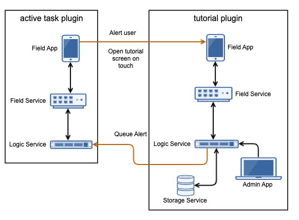

.. _learn_plugin_development_add_plugin_python_apis:

=====================
Add Plugin Python API
=====================

Overview
--------

Plugin APIs play a big part in the design and philosophy behind Peek.

Peeks philosophy is to create many small plugins that each do one job and do it well.

The idea being, once the plugin is written, you can leverage the functionality of that
plugin with out worrying about the internal workings of it.

Anther plugin benefit is to have many smaller code bases. It's easier for a rouge edit to
be introduced into existing code with out strict review procedures. Separate code bases
makes this impossible.

Same Service APIs Only
----------------------

Plugins can only use the APIs of other plugins on the same service.

For example, the code from :code:`peek_plugin_one` that runs on the Logic Service
can only use the API published by the code in :code:`peek_plugin_two` that runs on the
Logic service.

What are APIs
-------------

An API is an application programming interface, in python side Peek terms, it's an
exposed abstract class or classes that other plugins can import and use. By "exposed"
we mean, anything not under the "_private" package.

The Peek platform provides a method to grab a reference to another plugins exposed
API object. The plugin grabbing another plugins API object reference can then call methods
directly on it.

The ABC (Abstract Base Class) is purely for documentation purposes,
and allows the real implementation to be hidden in the :code:`_private` package.

In this example, we're going to expose an API for the Logic service in
the :code:`peek_plugin_tutorial` plugin.

We'll then get the API for the :code:`peek_plugin_inbox` plugin and create
a task.



Setup Logic API
---------------

In this section, we define an API on the Logic Service for the
:code:`peek_plugin_tutorial` plugin.

Add File :file:`DoSomethingTuple.py`
````````````````````````````````````

File :file:`DoSomethingTuple.py` defines a public tuple that will be returned from the API.

----

Create the file
:file:`peek_plugin_tutorial/tuples/DoSomethingTuple.py`
and populate it with the following contents.

::

        from peek_plugin_tutorial._private.PluginNames import tutorialTuplePrefix
        from vortex.Tuple import Tuple, addTupleType, TupleField


        @addTupleType
        class DoSomethingTuple(Tuple):
            """ Do Something Tuple

            This tuple is publicly exposed and will be the result of the doSomething api call.
            """
            __tupleType__ = tutorialTuplePrefix + 'DoSomethingTuple'

            #:  The result of the doSomething
            result = TupleField(defaultValue=dict)


Add Package :file:`logic`
`````````````````````````````````

Have you ever wondered why everything so far has been under the :file:`_private` package?
It's about to make more sense.

The :file:`peek_plugin_tutorial.logic` python package will contain the
exposed API abstract classes.

----

Create the :file:`peek_plugin_tutorial/logic` package, with
the commands ::

        mkdir peek_plugin_tutorial/logic
        touch peek_plugin_tutorial/logic/__init__.py


Add File :file:`TutorialApiABC.py`
``````````````````````````````````

File :file:`TutorialApiABC.py` defines the interface of the API, including what should
be detailed docstrings. It doesn't contain any implementation.

----

Create the file
:file:`peek_plugin_tutorial/logic/TutorialApiABC.py`
and populate it with the following contents.

::

        from abc import ABCMeta, abstractmethod

        from peek_plugin_tutorial.tuples.DoSomethingTuple import DoSomethingTuple


        class TutorialApiABC(metaclass=ABCMeta):

            @abstractmethod
            def doSomethingGood(self, somethingsDescription:str) -> DoSomethingTuple:
                """ Add a New Task

                Add a new task to the users device.

                :param somethingsDescription: An arbitrary string
                :return: The computed result contained in a DoSomethingTuple tuple

                """


Add File :file:`TutorialApi.py`
```````````````````````````````

File :file:`TutorialApi.py` is the implementation of the API. An instance of this class
will be passed to other APIs when they ask for it.

----

Create the file
:file:`peek_plugin_tutorial/_private/logic/TutorialApi.py`
and populate it with the following contents.

::

        from peek_plugin_tutorial._private.logic.controller.MainController import MainController
        from peek_plugin_tutorial.logic.TutorialApiABC import TutorialApiABC
        from peek_plugin_tutorial.tuples.DoSomethingTuple import DoSomethingTuple


        class TutorialApi(TutorialApiABC):
            def __init__(self, mainController: MainController):
                self._mainController = mainController

            def doSomethingGood(self, somethingsDescription: str) -> DoSomethingTuple:
                """ Do Something Good

                Add a new task to the users device.

                :param somethingsDescription: An arbitrary string

                """

                # Here we could pass on the request to the self._mainController if we wanted.
                # EG self._mainController.somethingCalled(somethingsDescription)

                return DoSomethingTuple(result="SUCCESS : " + somethingsDescription)


            def shutdown(self):
                pass


Edit File :file:`LogicEntryHook.py`
``````````````````````````````````````````

We need to update :file:`LogicEntryHook.py`, to initialise the API object.

----

Edit the file :file:`peek_plugin_tutorial/_private/logic/LogicEntryHook.py`:

#.  Add this import at the top of the file with the other imports: ::

        from .TutorialApi import TutorialApi


#.  Add this line at the end of the :code:`__init__(...):` method: ::

        self._api = None


#.  Add this line just before the :code:`logger.debug("Started")` line at the end
    of the :code:`start()` method: ::

        # Initialise the API object that will be shared with other plugins
        self._api = TutorialApi(mainController)
        self._loadedObjects.append(self._api)


#.  Add this line just before the :code:`logger.debug("Stopped")` line at the end
    of the :code:`stop()` method: ::

        self._api = None


#.  Add this method to end of the :code:`LogicEntryHook` class: ::


        @property
        def publishedLogicApi(self) -> object:
            """ Published Logic Service API

            :return  class that implements the API that can be used by other Plugins on this
            platform service.
            """
            return self._api


----

The API is now accessible from other plugins.

Use Logic Service API
---------------------

In this section we'll get a reference to the Peek Plugin Inbox API and then create a task on
the Field or Office UI.

.. note:: In order to use this example, you will need to have the
    :code:`peek_core_user` plugin installed and enabled in
    the Field, Office, and Logic services, via their config.json files.

    The user plugin is public, it can be installed with
    :command:`pip install peek-core-user`.

.. note:: In order to use this example, you will need to have the
    :code:`peek_plugin_inbox` plugin installed and enabled in
    the Field, Office, and Logic services, via their config.json files.

    The peek inbox plugin is public, it can be installed with
    :command:`pip install peek_plugin_inbox`.

Add File :file:`ExampleUseTaskApi.py`
`````````````````````````````````````

File :file:`ExampleUseTaskApi.py` contains the code that uses the Peek Inbox Tasks API.

----

Create the file
:file:`peek_plugin_tutorial/_private/logic/ExampleUseTaskApi.py`
and populate it with the following contents.

Replace the :code:`"userId"` with your user id.

::

        import logging
        import pytz
        from datetime import datetime

        from twisted.internet import reactor
        from twisted.internet.defer import inlineCallbacks

        from peek_plugin_inbox.logic.InboxApiABC import InboxApiABC, NewTask
        from peek_plugin_tutorial._private.logic service.controller.MainController import MainController
        from peek_plugin_tutorial._private.PluginNames import tutorialPluginName

        logger = logging.getLogger(__name__)


        class ExampleUseTaskApi:
            def __init__(self, mainController: MainController, inboxApi: InboxApiABC):
                self._mainController = mainController
                self._inboxApi = inboxApi

            def start(self):
                reactor.callLater(1, self.sendTask)
                return self

            @inlineCallbacks
            def sendTask(self):
                # First, create the task
                newTask = NewTask(
                    pluginName=tutorialPluginName,
                    uniqueId=str(datetime.now(pytz.utc)),
                    userId="userId",  # <----- Set to your user id
                    title="A task from tutorial plugin",
                    description="Tutorials task description",
                    routePath="/peek_plugin_tutorial",
                    autoDelete=NewTask.AUTO_DELETE_ON_SELECT,
                    overwriteExisting=True,
                    notificationRequiredFlags=NewTask.NOTIFY_BY_DEVICE_SOUND
                                              | NewTask.NOTIFY_BY_EMAIL
                )

                # Now send the task via the inbox tasks API
                yield self._inboxApi.addTask(newTask)

                logger.debug("Task Sent")

            def shutdown(self):
                pass


Edit File :file:`LogicEntryHook.py`
``````````````````````````````````````````

We need to update :file:`LogicEntryHook.py`, to initialise the example code

----

Edit the file :file:`peek_plugin_tutorial/_private/logic/LogicEntryHook.py`:

#.  Add this import at the top of the file with the other imports: ::

        from peek_plugin_inbox.logic.InboxApiABC import InboxApiABC
        from .ExampleUseTaskApi import ExampleUseTaskApi


#.  Add this line just before the :code:`logger.debug("Started")` line at the end
    of the :code:`start()` method: ::

        # Get a reference for the Inbox Task
        inboxApi = self.platform.getOtherPluginApi("peek_plugin_inbox")
        assert isinstance(inboxApi, InboxApiABC), "Wrong inboxApi"
        # Initialise the example code that will send the test task
        self._loadedObjects.append(
                ExampleUseTaskApi(mainController, inboxApi).start()
        )


Testing
-------

#.  Open Field web app

#.  Tap Task icon located in the top right corner

#.  You will see the task in the list
