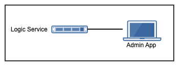

.. _learn_plugin_development_add_tuple_loader:

================
Add Tuple Loader
================

Outline
-------

In this document, we'll use the TupleLoader from VortexJS to load and update some
settings from the tables created in
:ref:`learn_plugin_development_add_storage_add_string_int_table` and tuples created in
:ref:`learn_plugin_development_add_tuples`.

The Admin and Logic services talk to each other via a Vortex, this is the name
given to the transport layer of VortexJS and VortexPY.

A plugin developer could choose to use standard HTTP requests with JSON, however,
the Vortex maintains a persistent connection unless it's shutdown.



This document modifies both the logic and admin parts of the plugin.

Advantages
``````````
#.  Easily edit table data.

Disadvantages
`````````````

#.  Not suitable for multiple users.

Logic Service Scaffold
----------------------

This section sets up the non specific files needed when we add the Tuple Load Handlers.

Add Package :file:`admin_backend`
`````````````````````````````````

The :file:`admin_backend` python package will contain the classes that provide
data sources to the Admin web app.

----

Create the :file:`peek_plugin_tutorial/_private/logic/admin_backend` package, with
the commands ::

        mkdir peek_plugin_tutorial/_private/logic/admin_backend
        touch peek_plugin_tutorial/_private/logic/admin_backend/__init__.py


Edit File :file:`admin_backend/__init__.py`
```````````````````````````````````````````

In this step, we add a setup method on the admin_backend package, this setup method
then loads all the handlers needed for the backend.

This just helps sectionalise the code a bit.

The :code:`makeAdminBackendHandlers` method is a generator because we use :code:`yield`.
We can yield more items after the first one, the calling will get an iterable return.

----

Edit file :file:`peek_plugin_tutorial/_private/logic/admin_backend/__init__.py`
Add the following:

::


        def makeAdminBackendHandlers(dbSessionCreator):
            pass


Edit File :file:`LogicEntryHook.py`
````````````````````````````````````

Now, we need to create and destroy our :code:`admin_backend` handlers when the Logic
Service starts the plugin.

If you look at :code:`self._loadedObjects`, you'll see that the :code:`stop()` method
shuts down all objects we add to this array. So adding to this array serves two purposes

#.  It keeps a reference to the object, ensuring it isn't garbage collected when the
    :code:`start()` method ends.

#.  It ensures all the objects are properly shutdown. In our case, this means it stops
    listening for payloads.

----

Edit file :file:`peek_plugin_tutorial/_private/logic/LogicEntryHook.py` :

#.  Add this import up the top of the file ::

        from .admin_backend import makeAdminBackendHandlers

#.  Add this line after the docstring in the :code:`start()` method ::

        self._loadedObjects.extend(makeAdminBackendHandlers(self.dbSessionCreator))


The method should now look similar to this ::

        def start(self):
            """ Load

            This will be called when the plugin is loaded, just after the db is migrated.
            Place any custom initialiastion steps here.

            """
            self._loadedObjects.extend(makeAdminBackendHandlers(self.dbSessionCreator))
            logger.debug("Started")


Test Python Services
--------------------

The backend changes are complete, please run :command:`run_peek_logic_service` to ensure that
there are no problems here.

StringInt Logic Service
-----------------------

Add the handler that will listen to the StringInt tuple loader.

Add File :file:`StringIntTableHandler.py`
`````````````````````````````````````````

The :file:`StringIntTableHandler.py` listens for payload from the Admin service (frontend)
These payloads are delivered by the vortex.

When the :code:`OrmCrudHandler` class in the Logic services
receives the payloads from the :code:`TupleLoader` in the Admin frontend,
it creates, reads, updates or deletes (CRUD) data in the the database.

----

Create the file
:file:`peek_plugin_tutorial/_private/admin_backend/StringIntTableHandler.py`
and populate it with the following contents.

::

        import logging

        from peek_plugin_tutorial._private.PluginNames import tutorialFilt
        from peek_plugin_tutorial._private.storage.StringIntTuple import StringIntTuple

        from vortex.sqla_orm.OrmCrudHandler import OrmCrudHandler

        logger = logging.getLogger(__name__)

        # This dict matches the definition in the Admin angular app.
        filtKey = {"key": "admin.Edit.StringIntTuple"}
        filtKey.update(tutorialFilt)


        # This is the CRUD hander
        class __CrudHandler(OrmCrudHandler):
            pass

            # If we only wanted to edit a subset of the data, this is how it's done
            # def createDeclarative(self, session, payloadFilt):
            #     lookupName = payloadFilt["lookupName"]
            #     return (session.query(StringIntTuple)
            #             .filter(StringIntTuple.lookupName == lookupName)
            #             .all())


        # This method creates an instance of the handler class.
        def makeStringIntTableHandler(dbSessionCreator):
            handler = __CrudHandler(dbSessionCreator, StringIntTuple,
                                    filtKey, retreiveAll=True)

            logger.debug("Started")
            return handler


Edit File :file:`admin_backend/__init__.py`
```````````````````````````````````````````

In this step, we add a setup method on the admin_backend package, this setup method
then loads all the handlers needed for the backend.

This just helps sectionalise the code a bit.

The :code:`makeAdminBackendHandlers` method is a generator because we use :code:`yield`.
We can yield more items after the first one, the calling will get an iterable return.

----

Edit file :file:`peek_plugin_tutorial/_private/logic/admin_backend/__init__.py`

#. Add the following python import to the top fo the file ::

        from .StringIntTableHandler import makeStringIntTableHandler


#. Find the method :code:`def makeAdminBackendHandlers(dbSessionCreator):`
Add the following line to it ::

            yield makeStringIntTableHandler(dbSessionCreator)


StringInt Admin Service
-----------------------

This section adds the tuple loader support in for the StringInt test tuple. these changes
are in TypeScript and run in Angular / The frontend.

Add Directory :file:`edit-string-int-table`
```````````````````````````````````````````

The :file:`edit-string-int-table` directory will contain the view and controller
that allows us to edit data in the admin app.

----

Create the :file:`peek_plugin_tutorial/_private/admin-app/edit-string-int-table`
directory, with the command ::

        mkdir peek_plugin_tutorial/_private/admin-app/edit-string-int-table


Add File :file:`edit.component.html`
````````````````````````````````````

The :file:`edit.component.html` file is the HTML file for the Angular component
(:file:`edit.component.ts`) we create next.

This view will display the data, allow us to edit it and save it.

----

Create the file
:file:`peek_plugin_tutorial/_private/admin-app/edit-string-int-table/edit.component.html`
and populate it with the following contents.

::

        <div class="panel panel-default">
            <div class="panel-heading">Edit String Ints
                <div class="btn-toolbar pull-right">
                    <div class="btn-group">
                        <div class="btn btn-default btn-sm" (click)='save()'>
                            Save
                        </div>
                        <div class="btn btn-default btn-sm" (click)='resetClicked()'>
                            Reset
                        </div>
                        <div class="btn btn-default btn-sm" (click)='addRow()'>
                            Add
                        </div>
                    </div>
                </div>
            </div>
            <div class="panel-body">
                <table class="table">
                    <tr>
                        <th>String 1</th>
                        <th>Int 1</th>
                        <th></th>
                    </tr>
                    <tr *ngFor="let item of items">
                        <td>
                            <input [(ngModel)]="item.string1"
                                   class="form-control input-sm"
                                   type="text"/>
                        </td>
                        <td>
                            <input [(ngModel)]="item.int1"
                                   class="form-control input-sm"
                                   type="number"/>
                        </td>
                        <td>
                            <div class="btn btn-default" (click)='removeRow(item)'>
                                <span class="glyphicon glyphicon-minus" aria-hidden="true"></span>
                            </div>
                        </td>
                    </tr>
                </table>
            </div>
        </div>


There are two buttons in this HTML that are related to the TupleLoader, these call
methods on the loader, :code:`loader.save(items)`, :code:`loader.load()`.

Add File :file:`edit.component.ts`
``````````````````````````````````

The :file:`edit.component.ts` is the Angular Component for the new edit page.

In this component:

#.  We inherit from NgLifeCycleEvents, this provides a little automatic
    unsubscription magic for VortexJS

#.  We define the filt, this is a dict that is used by payloads to describe where
    payloads should be routed to on the other end.

#.  We ask Angular to inject the Vortex services we need, this is in the constructor.

#.  We get the VortexService to create a new TupleLoader.

#.  We subscribe to the data from the TupleLoader.

----

Create the file
:file:`peek_plugin_tutorial/_private/admin-app/edit-string-int-table/edit.component.ts`
and populate it with the following contents.

::

        import {Component, OnInit} from "@angular/core";
        import { BalloonMsgService, NgLifeCycleEvents } from "@synerty/peek-plugin-base-js"
        import {
            extend,
            VortexService,
            TupleLoader
        } from "@synerty/vortexjs";
        import {StringIntTuple,
            tutorialFilt
        } from "@peek/peek_plugin_tutorial/_private";


        @Component({
            selector: 'pl-tutorial-edit-string-int',
            templateUrl: './edit.component.html'
        })
        export class EditStringIntComponent extends NgLifeCycleEvents {
            // This must match the dict defined in the admin_backend handler
            private readonly filt = {
                "key": "admin.Edit.StringIntTuple"
            };

            items: StringIntTuple[] = [];
            itemsToDelete: StringIntTuple[] = [];

            loader: TupleLoader;

            constructor(private balloonMsg: BalloonMsgService,
                        vortexService: VortexService) {
                super();

                this.loader = vortexService.createTupleLoader(this,
                    () => {
                        let filt = extend({}, this.filt, tutorialFilt);
                        // If we wanted to filter the data we get, we could add this
                        // filt["lookupName"] = 'lookupType';
                        return filt;
                    });

                this.loader.observable
                    .subscribe((tuples:StringIntTuple[]) => {
                        this.items = tuples;
                        this.itemsToDelete = [];
                    });
            }

            addRow() {
                let t = new StringIntTuple();
                // Add any values needed for this list here, EG, for a lookup list you might add:
                // t.lookupName = this.lookupName;
                this.items.push(t);
            }

            removeRow(item) {
                if (item.id != null)
                    this.itemsToDelete.push(item);

                let index: number = this.items.indexOf(item);
                if (index !== -1) {
                    this.items.splice(index, 1);
                }
            }

            save() {
                let itemsToDelete = this.itemsToDelete;

                this.loader.save(this.items)
                    .then(() => {
                        if (itemsToDelete.length != 0) {
                            return this.loader.del(itemsToDelete);
                        }
                    })
                    .then(() => this.balloonMsg.showSuccess("Save Successful"))
                    .catch(e => this.balloonMsg.showError(e));
            }

            resetClicked() {
                this.loader.load()
                    .then(() => this.balloonMsg.showSuccess("Reset Successful"))
                    .catch(e => this.balloonMsg.showError(e));
            }

        }


Edit File :file:`tutorial.component.html`
`````````````````````````````````````````

Update the :file:`tutorial.component.html` to insert the new
:code:`EditStringIntComponent` component into the HTML.

----

Edit the file :file:`peek_plugin_tutorial/_private/admin-app/tutorial.component.html`:

#.  Find the :code:`</ul>` tag and insert the following before that line: ::

        <!-- Edit String Int Tab -->
        <li role="presentation">
            <a href="#editStringInt" aria-controls="editStringInt" role="tab"
               data-toggle="tab">Edit String Int</a>
        </li>

#.  Find the :code:`<div class="tab-content">` tag and insert the following after
    the line it: ::

        <!-- Edit String Int Tab -->
        <div role="tabpanel" class="tab-pane" id="editStringInt">
            <pl-tutorial-edit-string-int></pl-tutorial-edit-string-int>
        </div>


Edit File :file:`tutorial.module.ts`
````````````````````````````````````

Edit the :file:`tutorial.module.ts` Angular Module to import the
:code:`EditStringIntComponent` component.


----

Edit the :file:`peek_plugin_tutorial/_private/admin-app/tutorial.module.ts`:

#.  Add this import statement with the imports at the top of the file: ::

        import {EditStringIntComponent} from "./edit-string-int-table/edit.component";

#.  Add :code:`EditStringIntComponent` to the :code:`declarations` array, EG: ::

        declarations: [TutorialComponent, EditStringIntComponent]


Test StringInt Tuple Loader
---------------------------

Restart the Logic Service, so that it rebuilds the Admin Angular Web app.

Navigate your browser to the admin page, select plugins, and then select the
"Edit String Int" tab.

Settings Logic Service
----------------------

Add the handler that will listen to the StringInt tuple loader.

Add File :file:`SettingPropertyHandler.py`
``````````````````````````````````````````

The :file:`SettingPropertyHandler.py` listens for payload from the Admin service (frontend)
These payloads are delivered by the vortex.

----

Create the file
:file:`peek_plugin_tutorial/_private/admin_backend/SettingPropertyHandler.py`
and populate it with the following contents.

::

        import logging
        from vortex.sqla_orm.OrmCrudHandler import OrmCrudHandler

        from peek_plugin_tutorial._private.PluginNames import tutorialFilt
        from peek_plugin_tutorial._private.storage.Setting import SettingProperty, globalSetting

        logger = logging.getLogger(__name__)

        # This dict matches the definition in the Admin angular app.
        filtKey = {"key": "admin.Edit.SettingProperty"}
        filtKey.update(tutorialFilt)


        # This is the CRUD handler
        class __CrudHandler(OrmCrudHandler):
            # The UI only edits the global settings
            # You could get more complicated and have the UI edit different groups of settings.
            def createDeclarative(self, session, payloadFilt):
                return [p for p in globalSetting(session).propertyObjects]


        # This method creates an instance of the handler class.
        def makeSettingPropertyHandler(dbSessionCreator):
            handler = __CrudHandler(dbSessionCreator, SettingProperty,
                                    filtKey, retreiveAll=True)

            logger.debug("Started")
            return handler


Edit File :file:`admin_backend/__init__.py`
```````````````````````````````````````````

In this step, we add the new handler to the :code:`makeAdminBackendHandlers` function,
this will start them when the plugin loads.

----

Edit file :file:`peek_plugin_tutorial/_private/logic/admin_backend/__init__.py`

#. Add the following python import to the top fo the file ::

        from .SettingPropertyHandler import makeSettingPropertyHandler


#. Find the method :code:`def makeAdminBackendHandlers(dbSessionCreator):`
Add the following line to it ::

            yield makeSettingPropertyHandler(dbSessionCreator)


Settings Admin Service
----------------------

This section adds the tuple loader support in for the SettingProperty tuples.
These changes are in TypeScript and run in Angular / The frontend.

Add Directory :file:`edit-setting-table`
````````````````````````````````````````

The :file:`edit-setting-table` directory will contain the view and controller
that allows us to edit settings in the admin app.

----

Create the :file:`peek_plugin_tutorial/_private/admin-app/edit-setting-table`
directory, with the command ::

        mkdir peek_plugin_tutorial/_private/admin-app/edit-setting-table


Add File :file:`edit.component.html`
````````````````````````````````````

The :file:`edit.component.html` file is the HTML file for the Angular component
(:file:`edit.component.ts`) we create next.

This view will display the data, allow us to edit it and save it.

----

Create the file
:file:`peek_plugin_tutorial/_private/admin-app/edit-setting-table/edit.component.html`
and populate it with the following contents.

::

        <div class="panel panel-default">
            <div class="panel-body">
                <form autocomplete="off" novalidate>
                    <table class="table">
                        <tr>
                            <th>Setting</th>
                            <th>Value</th>
                        </tr>
                        <tr *ngFor="let item of items">
                            <td>{{item.key}}</td>
                            <td *ngIf="item.type == 'boolean' ">
                                <Button class="btn"
                                        [class.btn-success]="item.boolean_value"
                                        [class.btn-danger]="!item.boolean_value"
                                        (click)="item.boolean_value = ! item.boolean_value">
                                    {{item.boolean_value ? "True" : "False"}}
                                </Button>
                            </td>
                            <td *ngIf="item.type == 'integer' ">
                                <input [(ngModel)]="item.int_value"
                                       [name]="item.key"
                                       type="number"
                                       step="1"
                                       class="form-control input-sm"/>
                            </td>
                            <td *ngIf="item.key.endsWith('pass') && item.type == 'string' ">
                                <input [(ngModel)]="item.char_value"
                                       [name]="item.key"
                                       type="password"
                                       class="form-control input-sm"/>
                            </td>
                            <td *ngIf="!item.key.endsWith('pass') && item.type == 'string' ">
                                <input [(ngModel)]="item.char_value"
                                       [name]="item.key"
                                       class="form-control input-sm"/>
                            </td>
                        </tr>
                    </table>

                    <div class="btn-toolbar">
                        <div class="btn-group">
                            <div class="btn btn-default" (click)='saveClicked()'>
                                Save
                            </div>
                            <div class="btn btn-default" (click)='resetClicked()'>
                                Reset
                            </div>
                        </div>
                    </div>
                </form>
            </div>
        </div>


There are two buttons in this HTML that are related to the TupleLoader, these call
methods on the loader, :code:`loader.save(items)`, :code:`loader.load()`.

Add File :file:`edit.component.ts`
``````````````````````````````````

The :file:`edit.component.ts` is the Angular Component for the new edit settings page.

----

Create the file
:file:`peek_plugin_tutorial/_private/admin-app/edit-setting-table/edit.component.ts`
and populate it with the following contents.

::

        import {Component} from "@angular/core";
        import { BalloonMsgService, NgLifeCycleEvents } from "@synerty/peek-plugin-base-js"
        import {
            extend,
            TupleLoader,
            VortexService
        } from "@synerty/vortexjs";
        import {SettingPropertyTuple, tutorialFilt} from "@peek/peek_plugin_tutorial/_private";


        @Component({
            selector: 'pl-tutorial-edit-setting',
            templateUrl: './edit.component.html'
        })
        export class EditSettingComponent extends NgLifeCycleEvents {
            // This must match the dict defined in the admin_backend handler
            private readonly filt = {
                "key": "admin.Edit.SettingProperty"
            };

            items: SettingPropertyTuple[] = [];

            loader: TupleLoader;

            constructor(private balloonMsg: BalloonMsgService,
                        vortexService: VortexService) {
                super();

                this.loader = vortexService.createTupleLoader(this,
                    () => extend({}, this.filt, tutorialFilt));

                this.loader.observable
                    .subscribe((tuples:SettingPropertyTuple[]) => this.items = tuples);
            }

            saveClicked() {
                this.loader.save()
                    .then(() => this.balloonMsg.showSuccess("Save Successful"))
                    .catch(e => this.balloonMsg.showError(e));
            }

            resetClicked() {
                this.loader.load()
                    .then(() => this.balloonMsg.showSuccess("Reset Successful"))
                    .catch(e => this.balloonMsg.showError(e));
            }

        }


Edit File :file:`tutorial.component.html`
`````````````````````````````````````````

Update the :file:`tutorial.component.html` to insert the new
:code:`EditSettingComponent` component into the HTML.

----

Edit the file :file:`peek_plugin_tutorial/_private/admin-app/tutorial.component.html`:

#.  Find the :code:`</ul>` tag and insert the following before that line: ::

        <!-- Edit Settings Tab -->
        <li role="presentation">
            <a href="#editSetting" aria-controls="editSetting" role="tab"
               data-toggle="tab">Edit Settings</a>
        </li>

#.  Find the :code:`<div class="tab-content">` tag and insert the following after
    the line it: ::

        <!-- Edit Settings Tab -->
        <div role="tabpanel" class="tab-pane" id="editSetting">
            <pl-tutorial-edit-setting></pl-tutorial-edit-setting>
        </div>

Edit File :file:`tutorial.module.ts`
````````````````````````````````````

Edit the :file:`tutorial.module.ts` Angular Module to import the
:code:`EditSettingComponent` component.


----

Edit the :file:`peek_plugin_tutorial/_private/admin-app/tutorial.module.ts`:

#.  Add this import statement with the imports at the top of the file: ::

        import {EditSettingComponent} from "./edit-setting-table/edit.component";

#.  Add :code:`EditSettingComponent` to the :code:`declarations` array, EG: ::

        declarations: [TutorialComponent, EditStringIntComponent, EditSettingComponent]


Test Settings Tuple Loader
--------------------------

Restart the Logic Service, so that it rebuilds the Admin Angular Web app.

Navigate your browser to the admin page, select plugins, and then select the
"Edit Settings" tab.
