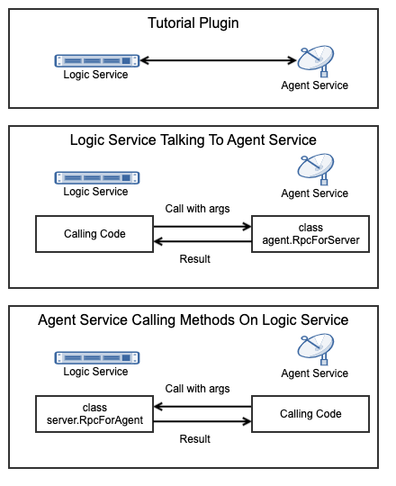

.. _learn_plugin_development_add_rpc:

==============
Add Vortex RPC
==============

Outline
-------

Peek has distributed services, and one plugin is usually run on more than one of these
services. This can make it incredibly complicated for code within the plugin that runs on
the agent service, to talk to the logic service for example.

In this document, we go through using the Vortex RPC to simplify communications between
the logic and agent service.

What is RPC
-----------

RPC stands for Remote Procedure Call, essentially is allows you to call
methods/functions/procedure over the network to another process.

In this example, the two processes are the Agent service and the Logic service.
These are completely separate processes, so you can't just call a method defined in the
logic service from the agent service.

Vortex RPC provides wrappers that make it easy to define procedures in one service,
and call them from another.

.. note:: Vortex RPC calls return :code:`twisted.internet.defer.Deferred`, regardless
            of what the actual method returns.



Logic Service RPC Setup
-----------------------

In this section we setup the files required to define an RPC on the logic service that will
only accept calls from the agent.

The RPC example could be much simpler, the intention is to show more of a good design
verses the bare minimum RPC example.

.. image:: LearnRPC_AgentToLogic.png

Add Package :file:`agent_handlers`
``````````````````````````````````

The :file:`agent_handlers` python package will contain the classes that generate tuple
data to send via the observable.

----

Create the :file:`peek_plugin_tutorial/_private/logic/agent_handlers` package, with
the commands ::

        mkdir peek_plugin_tutorial/_private/logic/agent_handlers
        touch peek_plugin_tutorial/_private/logic/agent_handlers/__init__.py


Add File :file:`RpcForAgent.py`
```````````````````````````````

File :file:`RpcForAgent.py` defines the methods the agent will call via RPC.

In this example we have just one file, however it it will be good practice to have
multiple files if the require RPC methods grow too large.

----

Create the file
:file:`peek_plugin_tutorial/_private/logic/agent_handlers/RpcForAgent.py`
and populate it with the following contents.

::

        import logging

        from peek_plugin_base.PeekVortexUtil import peekServerName, peekAgentName
        from peek_plugin_tutorial._private.PluginNames import tutorialFilt
        from peek_plugin_tutorial._private.logic.controller.MainController import MainController
        from peek_plugin_tutorial._private.storage.StringIntTuple import StringIntTuple
        from vortex.rpc.RPC import vortexRPC

        logger = logging.getLogger(__name__)


        class RpcForAgent:
            def __init__(self, mainController: MainController, dbSessionCreator):
                self._mainController = mainController
                self._dbSessionCreator = dbSessionCreator

            def makeHandlers(self):
                """ Make Handlers

                In this method we start all the RPC handlers
                start() returns an instance of itself so we can simply yield the result
                of the start method.

                """

                yield self.addInts.start(funcSelf=self)
                yield self.updateStatus.start(funcSelf=self)
                yield self.addStringInt.start(funcSelf=self)
                logger.debug("RPCs started")

            # -------------
            @vortexRPC(peekServerName,
                       acceptOnlyFromVortex=peekAgentName, additionalFilt=tutorialFilt)
            def addInts(self, val1, kwval1=9):
                """ Add Ints

                This is the simplest RPC example possible

                """
                return val1 + kwval1

            # -------------
            @vortexRPC(peekServerName,
                       acceptOnlyFromVortex=peekAgentName, additionalFilt=tutorialFilt)
            def updateStatus(self, updateStr: str):
                """ Update Status

                The agent may be running something and send updates on occasion,
                tell these to the main controller, it can deal with them.

                """
                self._mainController.agentNotifiedOfUpdate(updateStr)

            # -------------
            @vortexRPC(peekServerName, acceptOnlyFromVortex=peekAgentName,
                       additionalFilt=tutorialFilt, deferToThread=True)
            def addStringInt(self, stringInt: StringIntTuple):
                """ Insert a stringInt

                In this example RPC method, The agent tells the logic service to insert data into
                the database.

                It's a better design get the main controller to do things like this.
                It will know what else needs updating after the insert (IE, The observable)

                Notice the :code:`deferToThread=True` argument in :code:`@vortexRPC`?
                Because this code is blocking code, not written for twisted, we need to
                defer it to a thread so it doesn't block twisteds main reactor.

                As it's no longer in the twisted thread, all the code in this method
                should be standard blocking code.

                """
                session = self._dbSessionCreator()
                try:
                    session.add(stringInt)

                except:
                    session.rollback()
                    raise

                finally:
                    session.close()


Edit File :file:`MainController.py`
```````````````````````````````````

We need to update :file:`MainController.py`, to add an example method that the
RpcForAgent will call.

----

Edit the file :file:`peek_plugin_tutorial/_private/logic/controller/MainController.py`:

#.  Add this line to the bottom of the file, inside the class definition: ::


        def agentNotifiedOfUpdate(self, updateStr):
            logger.debug("Agent said : %s", updateStr)


Edit File :file:`LogicEntryHook.py`
``````````````````````````````````````````

We need to update :file:`LogicEntryHook.py`, to initialise the RpcForAgent.

----

Edit the file :file:`peek_plugin_tutorial/_private/logic/LogicEntryHook.py`:

#.  Add this import at the top of the file with the other imports: ::

        from .agent_handlers.RpcForAgent import RpcForAgent

#.  Add this line just before the :code:`logger.debug("Started")` line at the end
    of the :code:`start()` method: ::

        # Initialise the RpcForAgent
        self._loadedObjects.extend(RpcForAgent(mainController, self.dbSessionCreator)
                                   .makeHandlers())


----

The sever side RPC is now setup.

Agent Calling Logic Service RPC
-------------------------------

This section implements the code in the agent that will call the RPC methods
that the logic service has defined.

Add File :file:`AgentToLogicRpcCallExample.py`
`````````````````````````````````````````````````````

File :file:`AgentToLogicRpcCallExample.py` defines the methods the agent will
call via RPC.

In this example we have just one file, however it it will be good practice to have
multiple files if the require RPC methods grow too large.

----

Create the file
:file:`peek_plugin_tutorial/_private/agent/AgentToLogicRpcCallExample.py`
and populate it with the following contents.

::

        import logging

        from twisted.internet import reactor
        from twisted.internet.defer import inlineCallbacks

        from peek_plugin_tutorial._private.logic.agent_handlers.RpcForAgent import RpcForAgent
        from peek_plugin_tutorial._private.storage.StringIntTuple import StringIntTuple

        logger = logging.getLogger(__name__)


        class AgentToLogicRpcCallExample:
            def start(self):
                # kickoff the example
                # Tell the reactor to start it in 5 seconds, we shouldn't do things like
                # this in the plugins start method.
                reactor.callLater(5, self.runWithInlineCallback)

                # Return self, to make it simpler for the AgentEntryHook
                return self

            @inlineCallbacks
            def runWithInlineCallback(self):
                """ Run With Inline Callbacks

                To understand what the :code:`@inlineCallbacks` decorator does, you can read
                more in the twisted documentation.

                This is the simplest way to go with asynchronous code.

                Yield here, will cause the flow of code to return to the twisted.reactor
                until the deferreds callback or errback is called.

                The errback will cause an exception, which we'd catch with a standard
                try/except block.

                """

                # The :code:`@vortexRPC` decorator wraps the :code:`RpcForAgent.updateStatus`
                # method with an instance of the :code:`_VortexRPC` class,
                # this class has a :code:`__call__` method implemented, that is what we're
                # calling here.
                #
                # So although it looks like we're trying to call a class method, that's not what's
                # happening.
                yield RpcForAgent.updateStatus("Agent RPC Example Started")

                seedInt = 5
                logger.debug("seedInt = %s", seedInt)

                for _ in range(5):
                    seedInt = yield RpcForAgent.addInts(seedInt, kwval1=7)
                    logger.debug("seedInt = %s", seedInt)

                # Move onto the run method.
                # We don't use yield here, so :code:`runWithInlineCallback` will continue on and
                # finish
                self.run()
                logger.debug("runWithInlineCallback finished")

            def run(self):
                """ Run

                In this method, we call some RPCs and handle the deferreds.

                We won't be using @inlineCallbacks here. We will setup all the calls and
                callbacks, then the run method will return. The calls and callbacks will happen
                long after this method finishes.

                """

                stringInt = StringIntTuple(int1=50, string1="Created from Agent RPC")

                d = RpcForAgent.addStringInt(stringInt)

                # the deferred will call the lambda function,
                #   "_" will be the result of "addStringInt, which we ignore
                #   the lambda function calls RpcForAgent.updateStatus,
                #   which will return a deferred
                #
                # Returning a deferred from a callback is fine, it's just merilly processed
                d.addCallback(lambda _: RpcForAgent.updateStatus("Agent RPC Example Completed"))

                # Unless you have a good reason, always return the last deferred.
                return d

            def shutdown(self):
                pass


Edit File :file:`AgentEntryHook.py`
```````````````````````````````````

We need to update :file:`AgentEntryHook.py`, to initialise the
AgentToLogicRpcCallExample.

----

Edit the file :file:`peek_plugin_tutorial/_private/agent/AgentEntryHook.py`:

#.  Add this import at the top of the file with the other imports: ::

        from .AgentToLogicRpcCallExample import AgentToLogicRpcCallExample


#.  Add this line just before the :code:`logger.debug("Started")` line at the end
    of the :code:`start()` method: ::

        # Initialise and start the AgentToLogicRpcCallExample
        self._loadedObjects.append(AgentToLogicRpcCallExample().start())


----

The agent will now call the logic service RPC methods.

Agent RPC Setup
---------------

In this section we setup the files required to define an RPC on the agent that the logic service
will call.

Some example use cases would be:
*   Agent to query data from external DB
*   Agent to connect to remote server via SSH and pull back some data
*   Agent to push an update to a corporate system via HTTP

.. image:: LearnRPC_LogicToAgent.png

Add File :file:`RpcForLogic.py`
``````````````````````````````````````

File :file:`RpcForLogic.py` defines the methods the logic service will call via RPC.

----

Create the file
:file:`peek_plugin_tutorial/_private/agent/RpcForLogic.py`
and populate it with the following contents.

::

        import logging

        from peek_plugin_base.PeekVortexUtil import peekAgentName
        from peek_plugin_tutorial._private.PluginNames import tutorialFilt
        from vortex.rpc.RPC import vortexRPC

        logger = logging.getLogger(__name__)


        class RpcForLogic:
            def __init__(self):
                pass

            def makeHandlers(self):
                """ Make Handlers

                In this method we start all the RPC handlers
                start() returns an instance of itself so we can simply yield the result
                of the start method.

                """

                yield self.subInts.start(funcSelf=self)
                logger.debug("LogicService RPCs started")

            # -------------
            @vortexRPC(peekAgentName, additionalFilt=tutorialFilt)
            def subInts(self, val1, kwval1=9):
                """ Add Ints

                This is the simplest RPC example possible.

                :param val1: A value to start with
                :param kwval1: The value to subtract
                :return: One value minus the other

                """
                return val1 - kwval1


Edit File :file:`AgentEntryHook.py`
```````````````````````````````````

We need to update :file:`AgentEntryHook.py`, to initialise the RpcForLogic.

----

Edit the file :file:`peek_plugin_tutorial/_private/agent/AgentEntryHook.py`:

#.  Add this import at the top of the file with the other imports: ::

        from .RpcForLogic import RpcForLogic


#.  Add this line just before the :code:`logger.debug("Started")` line at the end
    of the :code:`start()` method: ::

        # Initialise and start the RPC for Logic Service
        self._loadedObjects.extend(RpcForLogic().makeHandlers())


----

The sever side RPC is now setup.

Logic Service Calling Agent RPC
-------------------------------

This section implements the code in the logic service that will call the RPC methods
that the agent has defined.


Add File :file:`LogicToAgentRpcCallExample.py`
``````````````````````````````````````````````

File :file:`LogicToAgentRpcCallExample.py` defines the methods the logic service
will call via RPC.


----

Create the file
:file:`peek_plugin_tutorial/_private/logic/LogicToAgentRpcCallExample.py`
and populate it with the following contents.

::

        import logging

        from twisted.internet import reactor
        from twisted.internet.defer import inlineCallbacks

        from peek_plugin_tutorial._private.agent.RpcForLogic import RpcForLogic

        logger = logging.getLogger(__name__)


        class LogicToAgentRpcCallExample:
            def start(self):
                # kickoff the example
                # Tell the reactor to start it in 20 seconds, we shouldn't do things like
                # this in the plugins start method.
                reactor.callLater(20, self.run)

                return self

            @inlineCallbacks
            def run(self):
                # Call the agents RPC method
                result = yield RpcForLogic.subInts(7, kwval1=5)
                logger.debug("seedInt result = %s (Should be 2)", result)

            def shutdown(self):
                pass


Edit File :file:`LogicEntryHook.py`
```````````````````````````````````

We need to update :file:`LogicEntryHook.py`, to initialise the
LogicToAgentRpcCallExample.

----

Edit the file :file:`peek_plugin_tutorial/_private/logic/LogicEntryHook.py`:

#.  Add this import at the top of the file with the other imports: ::

        from .LogicToAgentRpcCallExample import LogicToAgentRpcCallExample


#.  Add this line just before the :code:`logger.debug("Started")` line at the end
    of the :code:`start()` method: ::

        # Initialise and start the RPC for Logic Service
        self._loadedObjects.append(LogicToAgentRpcCallExample().start())


----

The logic service will now call the RPC method on the agent when it starts.

Testing
-------

#.  Open a command window and run: :code:`run_peek_logic_service`

#.  Open a command window and run: :code:`run_peek_agent_service`

#.  Examine the logs of both command windows

:code:`run_peek_logic_service` log example:

::

        19-Apr-2017 09:24:42 DEBUG vortex.rpc.RPC:Received RPC call for peek_plugin_tutorial._private.logic.agent_handlers.RpcForAgent.RpcForAgent.updateStatus
        19-Apr-2017 09:24:42 DEBUG peek_plugin_tutorial._private.logic.controller.MainController:Agent said : Agent RPC Example Started
        19-Apr-2017 09:24:42 DEBUG vortex.rpc.RPC:Received RPC call for peek_plugin_tutorial._private.logic.agent_handlers.RpcForAgent.RpcForAgent.addInts
        19-Apr-2017 09:24:42 DEBUG vortex.rpc.RPC:Received RPC call for peek_plugin_tutorial._private.logic.agent_handlers.RpcForAgent.RpcForAgent.addInts
        19-Apr-2017 09:24:42 DEBUG vortex.rpc.RPC:Received RPC call for peek_plugin_tutorial._private.logic.agent_handlers.RpcForAgent.RpcForAgent.addInts
        19-Apr-2017 09:24:42 DEBUG vortex.rpc.RPC:Received RPC call for peek_plugin_tutorial._private.logic.agent_handlers.RpcForAgent.RpcForAgent.addInts
        19-Apr-2017 09:24:42 DEBUG vortex.rpc.RPC:Received RPC call for peek_plugin_tutorial._private.logic.agent_handlers.RpcForAgent.RpcForAgent.addInts
        19-Apr-2017 09:24:42 DEBUG vortex.rpc.RPC:Received RPC call for peek_plugin_tutorial._private.logic.agent_handlers.RpcForAgent.RpcForAgent.addStringInt
        19-Apr-2017 09:24:42 DEBUG vortex.rpc.RPC:Received RPC call for peek_plugin_tutorial._private.logic.agent_handlers.RpcForAgent.RpcForAgent.updateStatus
        19-Apr-2017 09:24:42 DEBUG peek_plugin_tutorial._private.logic.controller.MainController:Agent said : Agent RPC Example Completed


:code:`run_peek_agent_service` log example:

::

        19-Apr-2017 09:24:42 DEBUG vortex.rpc.RPC:Calling RPC for peek_plugin_tutorial._private.logic.agent_handlers.RpcForAgent.RpcForAgent.updateStatus
        19-Apr-2017 09:24:42 DEBUG vortex.rpc.RPC:Received RPC result for peek_plugin_tutorial._private.logic.agent_handlers.RpcForAgent.RpcForAgent.updateStatus
        19-Apr-2017 09:24:42 DEBUG peek_plugin_tutorial._private.agent.AgentToLogicRpcCallExample:seedInt = 5
        19-Apr-2017 09:24:42 DEBUG vortex.rpc.RPC:Calling RPC for peek_plugin_tutorial._private.logic.agent_handlers.RpcForAgent.RpcForAgent.addInts
        19-Apr-2017 09:24:42 DEBUG vortex.rpc.RPC:Received RPC result for peek_plugin_tutorial._private.logic.agent_handlers.RpcForAgent.RpcForAgent.addInts
        19-Apr-2017 09:24:42 DEBUG peek_plugin_tutorial._private.agent.AgentToLogicRpcCallExample:seedInt = 12
        19-Apr-2017 09:24:42 DEBUG vortex.rpc.RPC:Calling RPC for peek_plugin_tutorial._private.logic.agent_handlers.RpcForAgent.RpcForAgent.addInts
        19-Apr-2017 09:24:42 DEBUG vortex.rpc.RPC:Received RPC result for peek_plugin_tutorial._private.logic.agent_handlers.RpcForAgent.RpcForAgent.addInts
        19-Apr-2017 09:24:42 DEBUG peek_plugin_tutorial._private.agent.AgentToLogicRpcCallExample:seedInt = 19
        19-Apr-2017 09:24:42 DEBUG vortex.rpc.RPC:Calling RPC for peek_plugin_tutorial._private.logic.agent_handlers.RpcForAgent.RpcForAgent.addInts
        19-Apr-2017 09:24:42 DEBUG vortex.rpc.RPC:Received RPC result for peek_plugin_tutorial._private.logic.agent_handlers.RpcForAgent.RpcForAgent.addInts
        19-Apr-2017 09:24:42 DEBUG peek_plugin_tutorial._private.agent.AgentToLogicRpcCallExample:seedInt = 26
        19-Apr-2017 09:24:42 DEBUG vortex.rpc.RPC:Calling RPC for peek_plugin_tutorial._private.logic.agent_handlers.RpcForAgent.RpcForAgent.addInts
        19-Apr-2017 09:24:42 DEBUG vortex.rpc.RPC:Received RPC result for peek_plugin_tutorial._private.logic.agent_handlers.RpcForAgent.RpcForAgent.addInts
        19-Apr-2017 09:24:42 DEBUG peek_plugin_tutorial._private.agent.AgentToLogicRpcCallExample:seedInt = 33
        19-Apr-2017 09:24:42 DEBUG vortex.rpc.RPC:Calling RPC for peek_plugin_tutorial._private.logic.agent_handlers.RpcForAgent.RpcForAgent.addInts
        19-Apr-2017 09:24:42 DEBUG vortex.rpc.RPC:Received RPC result for peek_plugin_tutorial._private.logic.agent_handlers.RpcForAgent.RpcForAgent.addInts
        19-Apr-2017 09:24:42 DEBUG peek_plugin_tutorial._private.agent.AgentToLogicRpcCallExample:seedInt = 40
        19-Apr-2017 09:24:42 DEBUG vortex.rpc.RPC:Calling RPC for peek_plugin_tutorial._private.logic.agent_handlers.RpcForAgent.RpcForAgent.addStringInt
        19-Apr-2017 09:24:42 DEBUG peek_plugin_tutorial._private.agent.AgentToLogicRpcCallExample:runWithInlineCallback finished
        19-Apr-2017 09:24:42 DEBUG vortex.rpc.RPC:Received RPC result for peek_plugin_tutorial._private.logic.agent_handlers.RpcForAgent.RpcForAgent.addStringInt
        19-Apr-2017 09:24:42 DEBUG vortex.rpc.RPC:Calling RPC for peek_plugin_tutorial._private.logic.agent_handlers.RpcForAgent.RpcForAgent.updateStatus
        19-Apr-2017 09:24:42 DEBUG vortex.rpc.RPC:Received RPC result for peek_plugin_tutorial._private.logic.agent_handlers.RpcForAgent.RpcForAgent.updateStatus

