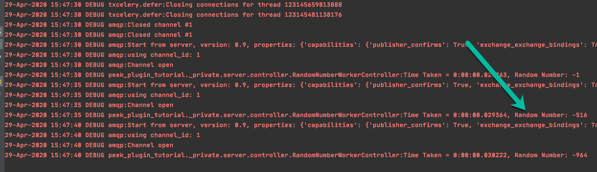

.. _learn_plugin_development_add_worker:

==================
Add Worker Service
==================

Outline
-------

In this document, we setup the Worker service and submit a job from the Logic service. The Logic service will send a
random number to worker and, the worker inverts the number and sends it back.

Add Package :file:`_private/worker`
-----------------------------------

Create directory :file:`peek_plugin_tutorial/_private/worker`

Create an empty package file in the worker directory:
:file:`peek_plugin_tutorial/_private/worker/__init__.py`

Commands: ::

        mkdir peek_plugin_tutorial/_private/worker
        touch peek_plugin_tutorial/_private/worker/__init__.py

Add File :file:`WorkerEntryHook.py`
-----------------------------------

Create the file :file:`peek_plugin_tutorial/_private/worker/EntryHook.py`
and populate it with the following contents.

::

        import logging
        from peek_plugin_base.worker.WorkerEntryHookABC import WorkerEntryHookABC
        from peek_plugin_tutorial._private.worker.tasks import RandomNumber

        logger = logging.getLogger(__name__)

        class WorkerEntryHook(PluginWorkerEntryHookABC):
            def __init__(self, *args, **kwargs):
                """" Constructor """
                # Call the base classes constructor
                WorkerEntryHookABC.__init__(self, *args, **kwargs)

                #: Loaded Objects, This is a list of all objects created when we start
                self._loadedObjects = []

            def load(self) -> None:
                """ Load

                This will be called when the plugin is loaded, just after the db is migrated.
                Place any custom initialiastion steps here.

                """
                logger.debug("Loaded")

            def start(self):
                """ Load

                This will be called when the plugin is loaded, just after the db is migrated.
                Place any custom initialiastion steps here.

                """
                logger.debug("Started")

            def stop(self):
                """ Stop

                This method is called by the platform to tell the peek app to shutdown and stop
                everything it's doing
                """
                # Shutdown and dereference all objects we constructed when we started
                while self._loadedObjects:
                    self._loadedObjects.pop().shutdown()

                logger.debug("Stopped")

            def unload(self):
                """Unload

                This method is called after stop is called, to unload any last resources
                before the PLUGIN is unlinked from the platform

                """
                logger.debug("Unloaded")

            @property
            def celeryAppIncludes(self):
                return [RandomNumber.__name__]

Add Package :file:`_private/worker/tasks`
-----------------------------------------

Create directory :file:`_private/worker/tasks`

Create an empty package file in the tasks directory,
:file:`peek_plugin_tutorial/_private/worker/tasks/__init__.py`

Commands: ::

        mkdir -p peek_plugin_tutorial/_private/worker/tasks
        touch peek_plugin_tutorial/_private/worker/tasks/__init__.py

Add File :file:`RandomNumber.py`
--------------------------------

Create the file :file:`peek_plugin_tutorial/_private/worker/tasks/RandomNumber.py`
and populate it with the following contents. This worker returns the negative number
for the given positive number

::

        import logging
        from random import randint
        from txcelery.defer import DeferrableTask
        from peek_plugin_base.worker.CeleryApp import celeryApp

        logger = logging.getLogger(__name__)

        @DeferrableTask
        @celeryApp.task(bind=True)
        def pickRandomNumber(self, item: int) -> int:
            """
            Returns random integer between 1 to 1000
            """
            return int(item) * -1

Edit :file:`peek_plugin_tutorial/__init__.py`
---------------------------------------------

Edit the file :file:`peek_plugin_tutorial/__init__.py`, and add the following: ::

        from peek_plugin_base.worker.PluginWorkerEntryHookABC import PluginWorkerEntryHookABC
        from typing import Type

        def peekWorkerEntryHook() -> Type[PluginWorkerEntryHookABC]:
            from ._private.worker.WorkerEntryHook import WorkerEntryHook
            return WorkerEntryHook

Edit :file:`plugin_package.json`
--------------------------------

Edit the file :file:`peek_plugin_tutorial/plugin_package.json` :

#.  Add **"worker"** to the requiresServices section so it looks like ::

        "requiresServices": [
            "worker"
        ]

#.  Add the **worker** section after **requiresServices** section: ::

        "worker": {
        }

#.  Ensure your JSON is still valid (Your IDE may help here)

Here is an example ::

        {
            "plugin": {
                ...
            },
            "requiresServices": [
                "worker"
            ],
            "worker": {
            }
        }

----

The plugin should now be ready for the worker to load.

Running on the Worker Service
-----------------------------

Edit :file:`~/peek-worker-service.home/config.json`:

#.  Ensure **logging.level** is set to **"DEBUG"**
#.  Add **"peek_plugin_tutorial"** to the **plugin.enabled** array

.. note:: It would be helpful if this is the only plugin enabled at this point.

It should somthing like this: ::

        {
            ...
            "logging": {
                "level": "DEBUG"
            },
            ...
            "plugin": {
                "enabled": [
                    "peek_plugin_tutorial"
                ],
                ...
            },
            ...
        }

.. note:: This file is created in :ref:`administer_peek_platform`

----

You can now run the peek worker, you should see your plugin load. ::

        peek@_peek:~$ run_peek_worker_service
        ...
        DEBUG peek_plugin_tutorial._private.worker.WorkerEntryHook:Loaded
        DEBUG peek_plugin_tutorial._private.worker.WorkerEntryHook:Started
        ...

Push work from logic to worker service
--------------------------------------

.. note:: Ensure :file:`rabbitmq` and :file:`redis` services are running

Create :file:`peek_plugin_tutorial/_private/logic/controller/RandomNumberWorkerController.py` with below content:

::

        import logging
        from twisted.internet import task, reactor, defer
        from twisted.internet.defer import inlineCallbacks
        from vortex.DeferUtil import deferToThreadWrapWithLogger, vortexLogFailure
        from datetime import datetime
        from random import randint
        import pytz

        logger = logging.getLogger(__name__)

        class RandomNumberWorkerController:
            """
                Random Number Generator
                Generates random number on worker periodically
            """

            PERIOD = 5
            TASK_TIMEOUT = 60.0

            def __init__(self):
                self._pollLoopingCall = task.LoopingCall(self._poll)

            def start(self):
                d = self._pollLoopingCall.start(self.PERIOD, now=False)
                d.addCallbacks(self._timerCallback, self._timerErrback)

            def _timerErrback(self, failure):
                vortexLogFailure(failure, logger)

            def _timerCallback(self, _):
                logger.info("Time executed successfully")

            def stop(self):
                if self._pollLoopingCall.running:
                    self._pollLoopingCall.stop()

            def shutdown(self):
                self.stop()

            @inlineCallbacks
            def _poll(self):
                # Send the tasks to the peek worker
                start = randint(1, 1000)
                try:
                    result = yield self._sendToWorker(start)
                catch Exception as e:
                    logger.exception(e)

            @inlineCallbacks
            def _sendToWorker(self, item):
                from peek_plugin_tutorial._private.worker.tasks.RandomNumber import pickRandomNumber
                startTime = datetime.now(pytz.utc)

                try:
                    d = pickRandomNumber.delay(item)
                    d.addTimeout(self.TASK_TIMEOUT, reactor)
                    randomNumber = yield d
                    logger.debug("Time Taken = %s, Random Number: %s" % (datetime.now(pytz.utc) - startTime, randomNumber))
                except Exception as e:
                    logger.debug(" RandomNumber task failed : %s", str(e))

Edit :file:`peek_plugin_tutorial/_private/logic/LogicEntryHook.py`:

#. Add the following imports at the top of the file with the other imports: ::

        from peek_plugin_base.logic.PluginLogicWorkerEntryHookABC import PluginLogicWorkerEntryHookABC
        from peek_plugin_tutorial._private.logic.controller.RandomNumberWorkerController import RandomNumberWorkerController

#. Add :file:`PluginLogicWorkerEntryHookABC` to list of inherited class: ::

        class LogicWorkerEntryHook(PluginLogicWorkerEntryHookABC, ...):

#. Add this line just before the :code:`logger.debug("Started")` line at the end of the :code:`start()` method: ::

        randomNumberController = RandomNumberWorkerController()
        self._loadedObjects.append(randomNumberController)
        randomNumberController.start()

Run :file:`run_peek_logic_service`
----------------------------------

You can now run the peek logic service, you should see output like below, showing the :

