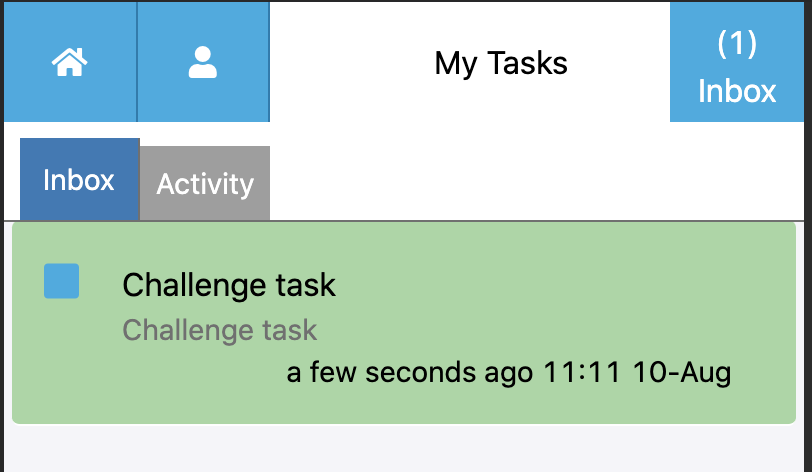
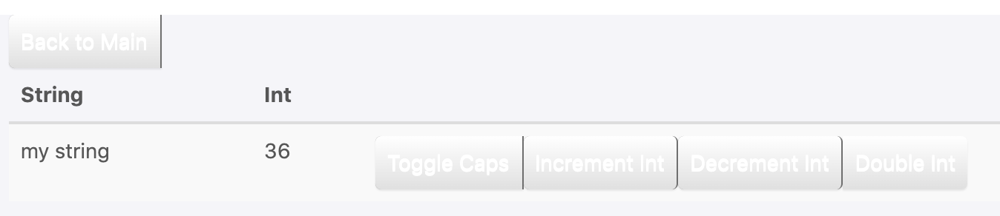

.. _learn_plugin_development_challenges:

==========
Challenges
==========

This document is designed to test your knowledge about the Peek platform.

Challenge #1: Lifecycle Methods
-------------------------------

This challenge will test your knowledge of lifecycle methods within Peek services.

Tasks:

- Log the current time when the peek logic service is in its `start` lifecycle.

The following module will be required:

::

    import datetime

The output should resemble this:

::

    10-Aug-2020 10:08:44 DEBUG peek_plugin_tutorial._private.logic.LogicEntryHook:2020-08-10 10:08:44.223694
    10-Aug-2020 10:08:44 DEBUG peek_plugin_tutorial._private.logic.LogicEntryHook:Started

----

Challenge #2: Admin Plugin Tab
------------------------------

This challenge will test your knowledge of the web interfaces within Peek services.

Tasks:

- Develop a new tab in the "Tutorial Plugins" page within the admin Peek site.

The output should resemble this:

----

Challenge #3: Field/Office Tasks
--------------------------------

This challenge will test your understanding of the various components located
within the admin Peek site, and how they interact with other Peek services.

Tasks:

- Send a task to the field / office service from the admin Peek site.

The output should resemble this:

----

Challenge #4: VortexJs Tuple Actions
------------------------------------

This challenge will test your understanding of how tuple actions work,
and how they are used by the various Peek services.

Tasks:

- Create an action that doubles the current int value displayed in
  the StringIntComponent.
- Initiate the action via a button click on the field app.
- Display the outcome on the field app.

The output should resemble this:

----

Challenge #5: Worker Service
----------------------------

This challenge will test your understanding of how the worker service
and logic service communicate with one another.

Tasks:

- Create a new task named "SpecificNumber" for the worker service to complete.
- Make the task log the number "24" and the time taken to complete the task
  every 5 seconds.

The output should resemble this:

::

    10-Aug-2020 14:10:31 DEBUG celery.worker.request:Task accepted:peek_plugin_tutorial._private.worker.tasks.SpecificNumber.pickSpecificNumber[fc6ee8bf-1e11-4481-b84b-66cf7e4f197a] pid:82053
    10-Aug-2020 14:10:31 INFO celery.app.trace:Task peek_plugin_tutorial._private.worker.tasks.SpecificNumber.pickSpecificNumber[fc6ee8bf-1e11-4481-b84b-66cf7e4f197a] succeeded in 0.0007026020030025393s: 24
