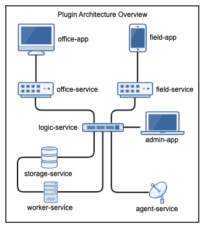

===========
First Steps
===========

Introduction
------------

The **peek_plugin_base** python package provides all the interfaces used for the Peek
Platform and the Plugins to function with each other.

The Platform Plugin API is available here  :ref:`api_plugin_package_json`.

The following sections go on to guide the reader to develop different parts of the plugin
and eventually run the plugins in development mode
(:command:`ng serve`, :command:`tns run` etc).

Ensure you are well versed with the platform from the :ref:`overview` as the following
sections build upon that.

The following sections will be useful if you're starting a plugin with out cloning
peek_plugin_noop, or if you'd like to learn more about how to code different parts
of the plugin.

Check Setup
-----------

.. important:: Windows users must use :command:`bash`

These instructions are cross platform, windows users should use bash from msys, which
is easily installable form the windows git installer, see the instructions here,
:ref:`setup_msys_git`.

----

Check Python

Before running through this procedure, ensure that your PATH variable includes the
right virtual environment for the platform you've installed. ::

        which python

This should return the location of your virtual environment, usually
:file:`~/synerty-peek-V.E.R/bin/python` on Linux or
or :file:`~/synerty-peek-V.E.R/Script/python` on windows. Where V.E.R is the version
number of the platform release, EG 0.2.0

Plugins and the Platform
------------------------

The Peek Platform services provide places for the Peek Plugins to run.
A plugin can chose to run on any service the platform provides.

Here is an architecture diagram for a plugin :

