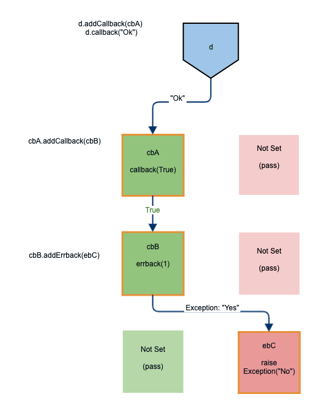
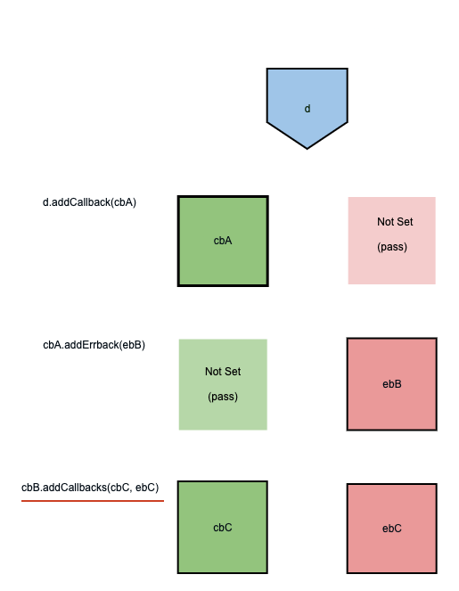
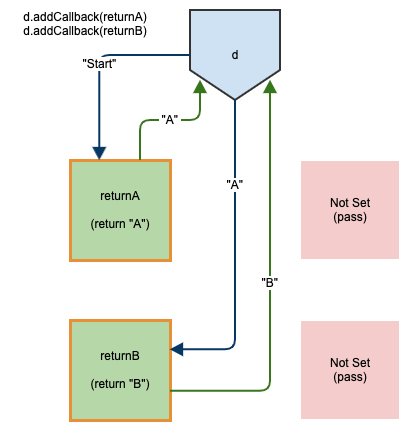
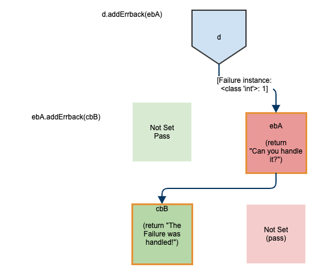

=============================
Deferred Callback Propagation
=============================

Before a Deferred has resolved, it can have a number of callbacks and an errbacks
added to it, that will tell it what to do in the case of a failure.

In many cases, these callbacks or errbacks can also return a Deferred,
which may in turn return yet more Deferreds, each with their own callbacks
and errbacks.

Callbacks may even be called by errbacks and vice versa, all the way
along the chain.

At the end of this tangled (dare I say, 'twisted')
process, the final returned value of the final callback or errback in the chain is the
value that the initial Deferred will be passed.

While the callback chain sounds like a difficult process to grasp, it is usually very
straightforward. For a more visual explanation, consider the following diagram:

If a chain of callbacks goes :code:`d` -> :code:`cbA` -> :code:`ebB`,
the final value of :code:`A` will be the value returned by :code:`ebB`.

----

In code, the above diagram would look similar to this::

    def testCallbackPropagationExample(self):
        def cbA(data):
            d = defer.Deferred()
            d.addCallback(cbB)
            d.callback(True)
            return d

        def cbB(data):
            d = defer.Deferred()
            d.addErrback(ebC)
            d.errback(1)
            return d

        def ebC(data):
            raise Exception("NO")

        d = defer.Deferred()
        d.addCallback(cbA)
        d.callback("OK")
        return d

Notice that in the diagram,  matching errbacks for :code:`cbA` and :code:`cbB`, and
a matching callback for :code:`cbC` were not set or used, but still existed.
This is because callbacks and errbacks are always created in pairs, much like
:code:`try`-:code:`catch` blocks. This behaviour is demonstrated below.

Callbacks and errbacks are always created in pairs
--------------------------------------------------

.. note::
    Calling :code:`addCallbacks()` *explicitly* adds both a :code:`callback` **and** an
    :code:`errback`, whereas :code:`addCallback()` or :code:`addErrback()` will
    only *explicitly* add one **or** the other.

In this diagram, the Deferred, :code:`d` was given a callback via the function
:code:`Deferred.addCallback`, and the function it called back (:code:`cbA`) added an
errback via the function :code:`Deferred.addErrback`.

In both of these cases, only either a callback **or** an errback were
explicitly added by the user, but in both cases a matching placeholder opposite was
added by Twisted. This is because errbacks and callbacks are always created in pairs.

Notice that :code:`cbB` adds both a callback (:code:`cbC`) **and** an
errback (:code:`ebC`) **explicitly** via the function :code:`Deferred.addCallbacks`.

If the :code:`cbB` function in the first example diagram had added both a callback
and errback to its Deferred as was done in this example, then the final value of
:code:`d` would be the return of whichever of :code:`cbC` or :code:`ebC` was
eventually called (or whichever was called last).

The implementation of the above diagram would look something like this::

    # Demonstrate that callbacks and errbacks are created in pairs
    def testCallbackErrbackPairs(self):

        def cbA(data):
            d = defer.Deferred()
            d.addErrback(ebB)
            #do something that will call d.errback(x)
            return d

        def ebB(data):
            d = defer.Deferred()
            d.addCallbacks(cbC, ebC)
            #do things that will call either:
            # d.callback(x) or d.errback(x)
            return d

        def cbC(data):
            return True

        def ebC(data):
            return False

        d = defer.Deferred()
        d.addCallback(cbA)
        #do something that will eventually call d.callback(x)
        return d

When a chain of callbacks and errbacks is useful
------------------------------------------------

Callback chains are useful for handling situations where a branching tree is an ideal
way to handle data. ("Run x. If x fails, do y unless the failure is z, then do...")
They are especially suited to the task because they are modular, easy to read, and do
not result in large, unwieldy walls of :code:`if` statements.

Multiple Callbacks for a single Deferred
----------------------------------------

It is worth noting that a single Deferred can have multiple callbacks.
Below, both :code:`returnA` and :code:`returnB` are added as callbacks to
:code:`d`. Because it has multiple callbacks, :code:`d` is assigned the value
returned by the **last** callback it fires. This means that the eventual resolved
value of :code:`d` is "B".

::

    class ExampleTests(unittest.TestCase):

        # Demonstrate that an individual Deferred can have multiple callbacks
        def testMultipleCallbacks(self):

            def returnA(d):
                print(d)
                return "A"

            def returnB(d):
                print(d)
                return "B"

            d = defer.Deferred()
            d.addCallback(returnA)
            d.addCallback(returnB)
            d.callback("Start")
            print(d)
            return d

----

When run, it should output something like this::

    Ran 1 test in 0.125s

    OK

    Process finished with exit code 0
    Start
    A
    <Deferred at 0x10b20ef98 current result: 'B'>

An errback calling a callback and continuing as-normal
------------------------------------------------------

Just because a Deferred's errback is called, it does not necessarily mean that
it will continue to errback, or that it will finally resolve into a Failure
instance.

Errbacks can be safely caught and called back, returning the program
to normal operation. Think of errbacks as being similar to try-except blocks in
standard python.

The below example creates a Deferred and has it callback :code:`willErrback`, which
does errback, but the function that it errbacks (:code:`willCallback`) returns a
callback. As a result, the errback that was created by :code:`willErrback` is
considered to be handled, allowing the program to continue.

Eventually, the original Deferred resolves with the value "It was touch and go for
a bit there" because that is what the **last** callback (or errback) in the chain
returns.

::

    # Demonstrate an Errback continuing as a callback
    def testErrbackContinues(self):

        def ebA(data):

            d = defer.Deferred()
            d.addCallback(cbB)
            d.callback("Can you handle it?")
            return d

        def cbB(data):
            print(data)
            return "The Failure was handled!"

        d = defer.Deferred()
        d.addErrback(ebA)
        d.addCallback(print)
        d.errback(1)
        return d

----

The output should look similar to this::

    Ran 1 test in 0.113s

    OK
    Can you handle it?
    The Failure was handled!

Another possible outcome could have been our errback continuing to errback any
number of times before eventually being handled and calling back, returning the
program to the normal flow.
