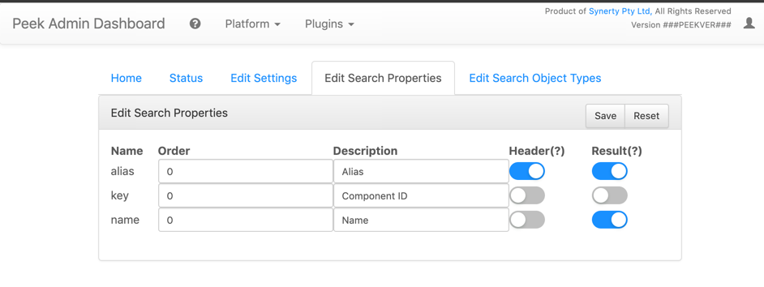
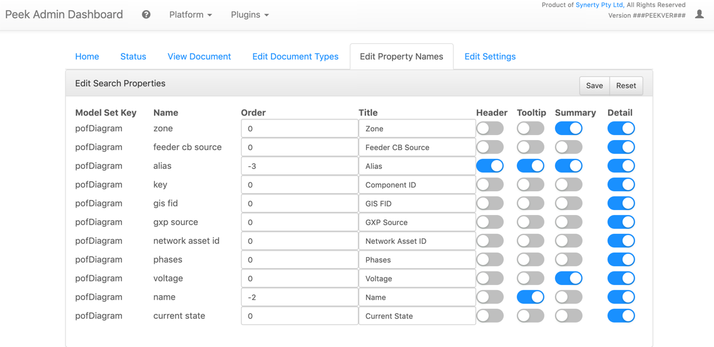

.. _upgrade_to_v2.0.x:

====================
v2.0.x Upgrade Notes
====================

Platform Changes
----------------


Platform Backend
````````````````

The Peek Admin UI now requires a login.

The admin login recovery password can be found in :file:`~/peek-server.home/config.json`.
 Under the path httpServer.admin.user.

----

The Peek-Client and Peek-Admin services now provide SSL support, see their respective
:file:`config.json` file, just provide valid files and SSL will be enabled.

----

The Peek-Client and Peek-Server services have combined the Web-App, websocket
 and Docs HTTP servers into the one HTTP port.

Docs are available at http://peekserver:port/docs


Platform Frontend
`````````````````

This release has upgraded the following major libraries

*   Angular from v6.x to v8.x

*   Typescript from v2.7.x to v3.4.x

*   Other smaller npmjs dependencies, such as rxjs

*   An introduction of ng.ant.design, Bootstrap will be phased out.


LDAP Authentication
```````````````````

LDAP Authentication has been improved, it now support multiple LDAP configs, including
multiple LDAP servers, or use it just for different combinations of OUs/Groups.

LDAP Configuration settings must be migrated manually


Peek Desktop
````````````

The Peek Desktop has had a face lift, the unsightly side bar has been slimmed down
and neatened up.

The scroll bars should not appear any longer.

Plugin Changes
--------------

DocDB Plugin
`````````````

The DocDB plugin has new information popups:

*   Tooltip

*   Summary

*   Details

These popups are triggered via the DocDB APIs from other plugins.

Search Plugin
`````````````

The Peek search has been revamped:

*   It now shows as a modal.

*   The search results have been cleaned up

*   The search results now show actions from the DocDB plugin popups

Diagram Generic Menu
````````````````````

This plugin has been renamed from "peek_plugin_generic_diagram_menu" to
peek_plugin_docdb_generic_menu" as it now operates on the new DocDB popups.


Diagram
```````

The diagram plugin has the following changes.

VIEW Updates:

*   The top left button now lets users select the Coord Set

*   The draw that used to load on the right hand side is now gone.
    The diagram instead triggers tooltip
    and summary popups from DocDB.


EDIT Updates:

*   Edit support now highlights a templates as just one object.

*   Edit support now lets you rotate a templates

*   New templates placed on the diagram are no longer invisible.


Diagram Positioner
``````````````````

The old peek_plugin_gis_dms_positioner plugin has been resurected.
This plugin now uses the DocDB popups, shows locate on actions
 using the coord-set names, and is smart enough to not show
 locate actions for the current coord-set.

This replaces the old method of just using the result sof peek-core-search.

Diagram Loaders
```````````````

All diagram loaders no longer load positions into the search db.

Deployment Changes
------------------

Linux Deployment
````````````````

Nil


macOS Deployment
````````````````

Nil

iOS Deployment
``````````````

Peek v2.0.x does not have support for iOS, this will be updated in a figure release


Windows Deployment
``````````````````

Nil.

.. note:: The windows deployment will change to use Windows Subsystem for Linux in
            a future release.

Migration Steps
----------------

Follow the following migration steps to rebuild the data that has changed in this
update.

Stop Peek
`````````

Start the migration tasks with Peek stopped.

On Linux this can be done with ::


    # Stop Peek
    sudo true
    sudo systemctl stop peek_agent
    sudo systemctl stop peek_client
    sudo systemctl stop peek_worker
    sudo systemctl stop peek_server


Redis Conf Update
`````````````````

The Redis Publisher/Subscriber buffer overflows and causes the task to fail, and the
agent to retry.  (See PEEK-317)

Double the buffer size with the following script ::

    # Prime SUDO
    sudo true


    OLD="client-output-buffer-limit pubsub 32mb 8mb 60"
    NEW="client-output-buffer-limit pubsub 64mb 16mb 90"
    F="/etc/redis.conf"

    # Check what it is now
    grep pubsub $F

    # Increase the size
    sudo sed -i "s/${OLD}/${NEW}/g" $F

    # Check that the change worked
    grep pubsub $F

    # Restart Redis
    sudo systemctl restart redis


Enable New Plugins
``````````````````

Update the peek config.json files.

#. Edit each of C:\Users\peek\peek-XXXX.home\config.json

#. Add :code:`peek_plugin_diagram_positioner` just after :code:`peek_plugin_diagram_trace`

#. Rename :code:`peek_plugin_diagram_generic_menu`
    to :code:`peek_plugin_docdb_generic_menu`
    or on Linux: ::

        sed -i 's/_diagram_generic_menu/_docdb_generic_menu/g' ~/peek*.home/config.json


Truncate Load States
````````````````````

Due to the changes to the search and diagram plugins, all of the data will need to be
reloaded.

Run the following SQL, for each applicable plugin that you have installed. ::

        psql <<EOF

        -- Search Plugin
        DROP SCHEMA core_search CASCADE;

        -- DocDB Plugin
        DROP SCHEMA pl_docdb CASCADE;

        -- PoF Equipment Loader
        TRUNCATE TABLE pl_pof_equipment_loader."ChunkLoadState";

        -- PoF Diagram Loader
        DELETE FROM pl_pof_diagram_loader."PageLoadState"
        WHERE "scope" = 'normal';

        -- PoF Pof GIS Location loader
        TRUNCATE TABLE pl_pof_gis_location_loader."ChunkLoadState";

        -- GraphDB
        TRUNCATE TABLE pl_graphdb."GraphDbChunkQueue";
        TRUNCATE TABLE pl_graphdb."GraphDbEncodedChunk";
        TRUNCATE TABLE pl_graphdb."GraphDbSegment";

        TRUNCATE TABLE pl_graphdb."ItemKeyIndexCompilerQueue";
        TRUNCATE TABLE pl_graphdb."ItemKeyIndexEncodedChunk";
        TRUNCATE TABLE pl_graphdb."ItemKeyIndex";

        -- PoF GraphDB Loader
        TRUNCATE TABLE pl_pof_graphdb_loader."GraphSegmentLoadState";

        EOF

----

Start up the Peek Server manually, it will:

 *  Rebuild the admin site

 *  Migrate the database

Open a shell or command prompt and run :code:`run_peek_server`

----

Once the Peek Server has finished loading :

#.  Load up the peek-admin screen at http://<peek-server>:port.

#.  Click the "Login" button, this will cause the server to write a recovery
    user to the :file:`peek-server.home/config.json` file with a random password.

#.  Use this recovery username and password to login to the Peek Admin UI.

----

Once Peek Server has finished running, kill it with CTRL+C

Restart Peek
````````````

Restart all Peek services.

For windows, restart the :code:`peek-server` service then
start the :code:`peek-restarter` service,
the agent, worker and client will now start.


Reconfigure LDAP
````````````````

Reconfigure the new LDAP settings from the Peek-Admin site, under Platform -> Users

#.  Enable the use of LDAP from the **General Settings** tab.

#.  Configure the new LDAP settings using the new LDAP Settings tab.

Reconfigure Search Properties
`````````````````````````````

Reconfigure the search properties from the Peek-Admin site, under Platform -> Search



Reconfigure DocDB Properties
````````````````````````````

Reconfigure the search properties from the Peek-Admin site, under Plugins -> Document DB




v2.0.1 Issues Log
-----------------

Bug
```

*    [PEEK-397] - Diagram Button Menu - missing some tooltips

*    [PEEK-399] - Print DMS Diagram - black sections of the canvas shown
                    in browser print preview

*    [PEEK-400] - Markup Support View Branch - ANT Theme-ing TODO

*    [PEEK-401] - Markup Support View Branch Items - browser unresponsive

*    [PEEK-402] - DMS Diagram Markup Support - unable to edit existing branch

*    [PEEK-405] - VortexJS - unable to begin transaction (3850 disk I/O error)

*    [PEEK-406] - Core User - Logging into the same browser with two browser
                    windows causes a logout

Improvement
```````````

*    [PEEK-404] - DMS Diagram Markup Support - Check Save change before close

*    [PEEK-233] - PERFORMANCE - SearchIndexChunkCompilerTask is slow

v2.0.0 Issues Log
-----------------

Bug
```

*    [PEEK-297] - Peek Desktop - Left Panel Appears unfinished

*    [PEEK-298] - DMS Diagram - Remove DMS Diagram landing page

*    [PEEK-299] - Pointer Cursor on Select World screen

*    [PEEK-301] - Core Search / Diagram / PoF Diagram Loader - show on other world panel should use descriptions

*    [PEEK-305] - Core Search - Hide panel after select show link

*    [PEEK-306] - Core Search / Diagram / PoF Diagram Loader - hide show on link for current world

*    [PEEK-308] - Core Search - Cleanup search results display

*    [PEEK-309] - DocDB - Show Properties incomplete

*    [PEEK-332] - Diagram Edit - Symbols need to rotate after insertion

*    [PEEK-333] - Diagram Edit - Symbols to be selected as a whole

*    [PEEK-334] - Peek to use HTTPS

*    [PEEK-335] - Peek Server - Peek Admin Doesn't Require Authentication

*    [PEEK-336] - Core-User - Restrict Users to a particular AD group

*    [PEEK-347] - GraphDB - Running peek_server causes massive memory leak.

*    [PEEK-348] - Diagram - Add tooltips to view toolbar

*    [PEEK-360] - GraphDB PowerOn Loader - unsupported 'datetime.datetime' and 'NoneType'

*    [PEEK-361] - Diagram - Problem with Disp linked DispLayer not matching DispLayer in LookupService

*    [PEEK-362] - Search - Property and Object Type fields are sometimes blank

*    [PEEK-365] - Diagram Panel - Equipment Panel is just terrible, make it a popover

*    [PEEK-367] - Peek fails to load in MS Edge

*    [PEEK-393] - Diagram fails to position on, in Edge

*    [PEEK-394] - IndexedDB is not open on Edge for diagram

*    [PEEK-368] - Diagram Edit - Hide conductor template button in edit mode

*    [PEEK-369] - Diagram Edit - Clicking on the items in the branch causes the browser to crash

*    [PEEK-371] - Diagram Edit - When creating a new node, show a circle or something before the template is selected

*    [PEEK-372] - Diagram - GridCache is not working.

*    [PEEK-374] - Logged in on another device message

*    [PEEK-379] - Diagram Generic Menu attributes not populating in URL

*    [PEEK-381] - Diagram Panel - reduce the number of properties shown.

*    [PEEK-383] - Diagram Panel - order the buttons shown by name

*    [PEEK-385] - Diagram Panel - Too many properties shown in equipment info

*    [PEEK-387] - All peek text is way to big in Peek Desktop

*    [PEEK-395] - DocDB - New popups secondary menu falls below other modals (such as search)

*    [PEEK-396] - Fix Angular errors preventing ng build --prod, and enable in Peek

Task
````


*    [PEEK-341] - Add support for action delegates in proxy

*    [PEEK-378] - Email NAR - disable send tab before saving

Improvement
```````````


*    [PEEK-326] - Add support for partial keywords in search.

*    [PEEK-351] - Implement websocket upgrades, so two ports are no longer required

*    [PEEK-354] - Add in UI support for ant.design

*    [PEEK-355] - Upgrade to Angular 8, etc

*    [PEEK-366] - Core User - Add support for multiple browser logins

*    [PEEK-389] - Upgrade docdb plugin properties, to reusable popups

*    [PEEK-390] - Make "Show on diagram" item popup buttons dynamic again

*    [PEEK-391] - Make DocDB popup screens configurable

*    [PEEK-392] - Core User - Add alternate login form, suitable for desktops
